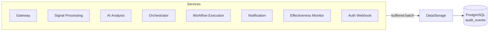

# Audit & Observability

Kubernaut provides a comprehensive audit trail that records every action taken during remediation. This supports compliance requirements (SOC2 Type II), incident review, and continuous improvement.

## Audit Architecture

Every Kubernaut service emits structured audit events to **DataStorage**, which persists them in **PostgreSQL**.

### Audit Pipeline Design

- **Buffered and batched** — Events are queued in-memory and sent in batches to DataStorage, minimizing overhead
- **Fire-and-forget** — Audit failures never block remediation; events are retried transparently
- **Configurable batching** — Buffer size, batch size, and flush interval are tunable per service

## What Gets Audited

Every stage of the remediation lifecycle emits audit events:

| Service | Event Types | Examples |
|---|---|---|
| **Gateway** | Signal received, scope validated | `gateway.signal.received` |
| **Signal Processing** | Enrichment completed, classification results | `signalprocessing.enrichment.completed` |
| **AI Analysis** | Investigation submitted, analysis completed, Rego evaluation, approval decision | `aianalysis.analysis.completed`, `aianalysis.rego.evaluated` |
| **Orchestrator** | Lifecycle transitions, child CRD creation | `orchestrator.lifecycle.created`, `orchestrator.phase.transition` |
| **Workflow Execution** | Workflow selected, execution started/completed | `workflowexecution.selection.completed`, `workflowexecution.execution.started` |
| **Notification** | Delivery attempted, delivery result | `notification.delivery.attempted` |
| **Effectiveness Monitor** | Assessment started, assessment result | `effectivenessmonitor.assessment.completed` |
| **Auth Webhook** | Operator approval, block clearance, timeout modification | `webhook.approval_decided`, `webhook.block_cleared` |

## Audit Event Structure

Each event contains:

| Field | Description |
|---|---|
| `event_id` | Unique UUID |
| `event_timestamp` | When the event occurred |
| `event_type` | Hierarchical type (e.g., `aianalysis.analysis.completed`) |
| `event_category` | Category (e.g., `signal`, `remediation`, `audit`) |
| `event_action` | Action performed (e.g., `received`, `completed`, `failed`) |
| `event_outcome` | Result: `success`, `failure`, or `pending` |
| `actor_type` / `actor_id` | Who performed the action (service or human operator) |
| `resource_type` / `resource_id` | Target resource |
| `correlation_id` | Groups all events for one RemediationRequest |
| `namespace` | Kubernetes namespace |
| `event_data` | JSONB payload with service-specific details |

## Operator Attribution

The **Auth Webhook** captures human actions through Kubernetes admission control:

- **Approval decisions** — Who approved or rejected a RemediationApprovalRequest
- **Block clearance** — Who cleared a workflow execution block
- **Timeout modifications** — Who changed a RemediationRequest's timeout configuration
- **Notification cancellation** — Who deleted a NotificationRequest

This ensures that every human action in the system has a recorded identity, timestamp, and context — critical for SOC2 compliance.

## Retention

Audit events are stored with a default retention of **2,555 days (7 years)**, supporting long-term compliance requirements.

The `audit_events` table is partitioned by month for efficient storage and querying. Individual events can be flagged as `is_sensitive` for PII handling.

## Correlation

All audit events for a single remediation share the same `correlation_id` (the RemediationRequest name). This enables:

- Querying the complete history of a remediation across all services
- Reconstructing the full CRD from audit data (see [Data Lifecycle](data-lifecycle.md))
- Incident timeline reconstruction for post-mortems

## Metrics

All services expose Prometheus metrics on `:9090/metrics`, including:

- Request counts and latencies per stage
- Error rates and retry counts
- Audit event emission rates
- Queue depths and processing times

See [Monitoring](../operations/monitoring.md) for dashboard configuration.

## Next Steps

- [Data Lifecycle](data-lifecycle.md) — CRD retention and reconstruction from audit data
- [Monitoring](../operations/monitoring.md) — Prometheus metrics and dashboards
- [Architecture: Audit Pipeline](../architecture/audit-pipeline.md) — Deep-dive into the audit system design
