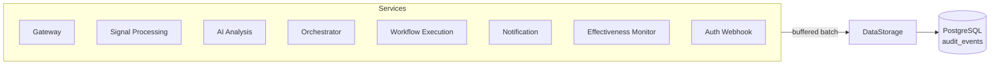

# Audit & Observability

!!! info "Architecture reference"
    For the buffered audit store, flush triggers, and DLQ design, see [Architecture: Audit Pipeline](../architecture/audit-pipeline.md).

Kubernaut provides a comprehensive audit trail that records every action taken during remediation. This supports SOC2 Type II alignment, incident review, and continuous improvement.

## Audit Architecture

Every Kubernaut service emits structured audit events to **DataStorage**, which persists them in **PostgreSQL**.

### Audit Pipeline Design

- **Buffered and batched** — Events are queued in-memory and sent in batches to DataStorage, minimizing overhead
- **Fire-and-forget** — Audit failures never block remediation; events are retried transparently
- **Configurable batching** — Buffer size, batch size, and flush interval are tunable per service

## What Gets Audited

Every stage of the remediation lifecycle emits audit events:

| Service | Event Types | Examples |
|---|---|---|
| **Gateway** | Signal received, scope validated | `gateway.signal.received` |
| **Signal Processing** | Enrichment completed, classification results | `signalprocessing.enrichment.completed` |
| **AI Analysis** | Investigation submitted, analysis completed/failed, Rego evaluation, approval decision | `aianalysis.analysis.completed`, `aianalysis.rego.evaluation`, `aianalysis.approval.decision` |
| **Orchestrator** | Lifecycle transitions, child CRD creation, routing blocks | `orchestrator.lifecycle.created`, `orchestrator.lifecycle.transitioned`, `orchestrator.routing.blocked` |
| **Workflow Execution** | Workflow selected, execution started/completed | `workflowexecution.selection.completed`, `workflowexecution.execution.started` |
| **Notification** | Message sent, delivery failure, acknowledgement, escalation | `notification.message.sent`, `notification.message.failed`, `notification.message.acknowledged`, `notification.message.escalated` |
| **Effectiveness Monitor** | Component assessments (health, hash, alerts, metrics), scheduling, completion | `effectiveness.health.assessed`, `effectiveness.hash.computed`, `effectiveness.alert.assessed`, `effectiveness.metrics.assessed`, `effectiveness.assessment.scheduled`, `effectiveness.assessment.completed` |
| **Auth Webhook** | Operator approval decisions, notification actions, timeout modifications, RemediationWorkflow and ActionType CRD lifecycle | `webhook.remediationapprovalrequest.decided`, `webhook.notification.cancelled`, `webhook.remediationrequest.timeout_modified`, `remediationworkflow.admitted.create`, `remediationworkflow.admitted.delete`, `remediationworkflow.admitted.denied`, `actiontype.admitted.create`, `actiontype.admitted.update`, `actiontype.admitted.delete`, `actiontype.denied.*` |
| **DataStorage** | Workflow catalog operations, action type taxonomy, workflow discovery | `datastorage.workflow.created`, `datastorage.workflow.updated`, `datastorage.actiontype.created`, `datastorage.actiontype.updated`, `datastorage.actiontype.disabled`, `datastorage.actiontype.reenabled`, `datastorage.actiontype.disable_denied`, `workflow.catalog.actions_listed`, `workflow.catalog.workflows_listed`, `workflow.catalog.workflow_retrieved`, `workflow.catalog.selection_validated` |

## Audit Event Structure

Each event contains core fields: `event_id`, `event_timestamp`, `event_type`, `event_category`, `event_action`, `event_outcome`, `actor_type`/`actor_id`, `resource_type`/`resource_id`, `correlation_id`, `namespace`, and `event_data`. See [Architecture: Audit Pipeline](../architecture/audit-pipeline.md#event-structure) for the complete event structure and field definitions.

## Operator Attribution

The **Auth Webhook** captures human actions through Kubernetes admission control:

- **Approval decisions** — Who approved or rejected a RemediationApprovalRequest
- **Block clearance** — Who cleared a workflow execution block
- **Timeout modifications** — Who changed a RemediationRequest's timeout configuration
- **Notification cancellation** — Who deleted a NotificationRequest
- **Workflow registration** — Who registered, deleted, or was denied a RemediationWorkflow CRD
- **Action type management** — Who created, updated, deleted, or was denied an ActionType CRD

This ensures that every human action in the system has a recorded identity, timestamp, and context — critical for SOC2 readiness.

## Retention

Audit events are stored with a configured retention of **2,555 days (7 years)**, supporting long-term compliance requirements.

!!! note "Retention Enforcement"
    The retention period is recorded per event but automatic deletion of expired events is deferred to v1.2. Events currently accumulate indefinitely.

The `audit_events` table is partitioned by month for efficient storage and querying. Individual events can be flagged as `is_sensitive` for PII handling.

## Correlation

All audit events for a single remediation share the same `correlation_id` (the RemediationRequest name). This enables:

- Querying the complete history of a remediation across all services
- Reconstructing the full CRD from audit data (see [Data Lifecycle](data-lifecycle.md))
- Incident timeline reconstruction for post-mortems

## Metrics

All services expose Prometheus metrics on `:9090/metrics`. Kubernaut exposes ~115 custom metrics across all services covering signal ingestion, classification, orchestration, execution, notification, effectiveness, audit, and LLM usage.

Key metric categories:

- **Throughput** -- Signals received, remediations completed, notifications delivered
- **Latency** -- Per-phase processing duration, LLM call latency, delivery duration
- **Errors** -- Failure rates, retry counts, circuit breaker states
- **Audit health** -- Buffer utilization, DLQ depth, write latency
- **LLM cost** -- Token consumption by provider and model

See [Monitoring: Prometheus Metrics Reference](../operations/monitoring.md#gateway-metrics) for the complete per-service metrics inventory with metric names, types, labels, and example PromQL queries for Grafana dashboards.

## Next Steps

- [Data Lifecycle](data-lifecycle.md) — CRD retention and reconstruction from audit data
- [Monitoring](../operations/monitoring.md) — Prometheus metrics and dashboards
- [Architecture: Audit Pipeline](../architecture/audit-pipeline.md) — Deep-dive into the audit system design
