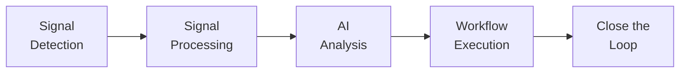

# Core Concepts

This page explains the key building blocks of Kubernaut: the data model, the services, and how a remediation flows through the system.

## The Remediation Pipeline

Every remediation in Kubernaut follows the same five-stage pipeline:



Each stage is represented by a **Custom Resource (CRD)** in Kubernetes. The **Remediation Orchestrator** coordinates the flow by creating child CRDs and watching their status.

## Custom Resources

### RemediationRequest

The top-level resource. Created by the Gateway when a signal arrives. Contains:

- **TargetResource** — The Kubernetes resource that triggered the alert (namespace, name, kind)
- **Signal metadata** — Alert name, signal type, labels, annotations, original payload
- **OverallPhase** — Current lifecycle phase (Pending → Processing → Analyzing → AwaitingApproval → Executing → Verifying → Completed/Failed/Blocked/TimedOut/Skipped/Cancelled)

The RemediationRequest is the "parent" — all other CRDs are children created by the Orchestrator.

### SignalProcessing

Created after a RemediationRequest is accepted. The Signal Processing controller enriches the signal with:

- **Kubernetes context** — Owner chain (Deployment → ReplicaSet → Pod), namespace labels and annotations, workload details (kind, name, labels), and custom labels
- **Environment classification** — Inferred from namespace labels or Rego policies (production, staging, development, test)
- **Priority assignment** — P0–P3 based on Rego policy evaluation or severity-based fallback
- **Business classification** — Business unit, service owner, criticality level, and SLA requirement (when labels are present)
- **Severity normalization** — Maps raw alert severity to a standard scale (critical, high, medium, low, unknown) via Rego policies with a configurable fallback matrix
- **Signal mode** — Reactive (something broke) or proactive (something is predicted to break)
- **Signal name normalization** — Normalizes the signal name for downstream matching while preserving the original for audit

### AIAnalysis

Created after signal enrichment completes. The AI Analysis controller:

1. Submits the enriched signal to **HolmesGPT** (via the HolmesGPT API service) for live root cause investigation
2. HolmesGPT investigates using Kubernetes inspection tools (pod logs, events, resource state, live metrics) and optionally Prometheus, Grafana Loki/Tempo, and other configured observability toolsets
3. Resolves the target resource's owner chain, computes a spec hash, fetches **remediation history** (past outcomes and effectiveness scores), and detects **infrastructure labels** (GitOps, Helm, service mesh, HPA, PDB) — giving the LLM full context before workflow selection
4. Searches the **workflow catalog** for a matching remediation based on enriched signal labels, detected infrastructure, and historical outcomes
5. Evaluates whether auto-approval is safe via a **Rego policy** (configurable confidence threshold)

### RemediationApprovalRequest

Created when the AI Analysis confidence is below the approval threshold, or when the Rego policy requires human review. A human operator approves or rejects the remediation.

### WorkflowExecution

Created after approval (auto or human). The Workflow Execution controller:

1. Resolves the workflow from the catalog (via DataStorage)
2. Validates dependencies (required Secrets, ConfigMaps)
3. Runs the remediation via **Tekton Pipelines** (multi-step) or **Kubernetes Jobs** (single-step)
4. Injects parameters (namespace, deployment name, etc.)

### NotificationRequest

Created after the workflow completes (or on escalation). Delivers a notification via configured channels:

- **Slack** — Rich messages with RCA summary and remediation outcome
- **Console / Log** — For development and testing
- **File** — For integration testing

### EffectivenessAssessment

Created after the workflow completes. The Effectiveness Monitor evaluates whether the fix actually resolved the issue:

- **Spec hash comparison** — Did the resource spec change as expected?
- **Health checks** — Is the workload healthy now?
- **Metric evaluation** — Did the triggering metric recover? (via Prometheus/AlertManager)

## Phases

A `RemediationRequest` progresses through these phases:

| Phase | Description |
|---|---|
| **Pending** | Created by Gateway, waiting for Orchestrator pickup |
| **Processing** | Signal Processing is enriching the signal |
| **Analyzing** | AI Analysis is performing RCA and workflow selection |
| **AwaitingApproval** | Human approval required (low confidence or policy mandate) |
| **Executing** | Workflow is running the remediation |
| **Verifying** | Workflow succeeded; effectiveness assessment in progress |
| **Blocked** | Routing condition prevents progress (requeued with cooldown) |
| **Completed** | Remediation finished successfully |
| **Failed** | Remediation failed at any stage (including human rejection) |
| **TimedOut** | Phase timeout expired |
| **Skipped** | Remediation skipped (e.g., resource busy) |
| **Cancelled** | Remediation cancelled |

## Signal Modes

Kubernaut classifies signals into two modes:

- **Reactive** — Responding to an active incident (e.g., `KubePodCrashLooping`, `KubePodOOMKilled`)
- **Proactive** — Responding to a predicted issue (e.g., Prometheus `predict_linear()` alerts for disk pressure, memory exhaustion)

Signal mode determines which prompt variant HolmesGPT uses for the investigation. In **reactive** mode, the LLM performs root cause analysis of an incident that has already occurred. In **proactive** mode, the prompt shifts to trend assessment and prevention — the LLM evaluates whether the predicted issue is likely to materialize and recommends preventive action (or concludes no action is needed).

## Resource Scope

Kubernaut uses a **label-based opt-in model**. Only namespaces and resources with the `kubernaut.ai/managed=true` label are eligible for remediation. The Gateway validates this label before creating a RemediationRequest.

```bash
# Opt a namespace into Kubernaut management
kubectl label namespace my-app kubernaut.ai/managed=true
```

## Workflow Catalog

Remediation workflows are packaged as **OCI images** containing a `workflow-schema.yaml` and stored in the **DataStorage** service as a searchable catalog. Each workflow has:

- **Metadata** — Workflow ID, version, structured description (what, whenToUse, whenNotToUse, preconditions)
- **Action type** — Taxonomy type (e.g., `RestartPod`, `RollbackDeployment`, `IncreaseMemoryLimits`)
- **Labels** — Signal name, severity, environment, component, priority (with wildcard and multi-value support)
- **Parameters** — Typed inputs injected at runtime as environment variables (`UPPER_SNAKE_CASE`)
- **Execution config** — Engine (`job` or `tekton`) and OCI bundle reference with digest

During investigation, the LLM selects a workflow through a three-step discovery protocol:

1. **List action types** — HolmesGPT calls DataStorage to retrieve available action types (e.g., `RestartPod`, `RollbackDeployment`), filtered by the signal's enriched labels (severity, environment, component, priority) and detected infrastructure labels (GitOps, Helm, service mesh)
2. **List workflows for action type** — The LLM picks an action type and retrieves matching workflows, which DataStorage returns ordered by label-match scoring (though scores are not exposed to the LLM)
3. **Get workflow details** — The LLM selects a specific workflow and retrieves its full parameter schema to fill in values from the root cause analysis

The LLM makes the final selection decision based on workflow descriptions (`what`, `whenToUse`, `whenNotToUse`), detected infrastructure context (e.g., prefer git-based workflows when `gitOpsManaged=true`), and remediation history (avoid workflows that recently failed on the same target). See [Remediation Workflows](workflows.md) for the full schema reference.

## Next Steps

- [Signals & Alert Routing](signals.md) — How signals enter the system
- [Remediation Workflows](workflows.md) — Writing your own workflows
- [Human Approval](approval.md) — Understanding the approval flow
