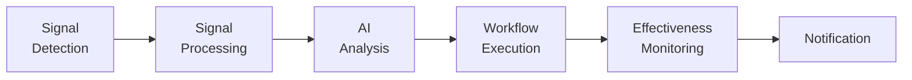

# Core Concepts

This page explains the key building blocks of Kubernaut: the data model, the services, and how a remediation flows through the system.

## The Remediation Pipeline

Every remediation in Kubernaut follows the same six-stage pipeline:


```mermaid
graph LR
    SD["Signal<br/>Detection"] --> SP["Signal<br/>Processing"]
    SP --> AA["AI<br/>Analysis"]
    AA --> WE["Workflow<br/>Execution"]
    WE --> EM["Effectiveness<br/>Monitoring"]
    EM --> NF["Notification"]
```

Each stage is represented by a **Custom Resource (CRD)** in Kubernetes. The **Remediation Orchestrator** coordinates the flow by creating child CRDs and watching their status.

## Custom Resources

### RemediationRequest

The top-level resource. Created by the Gateway when a signal arrives. Contains:

- **TargetResource** — The Kubernetes resource that triggered the alert (namespace, name, kind)
- **Signal metadata** — Alert name, signal type, labels, annotations, original payload
- **OverallPhase** — Current lifecycle phase (Pending → Processing → Analyzing → AwaitingApproval → Executing → Verifying → Completed/Failed/Blocked/TimedOut/Skipped/Cancelled)

The RemediationRequest is the "parent" — all other CRDs are children created by the Orchestrator.

### SignalProcessing

Created after a RemediationRequest is accepted. The Signal Processing controller enriches the signal with:

- **Kubernetes context** — Owner chain (Deployment → ReplicaSet → Pod), namespace labels and annotations, workload details (kind, name, labels), and custom labels
- **Environment classification** — Inferred from namespace labels or Rego policies (production, staging, development, test)
- **Priority assignment** — P0–P3 based on Rego policy evaluation or severity-based fallback
- **Business classification** — Business unit, service owner, criticality level, and SLA requirement (when labels are present)
- **Severity normalization** — Maps raw alert severity to a standard scale (critical, high, warning, info, unknown) via Rego policies with a configurable fallback matrix
- **Signal mode** — Reactive (something broke) or proactive (something is predicted to break)
- **Signal name normalization** — Normalizes the signal name for downstream matching while preserving the original for audit

### AIAnalysis

Created after signal enrichment completes. The AI Analysis controller:

1. Dispatches the enriched signal to **Kubernaut Agent** via an **`AgentSession` CRD** (v1.6+, DD-AA-KA-001) for a **two-invocation** LLM investigation (v1.3+):
    - **Invocation 1 (RCA)** — Root cause analysis using live cluster data (logs, events, resource state, metrics) via tools; also resolves the target resource's owner chain, spec hash, **remediation history** (DataStorage), and **infrastructure labels** (GitOps, Helm, service mesh, HPA, PDB) when resource-context tools are used
    - **Invocation 2 (Workflow selection)** — A **new** model session (no prior chat context) with structured RCA fields injected; the LLM discovers and selects a workflow from the catalog via a three-step protocol (`list_available_actions` → `list_workflows` → `get_workflow`), served from **Kubernaut Agent's own in-memory workflow catalog** (v1.6+; an informer-cache-backed watch over the `RemediationWorkflow`/`ActionType` CRDs, no DataStorage round trip) which applies label-based ranking, though the LLM drives the final selection; KA then **merges** the two invocations' results
2. Evaluates whether auto-approval is safe via a **Rego policy** (configurable confidence threshold)

KA owns the `AgentSession`, writing session ID, phase, and the curated result to its status; AA watches for completion. See [Investigation Pipeline](../architecture/kubernaut-agent-investigation.md) for the full two-invocation architecture and [AgentSession](../api-reference/crds.md#agentsession) for the CRD reference.

### RemediationApprovalRequest

Created when the AI Analysis confidence is below the approval threshold, or when the Rego policy requires human review. A human operator approves or rejects the remediation.

### WorkflowExecution

Created after approval (auto or human), with the selected workflow's full definition already embedded by the **Remediation Orchestrator** as an immutable `WorkflowRef` snapshot on `spec` — WorkflowExecution itself never queries the catalog at runtime. The Workflow Execution controller:

1. Reads the workflow definition from its own `spec.workflowRef` snapshot (no DataStorage or catalog lookup)
2. Validates dependencies (required Secrets, ConfigMaps)
3. Runs the remediation via **Tekton Pipelines** (multi-step), **Kubernetes Jobs** (single-step), or **Ansible (AWX/AAP)** (playbook-based)
4. Injects parameters (namespace, deployment name, etc.)

### EffectivenessAssessment

Created after the workflow completes successfully. The Effectiveness Monitor evaluates whether the fix actually resolved the issue:

- **Spec hash comparison** — Did the resource spec change as expected?
- **Health checks** — Is the workload healthy now?
- **Alert resolution** — Did the triggering alert stop firing? (via AlertManager)
- **Metric evaluation** — Did the triggering metric recover? (via Prometheus)

### NotificationRequest

Created after the effectiveness assessment completes (or earlier on escalation/manual review). The notification includes the full remediation outcome and effectiveness results. Delivers via configured channels:

- **Slack** — Rich messages with RCA summary, remediation outcome, and effectiveness score
- **Console / Log** — For development and testing
- **File** — For integration testing

## Phases

A `RemediationRequest` progresses through these phases:

| Phase | Description |
|---|---|
| **Pending** | Created by Gateway, waiting for Orchestrator pickup |
| **Processing** | Signal Processing is enriching the signal |
| **Analyzing** | AI Analysis is performing RCA and workflow selection |
| **AwaitingApproval** | Human approval required (low confidence or policy mandate) |
| **Executing** | Workflow is running the remediation |
| **Verifying** | Workflow succeeded; effectiveness assessment in progress |
| **Blocked** | Routing engine prevents progress; automatically retried after cooldown (see below) |
| **Completed** | Remediation finished successfully, or `NoActionRequired` / `ManualReviewRequired` outcome |
| **Failed** | Remediation failed at any stage (including human rejection, or Kubernaut Agent flagged human review with a selected workflow) |
| **TimedOut** | Phase timeout expired |
| **Skipped** | Remediation skipped (e.g., resource busy) |
| **Cancelled** | Remediation cancelled |

### Blocked Phase

The **Blocked** phase is a transient, non-terminal state. The Orchestrator's routing engine evaluates safety conditions before allowing a remediation to proceed. When a condition is met, the RR enters Blocked with a `blockReason`, a human-readable `blockMessage`, and (for time-based blocks) a `blockedUntil` timestamp. The RR is automatically requeued and will resume once the condition clears.

| Block Reason | Trigger | Default Cooldown |
|---|---|---|
| `ConsecutiveFailures` | 3+ consecutive failures on the same signal fingerprint | 1 hour |
| `DuplicateInProgress` | Another active RR with the same fingerprint is already being remediated | 30 s (recheck) |
| `ResourceBusy` | A WorkflowExecution is already running on the same target resource | 30 s (recheck) |
| `RecentlyRemediated` | The same workflow+target was successfully executed recently | 5 minutes |
| `ExponentialBackoff` | Progressive retry delay after failures (1 min to 10 min) | Adaptive |
| `UnmanagedResource` | Target namespace or resource lacks `kubernaut.ai/managed=true` | 5 s to 5 min (backoff) |
| `IneffectiveChain` | Consecutive remediations detected as ineffective via audit history | Escalates to manual review |

See [Troubleshooting](../operations/troubleshooting.md#stuck-in-blocked) for diagnostic steps.

## Signal Modes

Kubernaut classifies signals into two modes:

- **Reactive** — Responding to an active incident (e.g., `KubePodCrashLooping`, `KubePodOOMKilled`)
- **Proactive** — Responding to a predicted issue (e.g., Prometheus `predict_linear()` alerts for disk pressure, memory exhaustion)

Signal mode determines which prompt variant Kubernaut Agent uses for the investigation. In **reactive** mode, the LLM performs root cause analysis of an incident that has already occurred. In **proactive** mode, the prompt shifts to trend assessment and prevention — the LLM evaluates whether the predicted issue is likely to materialize and recommends preventive action (or concludes no action is needed).

## Resource Scope

Kubernaut uses a **label-based opt-in model**. Only namespaces and resources with the `kubernaut.ai/managed=true` label are eligible for remediation. The Gateway validates this label before creating a RemediationRequest.

```bash
# Opt a namespace into Kubernaut management
kubectl label namespace my-app kubernaut.ai/managed=true
```

## Workflow Catalog

Remediation workflows are defined as declarative **`RemediationWorkflow` CRDs**. The Auth Webhook's admission handler forwards every create/update/delete to **DataStorage**, which keeps the durable, queryable record used for audit and by other callers (e.g. the console). Each workflow has:

- **Identity** — Name (`metadata.name`), version, and structured description (what, whenToUse, whenNotToUse, preconditions) under `spec`
- **Action type** — Taxonomy type (e.g., `RestartPod`, `RollbackDeployment`, `IncreaseMemoryLimits`)
- **Labels** — Signal name, severity, environment, component, priority (with wildcard and multi-value support)
- **Parameters** — Typed inputs injected at runtime as environment variables (`UPPER_SNAKE_CASE`)
- **Execution config** — Engine (`job`, `tekton`, or `ansible`) plus engine-specific execution settings. Tekton workflows may reference OCI bundles for pipeline execution artifacts

!!! info "v1.6: discovery moved in-process to Kubernaut Agent"
    Through v1.5, all three discovery steps below were served by DataStorage over REST, with Kubernaut Agent acting as a thin proxy. **As of v1.6** (DD-WORKFLOW-019), Kubernaut Agent serves this protocol entirely from its own in-memory workflow catalog — an informer-cache-backed watch over the `RemediationWorkflow`/`ActionType` CRDs — with no DataStorage round trip on the investigation path. Filtering and label-match scoring behavior is unchanged; only where it executes changed. See [Workflow Selection](../architecture/workflow-selection.md) for the full detail.

During investigation, the LLM selects a workflow through a three-step discovery protocol:

1. **List action types** — Kubernaut Agent's own catalog returns available action types (e.g., `RestartPod`, `RollbackDeployment`), filtered by the signal's enriched labels (severity, environment, component, priority) and detected infrastructure labels (GitOps, Helm, service mesh)
2. **List workflows for action type** — The LLM picks an action type and retrieves matching workflows, which the catalog returns ordered by label-match scoring (though scores are not exposed to the LLM)
3. **Get workflow details** — The LLM selects a specific workflow and retrieves its full parameter schema to fill in values from the root cause analysis

The LLM makes the final selection decision based on workflow descriptions (`what`, `whenToUse`, `whenNotToUse`), detected infrastructure context (e.g., prefer git-based workflows when `gitOpsManaged=true`), and remediation history (avoid workflows that recently failed on the same target). See [Remediation Workflows](workflows.md) for the full schema reference and [Workflow Selection](../architecture/workflow-selection.md) for the discovery protocol's filtering/scoring internals.

## Next Steps

- [Signals & Alert Routing](signals.md) — How signals enter the system
- [Remediation Workflows](workflows.md) — Writing your own workflows
- [Human Approval](approval.md) — Understanding the approval flow
