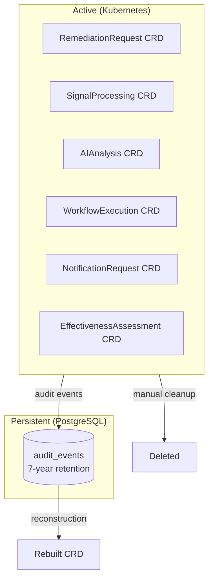

# Data Lifecycle

!!! info "Architecture reference"
    For the database schema, Valkey DLQ, and reconstruction internals, see [Architecture: Data Persistence](../architecture/data-persistence.md).

Kubernaut has a two-tier data model: **CRDs** in Kubernetes for active remediations, and **persistent audit data** in PostgreSQL for long-term compliance and analysis.

## CRD Retention

Custom Resources (CRDs) represent the active state of a remediation. The CRD type definition includes a `retentionExpiryTime` field intended for automatic cleanup after terminal phases, but **CRD TTL enforcement is not yet implemented** — terminal CRDs remain in Kubernetes indefinitely until manually deleted.

!!! note "Planned Feature"
    Automatic CRD cleanup (24h TTL after terminal phase) is planned but depends on full CRD reconstruction support being implemented first, ensuring no data loss.

This means:

- **Active remediations** are always visible via `kubectl get remediationrequests`
- **Completed remediations** persist until manually deleted
- **No data is lost** because every stage is persisted as audit events in PostgreSQL

## PostgreSQL as the System of Record

While CRDs are ephemeral, the audit trail in PostgreSQL is permanent. Every service emits detailed audit events throughout the remediation lifecycle (see [Audit & Observability](audit-and-observability.md)).

| Storage | Lifetime | Purpose |
|---|---|---|
| Kubernetes CRDs | Indefinite (TTL cleanup planned) | Active state, `kubectl` visibility, controller reconciliation |
| PostgreSQL `audit_events` | 7 years (configured, deletion deferred to v1.2) | Compliance, reconstruction, analytics, post-mortems |

## RemediationRequest Reconstruction

Because audit events capture the full context of every stage, Kubernaut can **reconstruct a complete RemediationRequest** from audit data — even after the CRD has expired.

The DataStorage service provides a reconstruction endpoint:

```
POST /api/v1/audit/remediation-requests/{correlation_id}/reconstruct
```

See [Architecture: Data Persistence](../architecture/data-persistence.md#remediationrequest-reconstruction) for the full reconstruction pipeline and source event mapping.

### Use Cases

- **SOC2 audits** — Produce the complete remediation record for any historical incident
- **Post-mortems** — Reconstruct what happened, when, and why
- **Compliance reports** — Generate evidence of automated remediation actions and human approvals
- **Debugging** — Investigate a remediation that completed days ago

## Data Flow Summary



## Next Steps

- [Audit & Observability](audit-and-observability.md) — What gets recorded and how
- [Architecture: Data Persistence](../architecture/data-persistence.md) — PostgreSQL schema and partitioning details
- [API Reference: DataStorage](../api-reference/datastorage-api.md) — Reconstruction endpoint reference
