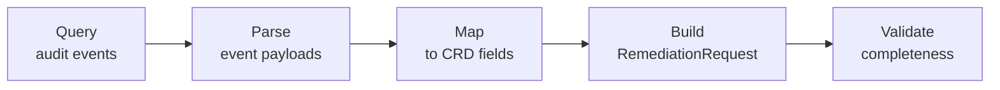
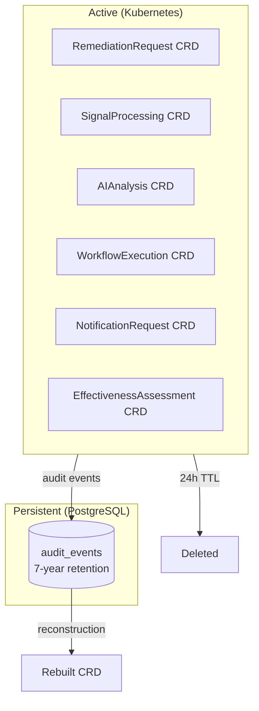

# Data Lifecycle

Kubernaut has a two-tier data model: **ephemeral CRDs** in Kubernetes for active remediations, and **persistent audit data** in PostgreSQL for long-term compliance and analysis.

## CRD Retention

Custom Resources (CRDs) represent the active state of a remediation. Once a `RemediationRequest` reaches a terminal phase (Completed, Failed, TimedOut, Skipped, or Cancelled), the CRD is retained for **24 hours** and then automatically cleaned up.

This means:

- **Active remediations** are always visible via `kubectl get remediationrequests`
- **Completed remediations** remain visible for 24 hours for debugging
- **After 24 hours**, the CRD is deleted — but nothing is lost

The 24-hour window is controlled by the `retentionExpiryTime` field on the RemediationRequest status, which is set to `now + 24h` when the remediation reaches a terminal phase.

## PostgreSQL as the System of Record

While CRDs are ephemeral, the audit trail in PostgreSQL is permanent. Every service emits detailed audit events throughout the remediation lifecycle (see [Audit & Observability](audit-and-observability.md)).

| Storage | Lifetime | Purpose |
|---|---|---|
| Kubernetes CRDs | 24 hours after completion | Active state, `kubectl` visibility, controller reconciliation |
| PostgreSQL `audit_events` | 7 years (default) | Compliance, reconstruction, analytics, post-mortems |

## RemediationRequest Reconstruction

Because audit events capture the full context of every stage, Kubernaut can **reconstruct a complete RemediationRequest** from audit data — even after the CRD has expired.

### How It Works

The DataStorage service provides a reconstruction endpoint:

```
POST /api/v1/audit/remediation-requests/{correlation_id}/reconstruct
```

Reconstruction follows a 5-phase pipeline:



1. **Query** — Fetch all audit events with the matching `correlation_id`
2. **Parse** — Extract CRD field data from event payloads
3. **Map** — Aggregate data into spec and status structures
4. **Build** — Produce a complete RemediationRequest object
5. **Validate** — Check for completeness and structural validity

### What Gets Reconstructed

| Field | Source Event |
|---|---|
| `spec.signalName`, `signalType`, `signalLabels` | `gateway.signal.received` |
| `spec.originalPayload` | `gateway.signal.received` |
| `spec.signalAnnotations` | `gateway.signal.received` |
| `status.selectedWorkflowRef` | `workflowexecution.selection.completed` |
| `status.executionRef` | `workflowexecution.execution.started` |
| `status.timeoutConfig` | `orchestrator.lifecycle.created` |

!!! note "Current Scope"
    Reconstruction is currently available for **RemediationRequest** CRDs only. Support for other CRD types is planned for future versions.

### Use Cases

- **SOC2 audits** — Produce the complete remediation record for any historical incident
- **Post-mortems** — Reconstruct what happened, when, and why
- **Compliance reports** — Generate evidence of automated remediation actions and human approvals
- **Debugging** — Investigate a remediation that completed days ago

## Data Flow Summary



## Next Steps

- [Audit & Observability](audit-and-observability.md) — What gets recorded and how
- [Architecture: Data Persistence](../architecture/data-persistence.md) — PostgreSQL schema and partitioning details
- [API Reference: DataStorage](../api-reference/datastorage-api.md) — Reconstruction endpoint reference
