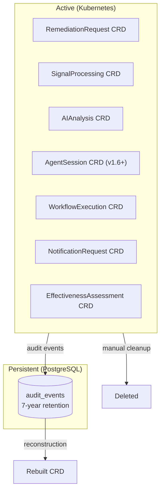

# Data Lifecycle

!!! info "Architecture reference"
    For the database schema, Valkey DLQ, and reconstruction internals, see [Architecture: Data Persistence](../architecture/data-persistence.md).

Kubernaut has a two-tier data model: **CRDs** in Kubernetes for active remediations, and **persistent audit data** in PostgreSQL for long-term compliance and analysis.

## CRD Retention

Custom Resources (CRDs) represent the active state of a remediation. From **v1.4**, Kubernaut enforces a **24-hour retention TTL** on terminal `RemediationRequest` CRDs (#265). When a remediation reaches a terminal phase (Completed, Failed, Blocked, TimedOut, Skipped, Cancelled), the `retentionExpiryTime` field is set to 24 hours from completion. After expiry, the CRD is automatically cleaned up.

This means:

- **Active remediations** are always visible via `kubectl get remediationrequests`
- **Completed remediations** are retained for 24 hours, then cleaned up automatically
- **No data is lost** because every stage is persisted as audit events in PostgreSQL before CRD cleanup
- The retention period is configurable via `retention.period` in Helm values
- **`AgentSession` (v1.6+)** has no independent retention timer -- it's owned by `AIAnalysis` (owner reference), so it cascades deletion transitively through the same `RemediationRequest` -> `AIAnalysis` -> `AgentSession` chain when the parent RR expires. See [API Reference: AgentSession](../api-reference/crds.md#agentsession).

## PostgreSQL as the System of Record

While CRDs are ephemeral, the audit trail in PostgreSQL is permanent. Every service emits detailed audit events throughout the remediation lifecycle (see [Audit & Observability](audit-and-observability.md)).

| Storage | Lifetime | Purpose |
|---|---|---|
| Kubernetes CRDs | 24h after terminal phase (v1.4, configurable) | Active state, `kubectl` visibility, controller reconciliation |
| PostgreSQL `audit_events` | 7 years (configured default; deletion not yet enforced — see [kubernaut#485](https://github.com/jordigilh/kubernaut/issues/485)) | Compliance, reconstruction, analytics, post-mortems |

## RemediationRequest Reconstruction

Because audit events capture the full context of every stage, Kubernaut can **reconstruct a complete RemediationRequest** from audit data — even after the CRD has expired. The DataStorage service provides a reconstruction endpoint that rebuilds the full spec and status from typed audit payloads. See [Architecture: Data Persistence](../architecture/data-persistence.md#remediationrequest-reconstruction) for the endpoint, reconstruction pipeline, and source event mapping.

### Use Cases

- **Compliance audits (SOC2)** — Produce the complete remediation record for any historical incident
- **Post-mortems** — Reconstruct what happened, when, and why
- **Compliance reports** — Generate evidence of automated remediation actions and human approvals
- **Debugging** — Investigate a remediation that completed days ago

## Data Flow Summary

```mermaid
graph TB
    subgraph Active["Active (Kubernetes)"]
        RR[RemediationRequest CRD]
        SP[SignalProcessing CRD]
        AA[AIAnalysis CRD]
        AS["AgentSession CRD (v1.6+)"]
        WE[WorkflowExecution CRD]
        NR[NotificationRequest CRD]
        EA[EffectivenessAssessment CRD]
    end

    subgraph Persistent["Persistent (PostgreSQL)"]
        AE[(audit_events<br/>7-year retention)]
    end

    Active -->|audit events| AE
    Active -->|manual cleanup| DEL[Deleted]
    AE -->|reconstruction| REBUILD[Rebuilt CRD]
```

## Next Steps

- [Audit & Observability](audit-and-observability.md) — What gets recorded and how
- [Architecture: Data Persistence](../architecture/data-persistence.md) — PostgreSQL schema and partitioning details
- [API Reference: DataStorage](../api-reference/datastorage-api.md) — Reconstruction endpoint reference
