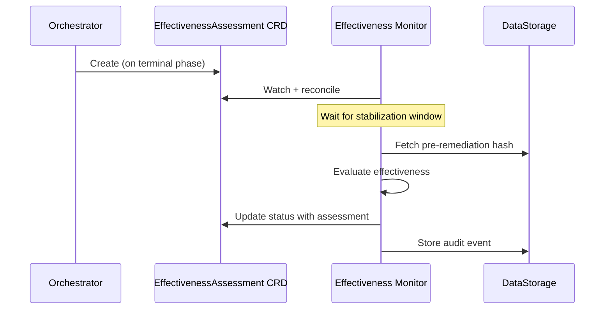

# Effectiveness Monitoring

After a remediation workflow completes, Kubernaut evaluates whether the fix actually resolved the issue. This is handled by the **Effectiveness Monitor** — a CRD controller that watches `EffectivenessAssessment` resources.

## How It Works

When a remediation reaches a terminal phase, the Orchestrator creates an `EffectivenessAssessment` CRD. The Effectiveness Monitor then:

1. **Waits for stabilization** — A configurable window (default: 5 minutes) allows the system to settle after the fix
2. **Evaluates effectiveness** through multiple dimensions
3. **Records the assessment** in the audit trail



## Assessment Dimensions

| Dimension | Method | What It Checks |
|---|---|---|
| **Spec Hash** | Compare pre/post resource spec | Did the resource spec change as expected? |
| **Health Status** | Kubernetes conditions | Are all pods ready, deployment available? |
| **Metric Recovery** | Prometheus / AlertManager (optional) | Did the triggering metric recover? |
| **Validity Window** | Time-based check | Is the assessment still within the validity window? |

### Spec Hash Comparison

Before remediation, the system records a hash of the target resource's spec. After remediation, it compares:

- **Hash changed** → The resource was modified (expected for most remediations)
- **Hash unchanged** → No spec change detected (may indicate the fix didn't apply)

### Health Checks

The monitor checks Kubernetes-native health signals:

- Pod `Ready` conditions
- Deployment `Available` condition
- No `CrashLoopBackOff` or `OOMKilled` events

### Metric Evaluation

When Prometheus and AlertManager are configured, the monitor can check whether the triggering alert has resolved.

## Async Propagation Delays

Some remediations involve **asynchronous propagation** — for example, a GitOps tool syncing changes or an operator reconciling after a CR update. Kubernaut accounts for this with configurable delays:

| Delay | Default | Purpose |
|---|---|---|
| `stabilizationWindow` | 5 minutes | Time to wait after remediation before assessing |
| `gitOpsSyncDelay` | 3 minutes | Expected ArgoCD/Flux sync time |
| `operatorReconcileDelay` | 1 minute | Expected operator reconciliation time |

These are configurable via Helm values:

```yaml
remediationorchestrator:
  config:
    effectivenessAssessment:
      stabilizationWindow: "5m"
    asyncPropagation:
      gitOpsSyncDelay: "3m"
      operatorReconcileDelay: "1m"
```

## Effectiveness Scoring

The assessment produces an effectiveness score that captures:

- Whether the spec changed as expected
- Whether the resource is healthy
- Whether triggering metrics recovered
- How long the fix took to stabilize

This data feeds into **continuous learning** — over time, Kubernaut tracks which workflows are most effective for which incident types, enabling better workflow selection.

## Next Steps

- [Audit & Observability](audit-and-observability.md) — How assessments are recorded
- [Configuration Reference](configuration.md) — Tuning propagation delays and stabilization
- [Architecture: Effectiveness Assessment](../architecture/effectiveness.md) — Deep-dive into the timing model
