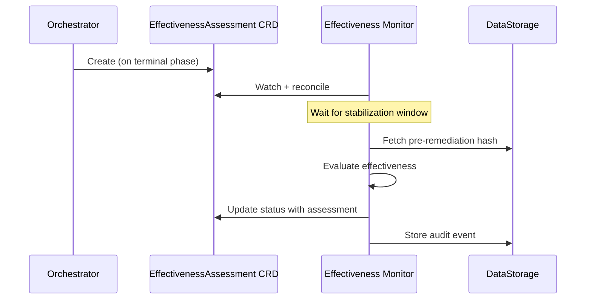
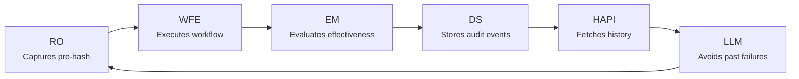

# Effectiveness Monitoring

!!! info "Architecture reference"
    For the CRD specification, phase state machine, and timing model, see [Architecture: Effectiveness Assessment](../architecture/effectiveness.md).

After a remediation workflow completes, Kubernaut evaluates whether the fix actually resolved the issue. This is handled by the **Effectiveness Monitor** — a CRD controller that watches `EffectivenessAssessment` resources.

## How It Works

When a remediation reaches a terminal phase, the Orchestrator creates an `EffectivenessAssessment` CRD. The Effectiveness Monitor then:

1. **Waits for stabilization** — A configurable window (default: 5 minutes) allows the system to settle after the fix
2. **Evaluates effectiveness** through multiple dimensions
3. **Records the assessment** in the audit trail



The EM evaluates four components (health, alert resolution, metrics, and spec hash). See [Architecture: Effectiveness Assessment](../architecture/effectiveness.md#assessment-components) for component weights and scoring details.

!!! note "Alert Decay Detection"
    When a Prometheus alert transitions from firing to resolved, the AlertManager lookback window may cause the alert to appear active even though the resource is healthy. The EM detects this by comparing health status with alert state, and re-queues the assessment until the alert clears. The `alertDecayRetries` field on the `EffectivenessAssessment` status tracks the number of decay re-checks. See [Architecture: Alert Decay Detection](../architecture/effectiveness.md#alert-decay-detection-dd-em-003) for details.

## Async Propagation Delays

Some remediations involve **asynchronous propagation** — for example, a GitOps tool syncing changes or an operator reconciling after a CR update. Kubernaut accounts for this with configurable delays:

| Delay | Default | Purpose |
|---|---|---|
| `stabilizationWindow` | 5 minutes | Time to wait after remediation before assessing |
| `gitOpsSyncDelay` | 3 minutes | Expected ArgoCD/Flux sync time |
| `operatorReconcileDelay` | 1 minute | Expected operator reconciliation time |

These are configurable via Helm values:

```yaml
remediationorchestrator:
  config:
    effectivenessAssessment:
      stabilizationWindow: "5m"
    asyncPropagation:
      gitOpsSyncDelay: "3m"
      operatorReconcileDelay: "1m"
```

## Feedback Loop: How Effectiveness Data Influences Future Decisions

The effectiveness assessment is not just a report -- it creates a continuous feedback loop that makes Kubernaut's workflow selection smarter over time.



### How EA Data Becomes Remediation History

The Effectiveness Monitor emits typed audit events to DataStorage:

- `effectiveness.health.assessed` -- Pod health status, restart delta, crash loops, OOM
- `effectiveness.alert.assessed` -- Whether the triggering alert resolved
- `effectiveness.metrics.assessed` -- CPU/memory before/after, latency, error rate
- `effectiveness.hash.computed` -- Pre-remediation and post-remediation spec hashes, whether they match
- `effectiveness.assessment.completed` -- Final assessment reason and duration

The Remediation Orchestrator also emits `remediation.workflow_created` with the pre-remediation spec hash. These events are stored in the `audit_events` table and indexed by `target_resource` and `pre_remediation_spec_hash`.

### How History Is Queried

When the next incident hits the same resource, HAPI calls the DataStorage remediation history endpoint with the current spec hash. DataStorage **joins** RO and EM events by `correlation_id` to build a complete picture: which workflow was used, what the effectiveness score was, whether the hash changed, and what the health checks showed.

### How the Spec Hash Creates a Configuration Fingerprint

- **Pre-remediation hash** (captured by RO before execution) and **post-remediation hash** (captured by EM after stabilization) create a before/after pair
- When a future incident occurs, HAPI computes the current spec hash and DataStorage's **three-way comparison** tells the LLM:
    - `"preRemediation"` -- Current config matches a previously-remediated state (**regression**)
    - `"postRemediation"` -- Config unchanged since last remediation
    - `"none"` -- Config has changed (fresh start)

This allows the LLM to distinguish between "this exact configuration was tried before and it failed" versus "the configuration changed, so previous results may not apply."

### Why This Matters for Operators

The richer the effectiveness data, the better the LLM's future decisions:

- **With AlertManager and Prometheus configured** -- History includes alert resolution status, CPU/memory deltas, error rate changes, and latency improvements. The LLM can see that "RestartPod resolved the alert but CPU usage remained high" and choose a different approach next time.
- **Without AlertManager/Prometheus** -- History is limited to health checks and hash comparison. The LLM can still detect regressions and track which workflows succeeded or failed, but with less nuance.

Operators should ensure the Effectiveness Monitor has access to AlertManager and Prometheus for the richest possible history data.

For a detailed technical breakdown of how history influences the LLM's workflow selection, see [Investigation Pipeline: How Remediation History Influences the LLM](../architecture/hapi-investigation.md#how-remediation-history-influences-the-llm).

## Next Steps

- [Audit & Observability](audit-and-observability.md) — How assessments are recorded
- [Configuration Reference](configuration.md) — Tuning propagation delays and stabilization
- [Architecture: Effectiveness Assessment](../architecture/effectiveness.md) — Deep-dive into the timing model
