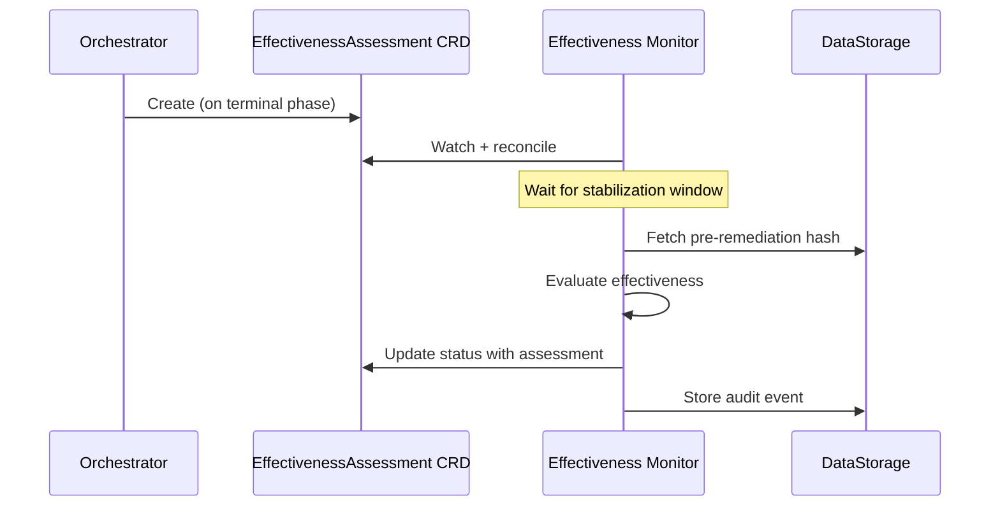
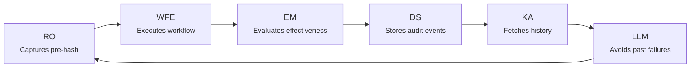

# Effectiveness Monitoring

!!! info "Architecture reference"
    For the CRD specification, phase state machine, and timing model, see [Architecture: Effectiveness Assessment](../architecture/effectiveness.md).

After a remediation workflow completes, Kubernaut evaluates whether the fix actually resolved the issue. This is handled by the **Effectiveness Monitor** — a CRD controller that watches `EffectivenessAssessment` resources.

<div style="max-width:100%;overflow-x:auto;margin:1.5rem 0">
<svg xmlns="http://www.w3.org/2000/svg" viewBox="0 0 860 400" style="width:100%;height:auto" font-family="Inter, -apple-system, BlinkMacSystemFont, 'Segoe UI', sans-serif" aria-label="Diagram: LLM learns from failure across two cycles">
  <rect width="860" height="400" fill="#FFFFFF"/>
  <defs>
    <clipPath id="eff-card-p1"><rect x="16" y="16" width="400" height="310" rx="10"/></clipPath>
    <clipPath id="eff-card-p2"><rect x="444" y="16" width="400" height="310" rx="10"/></clipPath>
  </defs>
  <rect x="16" y="16" width="400" height="310" rx="10" fill="#FFFFFF" stroke="#E2E8F0"/>
  <rect x="16" y="16" width="400" height="5" fill="#0F172A" clip-path="url(#eff-card-p1)"/>
  <text x="28" y="43" fill="#0F172A" font-size="16" font-weight="700">Cycle 1: Automated Fix</text>
  <line x1="28" y1="54" x2="404" y2="54" stroke="#F0F0F0"/>
  <text x="28" y="72" fill="#0891B2" font-size="12" font-weight="700">Signal</text>
  <text x="28" y="88" fill="#0F172A" font-size="12">OOMKill on ml-worker (64 Mi limit)</text>
  <line x1="28" y1="96" x2="404" y2="96" stroke="#F0F0F0"/>
  <text x="28" y="114" fill="#0891B2" font-size="12" font-weight="700">AI Action</text>
  <text x="28" y="130" fill="#0F172A" font-size="12">LLM investigates with 36 tools</text>
  <text x="28" y="146" fill="#0F172A" font-size="12">Selects: IncreaseMemoryLimits</text>
  <text x="28" y="162" fill="#0F172A" font-size="12">Patches limit: 64 Mi &#x2192; 128 Mi</text>
  <line x1="28" y1="170" x2="404" y2="170" stroke="#F0F0F0"/>
  <text x="28" y="188" fill="#0891B2" font-size="12" font-weight="700">Result</text>
  <rect x="28" y="196" width="352" height="48" rx="6" fill="#FEF2F2" stroke="#DC2626"/>
  <text x="40" y="214" fill="#DC2626" font-size="12" font-weight="700">healthScore = 0</text>
  <text x="40" y="232" fill="#334155" font-size="10">OOMKill recurs after 16s (leak at 8 Mi/s)</text>
  <text x="28" y="318" fill="#94A3B8" font-size="9">Outcome persisted for next investigation</text>
  <rect x="444" y="16" width="400" height="310" rx="10" fill="#FFFFFF" stroke="#E2E8F0"/>
  <rect x="444" y="16" width="400" height="5" fill="#DC2626" clip-path="url(#eff-card-p2)"/>
  <text x="456" y="43" fill="#DC2626" font-size="16" font-weight="700">Cycle 2: Escalation</text>
  <line x1="456" y1="54" x2="832" y2="54" stroke="#F0F0F0"/>
  <text x="456" y="72" fill="#DC2626" font-size="12" font-weight="700">LLM Reads History</text>
  <text x="456" y="88" fill="#0F172A" font-size="12">Previous fix scored 0 &#x2014; regression detected</text>
  <text x="456" y="104" fill="#0F172A" font-size="12">&quot;Do NOT repeat failed workflows&quot;</text>
  <line x1="456" y1="112" x2="832" y2="112" stroke="#F0F0F0"/>
  <text x="456" y="130" fill="#DC2626" font-size="12" font-weight="700">AI Decision</text>
  <text x="456" y="146" fill="#0F172A" font-size="12">Evaluates all candidate workflows</text>
  <text x="456" y="162" fill="#0F172A" font-size="12">Rejects each: &quot;memory limits can&apos;t fix leaks&quot;</text>
  <line x1="456" y1="170" x2="832" y2="170" stroke="#F0F0F0"/>
  <text x="456" y="188" fill="#DC2626" font-size="12" font-weight="700">Outcome</text>
  <rect x="456" y="196" width="352" height="48" rx="6" fill="#F8FAFC" stroke="#94A3B8"/>
  <text x="468" y="214" fill="#0F172A" font-size="12" font-weight="700">ManualReviewRequired</text>
  <text x="468" y="232" fill="#334155" font-size="10">Notification sent to human via Slack/PagerDuty</text>
  <text x="456" y="318" fill="#94A3B8" font-size="9">Total: 2 cycles, ~8 min, 216K tokens, 37 tool calls</text>
  <text x="430" y="178" fill="#94A3B8" font-size="24" font-weight="700" text-anchor="middle">&#x2192;</text>
  <text x="430" y="194" fill="#DC2626" font-size="10" font-weight="700" text-anchor="middle">recurs</text>
  <rect x="16" y="340" width="828" height="44" rx="8" fill="#0891B2"/>
  <text x="430" y="368" fill="#FFFFFF" font-size="14" font-weight="700" text-anchor="middle">The platform knows when to stop automating and hand off to a human.</text>
</svg>
</div>

## Phase state and tuning

Assessments normally progress through pending, propagation, stabilization, and active scoring to **Completed**. If the EM cannot finish — for example the target resource was deleted, or Prometheus stays unavailable after retries — the CRD moves to a terminal **`Failed`** phase. See [Architecture: Phase State Machine](../architecture/effectiveness.md#phase-state-machine).

Helm values under `effectivenessmonitor.config.assessment` include `stabilizationWindow`, `validityWindow`, and `maxConcurrentReconciles`. Requeue cadence during in-progress assessment follows controller timing derived from scrape windows. See [Configuration Reference](configuration.md#effectivenessmonitor).

The remediation orchestrator and effectiveness monitor include **mounted ConfigMap `.data` / `.binaryData`** in the canonical spec hash (Secrets are excluded). If a referenced ConfigMap changes between pre- and post-capture, hashes will differ — treat that as a real configuration change for effectiveness comparison.

## How It Works

When a remediation reaches a terminal phase, the Orchestrator creates an `EffectivenessAssessment` CRD. The Effectiveness Monitor then:

1. **Waits for stabilization** — The Remediation Orchestrator creates the EA with a **stabilization window** (default: **5 minutes**, from `remediationorchestrator.config.effectivenessAssessment.stabilizationWindow`). The Effectiveness Monitor enforces this window using `EA.spec.config.stabilizationWindow` — the EM does not start running assessment scorers until this duration has elapsed after the EA's creation. The stabilization window that governs the EM reconciler behavior comes from the **EA spec** (set by the RO), not from the EM's own Helm config.
2. **Evaluates effectiveness** through multiple dimensions
3. **Records the assessment** in the audit trail


```mermaid
sequenceDiagram
    participant RO as Orchestrator
    participant EA as EffectivenessAssessment CRD
    participant EM as Effectiveness Monitor
    participant DS as DataStorage

    RO->>EA: Create (on terminal phase)
    EM->>EA: Watch + reconcile
    Note over EM: Wait for stabilization window
    EM->>DS: Fetch pre-remediation hash
    EM->>EM: Evaluate effectiveness
    EM->>EA: Update status with assessment
    EM->>DS: Store audit event
```

The EM evaluates four components (health, alert resolution, metrics, and spec hash). See [Architecture: Effectiveness Assessment](../architecture/effectiveness.md#assessment-components) for component weights and scoring details.

**`Inconclusive` is not an EA value.** When verification finishes, the **Remediation Orchestrator** may set the RR outcome to `Inconclusive` (or `Remediated`) from EA alert results — that logic lives in the RO, not the EM. See [Architecture: Remediation outcome: Inconclusive](../architecture/effectiveness.md#remediation-outcome-inconclusive-not-an-assessment-reason).

!!! note "Alert Decay Detection"
    When a Prometheus alert transitions from firing to resolved, the AlertManager lookback window may cause the alert to appear active even though the resource is healthy. The EM detects this by comparing health status with alert state, and re-queues the assessment until the alert clears. The `alertDecayRetries` field on the `EffectivenessAssessment` status tracks the number of decay re-checks. See [Architecture: Alert Decay Detection](../architecture/effectiveness.md#alert-decay-detection-dd-em-003) for details.

## Async Propagation Delays

Some remediations involve **asynchronous propagation** — for example, a GitOps tool syncing changes or an operator reconciling after a CR update. Kubernaut accounts for this with configurable delays:

| Delay | Default | Purpose |
|---|---|---|
| `stabilizationWindow` | 5 minutes | Time to wait after remediation before assessing |
| `gitOpsSyncDelay` | 3 minutes | Expected ArgoCD/Flux sync time |
| `operatorReconcileDelay` | 1 minute | Expected operator reconciliation time |

These are configurable via Helm values:

```yaml
remediationorchestrator:
  config:
    effectivenessAssessment:
      stabilizationWindow: "5m"
    asyncPropagation:
      gitOpsSyncDelay: "3m"
      operatorReconcileDelay: "1m"
```

## Feedback Loop: How Effectiveness Data Influences Future Decisions

The effectiveness assessment is not just a report -- it creates a continuous feedback loop that makes Kubernaut's workflow selection smarter over time.


```mermaid
flowchart LR
    RO["RO<br/><small>Captures pre-hash</small>"] --> WFE["WFE<br/><small>Executes workflow</small>"]
    WFE --> EM["EM<br/><small>Evaluates effectiveness</small>"]
    EM --> DS["DS<br/><small>Stores audit events</small>"]
    DS --> KA["KA<br/><small>Fetches history</small>"]
    KA --> LLM["LLM<br/><small>Avoids past failures</small>"]
    LLM --> RO
```

### How EA Data Becomes Remediation History

The Effectiveness Monitor emits typed audit events to DataStorage:

- `effectiveness.health.assessed` -- Pod health status, restart delta, crash loops, OOM
- `effectiveness.alert.assessed` -- Whether the triggering alert resolved
- `effectiveness.metrics.assessed` -- CPU/memory before/after, latency, error rate
- `effectiveness.hash.computed` -- Pre-remediation and post-remediation spec hashes, whether they match
- `effectiveness.assessment.completed` -- Final assessment reason and duration

The Remediation Orchestrator also emits `remediation.workflow_created` with the pre-remediation spec hash. These events are stored in the `audit_events` table and indexed by `target_resource` and `pre_remediation_spec_hash`.

### How History Is Queried

When the next incident hits the same resource, Kubernaut Agent calls the DataStorage remediation history endpoint with the current spec hash. DataStorage **joins** RO and EM events by `correlation_id` to build a complete picture: which workflow was used, what the effectiveness score was, whether the hash changed, and what the health checks showed.

### How the Spec Hash Creates a Configuration Fingerprint

- **Pre-remediation hash** (captured by RO before execution) and **post-remediation hash** (captured by EM after stabilization) create a before/after pair
- When a future incident occurs, Kubernaut Agent computes the current spec hash and DataStorage's **three-way comparison** tells the LLM:
    - `"preRemediation"` -- Current config matches a previously-remediated state (**regression**)
    - `"postRemediation"` -- Config unchanged since last remediation
    - `"none"` -- Config has changed (fresh start)

This allows the LLM to distinguish between "this exact configuration was tried before and it failed" versus "the configuration changed, so previous results may not apply."

### Why This Matters for Operators

The richer the effectiveness data, the better the LLM's future decisions:

- **With AlertManager and Prometheus configured** -- History includes alert resolution status, CPU/memory deltas, error rate changes, and latency improvements. The LLM can see that "RestartPod resolved the alert but CPU usage remained high" and choose a different approach next time.
- **Without AlertManager/Prometheus** -- History is limited to health checks and hash comparison. The LLM can still detect regressions and track which workflows succeeded or failed, but with less nuance.

Operators should ensure the Effectiveness Monitor has access to AlertManager and Prometheus for the richest possible history data.

For a detailed technical breakdown of how history influences the LLM's workflow selection, see [Investigation Pipeline: How Remediation History Influences the LLM](../architecture/kubernaut-agent-investigation.md#how-remediation-history-influences-the-llm).

## Next Steps

- [Audit & Observability](audit-and-observability.md) — How assessments are recorded
- [Configuration Reference](configuration.md) — Tuning propagation delays and stabilization
- [Architecture: Effectiveness Assessment](../architecture/effectiveness.md) — Deep-dive into the timing model
