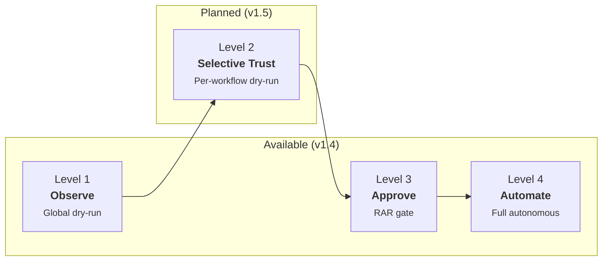

# Building Confidence with Kubernaut

Operators rarely hand full control of cluster remediation to an AI on day one. Kubernaut provides an incremental **Trust Ladder** — a four-level graduation path that lets teams build confidence at their own pace, starting with full human oversight and progressing toward autonomous remediation as trust grows.

## The Trust Ladder



| Level | Name | Human Involvement | Available |
|---|---|---|---|
| **1** | **Observe** | Operator sees what Kubernaut *would* do — no execution | **v1.4** (global dry-run) |
| **2** | Selective Trust | Trusted workflows execute; new ones stay in dry-run | v1.5 (per-workflow dry-run) |
| **3** | **Approve** | Rego policy gates remediation via RAR — operator approves/rejects | **v1.4** |
| **4** | **Automate** | Matched workflows execute without human intervention | **v1.4** |

Operators typically start at Level 1 (observe) or Level 3 (approve) and graduate individual workflows or entire namespaces to Level 4 as they gain confidence in Kubernaut's decision-making.

---

## Level 3: Approve (Available Now) {: #level-3-approve }

At this level, the Rego approval policy determines which remediations require human review. When `require_approval` evaluates to `true`, a **RemediationApprovalRequest (RAR)** is created before execution. The operator reviews Kubernaut's recommendation — the selected workflow, confidence score, root cause analysis, and detected infrastructure labels — and either approves or rejects it.

### How it works

1. Alert arrives → Signal Processing enriches it → Kubernaut Agent investigates root cause
2. Kubernaut Agent selects a workflow with a confidence score
3. The [Rego approval policy](approval.md) evaluates the selection and creates a **RAR** if approval is needed
4. Operator receives a notification with the full RCA and proposed remediation
5. Operator **approves** (execution proceeds), **rejects** (remediation stops), or **overrides** (substitutes workflow parameters via `WorkflowOverride`)
6. If no action is taken within the configured timeout, the RAR expires (default: **15 minutes**, configurable via `spec.requiredBy`)

### Configuration

The approval gate is controlled by the Rego policy deployed in the `aianalysis-policies` ConfigMap. The Helm chart does not ship a default policy — operators must supply one via `aianalysis.policies.content` or `aianalysis.policies.existingConfigMap`.

A typical starter policy requires approval for:

- **Production namespaces** (case-insensitive)
- **Sensitive resource kinds** (Node, StatefulSet)
- **Missing remediation targets** (safety net)
- **Low-confidence selections** (below `aianalysis.rego.confidenceThreshold`, default **0.8**)

Non-production namespaces with a valid remediation target and high confidence auto-approve.

To **require approval for everything** (strictest Level 3), replace the default policy with:

```rego
package aianalysis.approval

default require_approval := true
```

To adjust the confidence threshold for approval:

```yaml
# Helm values
aianalysis:
  rego:
    confidenceThreshold: "0.9"  # Require approval below 90% confidence (default: 0.8)
```

### Operator workflow overrides (v1.4)

When approving a RAR, operators can substitute the AI-selected workflow or adjust its parameters via `status.workflowOverride`. Override requests are validated by the authwebhook and recorded in the audit trail. See [Operator Workflow Overrides](approval.md#operator-workflow-overrides-v14) for details.

### Alignment gate (v1.4)

When shadow-agent alignment is enabled, Kubernaut runs a secondary AI evaluation to verify the primary agent's recommendation. If alignment fails, the pipeline creates a **ManualReviewRequired** notification and stops execution — even if the Rego policy would have auto-approved. This provides an additional safety layer independent of the trust level.

### Graduation signals

You're ready to graduate a workflow to Level 4 when:

- The Effectiveness Monitor consistently scores remediations as successful (`Full` assessment reason with high weighted scores)
- You've approved the same workflow type multiple times without rejecting
- The workflow targets non-sensitive resources in well-understood namespaces
- Your team is comfortable with the workflow's blast radius

### References

- [Human Approval](approval.md) — full RAR lifecycle, Rego policy evaluation, and operator actions
- [AIAnalysis Approval Policy](configmap-approval.md) — ConfigMap reference and default behavior
- [Rego Policies](policies.md) — approval policy input fields and rules

---

## Level 4: Automate (Available Now) {: #level-4-automate }

At this level, matched workflows execute without human intervention. The operator monitors outcomes via notifications and Effectiveness Monitor dashboards.

### How it works

1. Alert arrives → Signal Processing → Kubernaut Agent → workflow selected
2. Rego policy evaluates and **does not require approval** (auto-approved)
3. Workflow executes immediately
4. Operator receives completion/failure notifications
5. Effectiveness Monitor verifies the fix worked (health checks, alert resolution, spec hash comparison, metrics)
6. Effectiveness scores feed back into future investigations

### Configuration

Auto-approval happens when the Rego policy returns `require_approval := false`. With the default policy, this occurs for:

- Non-production namespaces (`staging`, `development`, `qa`, `test`)
- Non-sensitive resource kinds (anything other than Node/StatefulSet)
- Valid remediation target present

To allow **specific production workflows** to run autonomously, customize the Rego policy:

```rego
package aianalysis.approval

import rego.v1

default require_approval := true

require_approval := false if {
    not is_production
}

require_approval := false if {
    is_production
    input.remediation_target.kind != "Node"
    input.remediation_target.kind != "StatefulSet"
    input.detected_labels["workflow_name"] in trusted_production_workflows
}

trusted_production_workflows := {
    "crashloop-rollback-v1",
    "restart-pod-v1",
    "increase-memory-limits-v1",
}

is_production if {
    lower(input.environment) == "production"
}
```

### Monitoring autonomous remediations

At Level 4, monitoring replaces manual review:

| Signal | What to watch | Where |
|---|---|---|
| **Effectiveness scores** | Consistent `Full` assessments with high scores | Effectiveness Monitor metrics, audit events |
| **Notification volume** | Sudden spike may indicate oscillation | Notification metrics (`kubernaut_notification_reconciler_active`) |
| **Circuit breaker state** | Channel health degradation | `kubernaut_notification_channel_circuit_breaker_state` |
| **Assessment reasons** | `Expired`, `MetricsTimedOut`, or `Unrecoverable` indicate infrastructure issues | `kubernaut_effectivenessmonitor_assessments_completed_total` |
| **ManualReviewRequired** | Remediation needs human attention | Notification pipeline (ManualReview NRs) |

### Rollback to Level 3

To move a workflow (or all workflows) back to Level 3, update the Rego policy to require approval. Changes to the policy ConfigMap take effect on the next remediation cycle — no pod restart required.

### References

- [Effectiveness Monitoring](effectiveness.md) — how Kubernaut verifies fixes
- [Monitoring](../operations/monitoring.md) — Prometheus metrics for all services
- [Notification Channels](notifications.md) — configuring alerts for autonomous operations

---

## Level 1: Observe (Available — v1.4) {: #level-1-observe }

At this level, Kubernaut runs the full pipeline through AI Analysis — investigating root cause and selecting a workflow — but **stops before execution**. No `WorkflowExecution`, `RemediationApprovalRequest`, or `EffectivenessAssessment` CRDs are created. The `RemediationRequest` completes with outcome **`DryRun`**.

### How it works

1. Alert arrives → Signal Processing enriches it → Kubernaut Agent investigates root cause
2. Kubernaut Agent selects a workflow with a confidence score
3. Pipeline **stops** — the RR completes with outcome `DryRun`
4. A `dryRunHoldPeriod` is set on the RR to suppress re-triggering for the same signal fingerprint (default: 1 hour)
5. Operator reviews the RCA and selected workflow via audit events or notifications

### Configuration

Enable dry-run mode in the Remediation Orchestrator config:

```yaml
# remediationorchestrator-config ConfigMap
remediationOrchestrator:
  dryRun: true
  dryRunHoldPeriod: "1h"  # minimum: 5m
```

- **`dryRun`** — When `true`, the pipeline stops after AI Analysis. Default: `false`.
- **`dryRunHoldPeriod`** — Duration to suppress new RR creation for the same signal fingerprint after a dry-run completion. Minimum: `5m`. Default: `1h`.

**Goal:** Understand Kubernaut's decision-making without any risk. This is the recommended starting point for new installations.

---

## Level 2: Selective Trust (Planned — v1.5) {: #level-2-selective-trust }

!!! note "Not yet available"
    Level 2 depends on **per-workflow dry-run overrides** ([kubernaut#116](https://github.com/jordigilh/kubernaut/issues/116)), planned for v1.5. Global dry-run (Level 1) is available in v1.4.

At this level, trusted workflows that have been validated in dry-run mode graduate to real execution, while new or untested workflows continue to complete with outcome `DryRun`.

**Planned capabilities:**

- Per-workflow dry-run overrides (disable dry-run for trusted workflows)
- New workflows automatically enter dry-run until explicitly graduated
- Effectiveness Monitor data drives graduation confidence

**Goal:** Graduate individual workflows as confidence grows, building a library of trusted automations.

---

## Suggestions: Always-On Safety Net (Planned — v1.5) {: #suggestions }

!!! note "Not yet available"
    The Suggestions feature depends on [kubernaut#115](https://github.com/jordigilh/kubernaut/issues/115), planned for v1.5.

When no workflow matches an alert — at **any** trust level — Kubernaut will suggest step-by-step remediation actions via an LLM-generated Suggestion RAR. This is orthogonal to the trust ladder and operates as a permanent safety net for unknown scenarios.

**Planned capabilities:**

- LLM-generated remediation steps when no catalog workflow matches
- Natural language investigation via MCP/A2A protocols to refine the suggestion
- Option to convert a validated suggestion into a new registered workflow

**Goal:** Novel incidents become automated workflows through operator-AI collaboration. The workflow library grows organically.

---

## Recommended Adoption Path

For teams new to Kubernaut, we recommend the following progression:

| Phase | Timeline | What to do |
|---|---|---|
| **Week 1** | Observe | Install with `dryRun: true` (Level 1). Kubernaut investigates and selects workflows but does not execute. Review RCAs and workflow selections via audit events. |
| **Week 2–3** | Approve | Disable dry-run, deploy a Rego approval policy (Level 3). Production remediations require human approval; non-production auto-approves based on your policy. |
| **Week 3–4** | Validate | Review RAR decisions. Check Effectiveness Monitor scores. Build familiarity with Kubernaut's recommendations. |
| **Month 2** | Graduate non-prod | Confirm non-production workflows are consistently effective. Monitor autonomous execution. |
| **Month 2–3** | Graduate prod workflows | Customize the Rego policy to auto-approve specific, well-validated production workflows (e.g., `crashloop-rollback-v1`). |
| **Month 3+** | Expand | Add new workflow types in Level 3 (approval). Graduate to Level 4 as confidence grows. |

---

## Future: Agentic Enhancements (v1.5+) {: #agentic-enhancements }

The v1.5 release will introduce agentic integration features that enhance every trust level:

| Feature | Enhancement |
|---|---|
| **MCP Interactive Mode** ([#703](https://github.com/jordigilh/kubernaut/issues/703)) | Operators investigate and review remediations through any MCP-compatible chat interface |
| **Kubernaut Console** ([#713](https://github.com/jordigilh/kubernaut/issues/713)) | Web dashboard with chat UI, live remediation streaming, and workflow management |
| **A2A Protocol** ([#705](https://github.com/jordigilh/kubernaut/issues/705)) | External AI agents can delegate remediation to Kubernaut |
| **Natural Language Investigation** ([#714](https://github.com/jordigilh/kubernaut/issues/714)) | Trigger investigations by describing the problem in plain text |

These features are **complementary** to the Trust Ladder — they enhance how operators interact at each level (e.g., MCP chat during dry-run review at Level 1, Console dashboards for monitoring at Level 4) without changing the fundamental graduation model.
