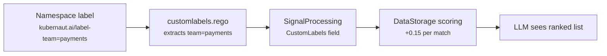

# Authoring Workflows and Action Types

This guide explains how to design workflow schemas and action types so that Kubernaut's LLM selects the right workflow for each incident. It covers the 3-step discovery protocol, description engineering, customLabels-based differentiation, and common pitfalls.

Read [Remediation Workflows](workflows.md) first for schema syntax, registration, and lifecycle. This page focuses on the **design decisions** that affect selection.

## How Workflow Selection Works

Kubernaut selects workflows through a 3-step discovery protocol (DD-HAPI-017). Understanding each step -- and where your authoring choices matter -- is essential.

### Step 1: Action Type Selection

The LLM calls `list_available_actions` and receives every active action type with its `description`. It picks the action type whose `whenToUse` best matches the root cause it identified during investigation.

**What matters here:**

- The action type `description.what` and `description.whenToUse`
- The LLM's understanding of the root cause

**What does NOT matter here:**

- CustomLabels (zero influence)
- DetectedLabels (zero influence)
- Workflow-level descriptions (not visible yet)

### Step 2: Workflow Ranking

The LLM calls `list_workflows` for the chosen action type. DataStorage returns all active, latest-version workflows under that action type, **ordered by `final_score`**.

The score is computed from label overlap between the incident context and the workflow schema:

```
final_score = LEAST((5.0 + detected_boost + custom_boost - penalty) / 10.0, 1.0)
```

**What matters here:**

- DetectedLabels (highest impact: up to +0.39)
- CustomLabels (+0.15 per exact match, +0.075 per wildcard)
- Mandatory label filters (severity, environment, component, priority) -- workflows that don't match are excluded entirely

### Step 3: Workflow Selection

The LLM receives the ranked list and picks the workflow whose `description.whenToUse` best fits the incident. It also considers remediation history (what worked or failed before on this resource).

**What matters here:**

- The workflow `description.whenToUse` and `description.whenNotToUse`
- The DataStorage ranking (LLM tends to prefer higher-ranked workflows when descriptions are similar)
- Remediation history

### Key Insight

Steps 2 and 3 work together: DataStorage provides the **ordering** via scoring, and the LLM makes the **final decision** via descriptions. For reliable selection, **both the ranking (via labels) and the description guidance must align**.

## Planning Your Workflow Catalog

### When to Group Workflows Under the Same Action Type

If two workflows solve the **same category of problem** but differ in **how** they solve it, they should share the same action type. CustomLabels and descriptions then differentiate them.

| Scenario | Same Action Type? | Why |
|---|---|---|
| Direct kubectl patch vs GitOps commit for memory limits | Yes (`IncreaseMemoryLimits`) | Same intent, different execution strategy |
| Fast restart vs safe rollback for CrashLoopBackOff | Depends | If risk tolerance is the differentiator, consider same type with customLabels. If the actions are fundamentally different (restart vs rollback), use separate types |
| Rollback a Deployment vs rollback a Helm release | No | Different resources, different rollback mechanisms |
| Scale replicas vs increase CPU limits | No | Different remediation categories |

!!! warning "CustomLabels cannot steer across action types"
    If two workflows are under **different** action types, customLabels have no effect on selection between them. The LLM picks the action type first (Step 1), then workflows within that type are ranked (Step 2). CustomLabels only influence Step 2.

### When to Create a New Action Type

Create a new action type when:

- The remediation is a **fundamentally different category** (e.g., "scale" vs "restart" vs "rollback")
- No existing action type's `whenToUse` covers the scenario
- The LLM would be confused choosing between this action and an existing one under the same type

## Writing Effective Descriptions

Descriptions are the primary mechanism the LLM uses for selection. Poorly written descriptions are the #1 cause of incorrect workflow selection.

### Action Type Descriptions

Action type descriptions should describe the **category of action**, not specific conditions or environments.

**Good:**

```yaml
spec:
  name: IncreaseMemoryLimits
  description:
    what: "Increase memory resource limits on containers that are being OOMKilled"
    whenToUse: "When containers are being OOMKilled because the memory limit is too low and the correct new limit can be determined"
    whenNotToUse: "When the OOMKill is caused by a memory leak -- increasing limits only delays the inevitable"
    preconditions: "The deployment exists and defines explicit memory limits"
```

**Bad:**

```yaml
spec:
  name: IncreaseMemoryLimitsGitOps
  description:
    what: "Increase memory limits via GitOps commit for ArgoCD-managed deployments"
    # Too specific -- this describes a workflow variant, not an action category
```

The bad example bakes environment-specific conditions into the action type, preventing other workflows (e.g., direct kubectl patch) from sharing the same type.

### Workflow Descriptions

Workflow descriptions should reference the **specific conditions** under which this variant is preferred, including explicit references to customLabels and detectedLabels.

**Good -- two workflows under `IncreaseMemoryLimits`:**

```yaml
# Workflow 1: Direct patch (default)
spec:
  metadata:
    workflowName: increase-memory-limits-v1
    description:
      what: "Increases memory limits by patching the deployment directly via kubectl"
      whenToUse: "When containers are being OOMKilled and the deployment is NOT managed by a GitOps tool. Suitable for environments where direct patching is acceptable."
      whenNotToUse: "When the deployment is managed by ArgoCD or Flux -- direct patching will cause drift"

# Workflow 2: GitOps commit (Ansible)
spec:
  metadata:
    workflowName: increase-memory-limits-gitops-v1
    description:
      what: "Increases memory limits by updating the deployment YAML in the source Git repository and letting the GitOps controller reconcile"
      whenToUse: "When containers are being OOMKilled and the deployment is managed by a GitOps tool (ArgoCD or Flux). The new memory value must be higher than the current limit."
      whenNotToUse: "When the environment is not GitOps-managed. When the OOMKill is caused by a memory leak."
```

The LLM reads both descriptions and, combined with the DataStorage ranking (which boosts the GitOps workflow when `gitOpsManaged: "true"` is detected), reliably picks the right one.

### Description Engineering Checklist

- [ ] Action type `whenToUse` describes the **category** (what problem does this solve?)
- [ ] Workflow `whenToUse` describes the **variant** (under what conditions is this variant preferred?)
- [ ] Workflow `whenNotToUse` explicitly excludes scenarios where the other variant should be chosen
- [ ] If customLabels differentiate workflows, the `whenToUse` references the condition (e.g., "when risk tolerance is high")
- [ ] Descriptions don't overlap semantically -- the LLM must be able to distinguish them

## Using CustomLabels for Condition-Based Selection

CustomLabels are operator-defined key-value pairs that influence DataStorage scoring. They're the mechanism for steering selection based on organizational or operational conditions that aren't captured by infrastructure detection.

### How CustomLabels Flow Through the System



1. **Namespace labels**: The operator labels namespaces with `kubernaut.ai/label-{key}={value}`
2. **Rego policy**: `customlabels.rego` extracts labels with the `kubernaut.ai/label-` prefix
3. **Signal Processing**: Stores them in the `CustomLabels` field on the SP CRD
4. **DataStorage**: During `list_workflows`, matches SP's custom labels against each workflow's `customLabels` and boosts the score
5. **LLM**: Sees the ranked list and makes the final selection, guided by descriptions

### Declaring CustomLabels on Workflow Schemas

```yaml
spec:
  customLabels:
    risk_tolerance: "high"       # exact match only
    team: "payments"             # matches this specific value
    region: "*"                  # wildcard -- matches any value
```

- **Exact match**: The workflow's value must equal the incident's value. Boost: **+0.15** per matching key.
- **Wildcard** (`"*"`): The workflow matches any non-empty value for that key. Boost: **+0.075** (half of exact).

CustomLabels are `map[string]string` on the CRD -- each key maps to a single string value. Internally, DataStorage wraps these into arrays for JSONB storage and scoring.

### Labeling Namespaces

```bash
kubectl label namespace payments-prod kubernaut.ai/label-team=payments
kubectl label namespace payments-prod kubernaut.ai/label-risk_tolerance=high
```

The default `customlabels.rego` extracts all `kubernaut.ai/label-*` labels automatically:

```rego
package signalprocessing.customlabels

import rego.v1

labels[key] := value if {
  some k, v in input.kubernetes.namespace.labels
  startswith(k, "kubernaut.ai/label-")
  key := trim_prefix(k, "kubernaut.ai/label-")
  value := v
}
```

### Custom Rego for Non-Standard Labels

If your labels don't follow the `kubernaut.ai/label-` convention, write a custom Rego policy:

```rego
package signalprocessing.customlabels

import rego.v1

labels := result if {
  rt := input.kubernetes.namespace.labels["company.io/risk-tolerance"]
  rt != ""
  result := {"risk_tolerance": [rt]}
}
```

Deploy it via the `signalprocessing-customlabels-policy` ConfigMap. Signal Processing hot-reloads Rego policies.

### Scoring Impact

Each matching custom label adds +0.15 to the raw score (before normalization to 0-1). With a base score of 5.0/10.0 = 0.50, a single matching custom label produces a final score of approximately 0.515, while a non-matching workflow stays at 0.50.

This is a **tiebreaker/ordering influence**, not an override. It won't overcome a strong semantic mismatch in descriptions -- if the LLM strongly prefers a lower-ranked workflow based on its `whenToUse`, it will still pick it.

Multiple matching labels are additive: 3 matching keys produce +0.45 raw boost (+0.045 on the normalized score).

## Worked Example: Risk-Based CrashLoopBackOff Remediation

This example demonstrates two workflows for the same problem (CrashLoopBackOff), differentiated by risk tolerance, from Rego policy through workflow schema to successful selection.

### Scenario

- **Team Alpha** (namespace `alpha-prod`): Risk tolerance is `high`. They prefer fast restarts to minimize downtime.
- **Team Beta** (namespace `beta-prod`): Risk tolerance is `low`. They prefer safe rollbacks even if slower.

Both namespaces experience CrashLoopBackOff events. The same `GracefulRestart` action type should serve both, but with different workflows selected based on team preference.

### Step 1: Label the Namespaces

```bash
kubectl label namespace alpha-prod kubernaut.ai/label-risk_tolerance=high
kubectl label namespace beta-prod kubernaut.ai/label-risk_tolerance=low
```

### Step 2: Verify the Rego Policy

The default `customlabels.rego` extracts `risk_tolerance` automatically (it has the `kubernaut.ai/label-` prefix). No custom Rego needed.

### Step 3: Create the Action Type

Both workflows share the same action type:

```yaml
apiVersion: kubernaut.ai/v1alpha1
kind: ActionType
metadata:
  name: graceful-restart
spec:
  name: GracefulRestart
  description:
    what: "Perform a graceful rolling restart to reset runtime state"
    whenToUse: "When pods are in a degraded state (CrashLoopBackOff, high restart count) but the deployment spec is correct"
    whenNotToUse: "When the issue is caused by a bad image or config change -- a restart won't help"
    preconditions: "The deployment exists and has at least one ready replica"
```

### Step 4: Create the Workflows

**Workflow A -- Fast restart (high risk tolerance):**

```yaml
apiVersion: kubernaut.ai/v1alpha1
kind: RemediationWorkflow
metadata:
  name: restart-pods-v1
spec:
  metadata:
    workflowName: restart-pods-v1
    version: "1.0.0"
    description:
      what: "Restarts all pods in the deployment immediately via kubectl delete"
      whenToUse: "When fast recovery is preferred over safety. Best for teams with high risk tolerance where minimizing downtime is the priority, even at the cost of brief unavailability during restart."
      whenNotToUse: "When the team has low risk tolerance or the service handles financial transactions"
      preconditions: "Deployment exists with at least one pod"
  actionType: GracefulRestart
  labels:
    severity: [critical, high]
    environment: ["*"]
    component: deployment
    priority: "*"
  customLabels:
    risk_tolerance: "high"
  execution:
    engine: job
    bundle: registry.example.com/workflows/restart-pods@sha256:abc123...
  parameters:
    - name: TARGET_NAMESPACE
      type: string
      required: true
      description: "Namespace of the deployment"
    - name: TARGET_DEPLOYMENT
      type: string
      required: true
      description: "Name of the deployment to restart"
```

**Workflow B -- Safe rollback (low risk tolerance):**

```yaml
apiVersion: kubernaut.ai/v1alpha1
kind: RemediationWorkflow
metadata:
  name: crashloop-rollback-v1
spec:
  metadata:
    workflowName: crashloop-rollback-v1
    version: "1.0.0"
    description:
      what: "Rolls back the deployment to the previous stable revision"
      whenToUse: "When safe recovery is preferred. Best for teams with low risk tolerance where ensuring a known-good state is more important than speed."
      whenNotToUse: "When the team has high risk tolerance and prefers faster restart over rollback"
      preconditions: "Deployment exists with at least one previous revision"
  actionType: GracefulRestart
  labels:
    severity: [critical, high]
    environment: ["*"]
    component: deployment
    priority: "*"
  customLabels:
    risk_tolerance: "low"
  execution:
    engine: job
    bundle: registry.example.com/workflows/crashloop-rollback@sha256:def456...
  parameters:
    - name: TARGET_NAMESPACE
      type: string
      required: true
      description: "Namespace of the deployment"
    - name: TARGET_DEPLOYMENT
      type: string
      required: true
      description: "Name of the deployment to roll back"
```

### Step 5: What Happens at Runtime

**Incident in `alpha-prod`** (risk_tolerance=high):

1. **Step 1**: LLM picks `GracefulRestart` based on the CrashLoopBackOff root cause
2. **Step 2**: DataStorage scores both workflows:
    - `restart-pods-v1`: base 0.50 + customLabel match (`risk_tolerance: high` == `high`) = **0.515**
    - `crashloop-rollback-v1`: base 0.50 + no match (`risk_tolerance: low` != `high`) = **0.50**
3. **Step 3**: LLM sees `restart-pods-v1` ranked first, reads its `whenToUse` ("high risk tolerance"), confirms it fits. Selected.

**Incident in `beta-prod`** (risk_tolerance=low):

1. **Step 1**: LLM picks `GracefulRestart` (same action type)
2. **Step 2**: DataStorage scores:
    - `crashloop-rollback-v1`: base 0.50 + customLabel match = **0.515**
    - `restart-pods-v1`: base 0.50 + no match = **0.50**
3. **Step 3**: LLM sees `crashloop-rollback-v1` ranked first, reads its `whenToUse` ("low risk tolerance"), confirms it fits. Selected.

### Why This Works

The ranking and the descriptions **reinforce each other**:

- DataStorage puts the correct workflow first via the customLabel score boost
- The LLM confirms the choice by reading the `whenToUse` description, which explicitly references risk tolerance
- If the descriptions were generic (no mention of risk tolerance), the LLM would have no basis to differentiate and might ignore the ranking

## Troubleshooting

### The LLM selects the wrong workflow

**Symptom**: The correct workflow exists but the LLM consistently picks a different one.

**Diagnostic steps:**

1. **Check the action type**: Are both workflows under the **same** action type? If they're under different action types, customLabels can't differentiate them.

    ```bash
    kubectl get remediationworkflows -o custom-columns=NAME:.metadata.name,ACTION:.spec.actionType
    ```

2. **Check DataStorage ranking**: Query the DataStorage API directly to see how workflows are scored:

    ```bash
    curl -s "http://data-storage:8080/api/v1/workflows/actions/GracefulRestart?severity=critical&environment=production&component=deployment&priority=P1" | jq '.[] | {name: .name, score: .confidence}'
    ```

    If the wrong workflow is ranked higher, check label matching.

3. **Check customLabels on the SP CRD**: Verify that Signal Processing extracted the expected custom labels:

    ```bash
    kubectl get signalprocessing -n kubernaut-system -o jsonpath='{.items[0].status.kubernetesContext.customLabels}'
    ```

4. **Check namespace labels**: Verify the source namespace has the expected labels:

    ```bash
    kubectl get namespace alpha-prod --show-labels | grep kubernaut.ai/label
    ```

5. **Check workflow customLabels**: Verify the workflow declares the matching customLabels:

    ```bash
    kubectl get remediationworkflow restart-pods-v1 -o jsonpath='{.spec.customLabels}'
    ```

### No workflows found for the action type

**Symptom**: The LLM reports no workflows available after selecting an action type.

**Causes:**

- **Mandatory label mismatch**: The workflow's `severity`, `environment`, `component`, or `priority` don't match the incident. Check that labels include the incident's values or use `"*"` wildcards.
- **Workflow not active**: The workflow might be `disabled` or `superseded`. Check: `kubectl get remediationworkflow <name> -o jsonpath='{.status.catalogStatus}'`
- **Not latest version**: If a newer version was registered, the old one has `is_latest_version = false` and is excluded.

### CustomLabels have no effect

**Symptom**: Both workflows have the same DataStorage score despite different customLabels.

**Causes:**

- **Rego policy not extracting labels**: Check that `customlabels.rego` outputs the expected keys. Test with `opa eval` or check the SP CRD's `status.customLabels`.
- **Namespace missing labels**: The namespace must have `kubernaut.ai/label-{key}={value}` labels for the default Rego policy to extract them.
- **Workflow not declaring customLabels**: The workflow schema must have a `customLabels` section. Without it, there's nothing to match against.
- **Key mismatch**: The Rego output key must exactly match the workflow's customLabel key (e.g., `risk_tolerance` in both).

### The LLM ignores the DataStorage ranking

**Symptom**: The higher-ranked workflow is not selected.

This is expected behavior in some cases. The LLM makes the final decision based on descriptions and context. If the lower-ranked workflow's `whenToUse` is a much better semantic fit, the LLM will prefer it.

**Fix**: Ensure descriptions reinforce the ranking. If `customLabels` differentiate workflows, the `whenToUse` text should reference the same condition (e.g., "for teams with high risk tolerance"). When ranking and descriptions align, the LLM consistently follows the ranking.

## Summary

| Authoring Decision | Affects Step | Impact |
|---|---|---|
| Action type `whenToUse` | Step 1 (action type selection) | Determines which action category the LLM picks |
| Mandatory labels (severity, environment, component, priority) | Step 2 (filtering) | Excludes workflows that don't match -- they never reach the LLM |
| DetectedLabels | Step 2 (scoring) | Highest-weight infrastructure boost (up to +0.39) |
| CustomLabels | Step 2 (scoring) | Operator-intent boost (+0.15 per exact match) |
| Workflow `whenToUse` / `whenNotToUse` | Step 3 (LLM selection) | The LLM's primary decision input -- must reinforce the ranking |
| Remediation history | Step 3 (LLM context) | The LLM avoids repeating failed approaches |
