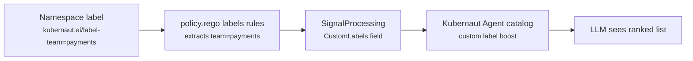

# Authoring Workflows and Action Types

This guide explains how to design workflow schemas and action types so that Kubernaut's LLM selects the right workflow for each incident. It covers the 3-step discovery protocol, description engineering, customLabels-based differentiation, and common pitfalls.

Read [Remediation Workflows](workflows.md) first for schema syntax, registration, and lifecycle. This page focuses on the **design decisions** that affect selection.

## How Workflow Selection Works

Kubernaut selects workflows through a 3-step discovery protocol (DD-HAPI-017). Understanding each step -- and where your authoring choices matter -- is essential.

### Step 1: Action Type Selection

The LLM calls `list_available_actions` and receives every active action type with its `description`. It picks the action type whose `whenToUse` best matches the root cause it identified during investigation.

**What matters here:**

- The action type `description.what` and `description.whenToUse`
- The LLM's understanding of the root cause

**What does NOT matter here:**

- CustomLabels (zero influence)
- DetectedLabels (zero influence)
- Workflow-level descriptions (not visible yet)

### Step 2: Workflow Ranking

The LLM calls `list_workflows` for the chosen action type. Kubernaut Agent (v1.6+; DataStorage through v1.5) returns all active, latest-version workflows under that action type, **ordered by `final_score`**.

The scoring algorithm combines detected label boosts, custom label boosts, and penalties. See [Workflow Search and Scoring](workflows.md#workflow-search-and-scoring) for the complete formula and boost values.

**What matters here:**

- DetectedLabels (highest impact on ranking)
- CustomLabels (operator-intent boost)
- Mandatory label filters: `severity`, `environment`, and `component` are string arrays in the API (`[]string` with `minItems: 1`); `priority` is a single string -- workflows that don't match are excluded entirely

### Step 3: Workflow Selection

The LLM receives the ranked list and picks the workflow whose `description.whenToUse` best fits the incident. It also considers remediation history (what worked or failed before on this resource).

**What matters here:**

- The workflow `description.whenToUse` and `description.whenNotToUse`
- The catalog ranking (LLM tends to prefer higher-ranked workflows when descriptions are similar)
- Remediation history

### Key Insight

Steps 2 and 3 work together: the catalog provides the **ordering** via scoring, and the LLM makes the **final decision** via descriptions. For reliable selection, **both the ranking (via labels) and the description guidance must align**.

## Planning Your Workflow Catalog

### When to Group Workflows Under the Same Action Type

If two workflows solve the **same category of problem** but differ in **how** they solve it, they should share the same action type. CustomLabels and descriptions then differentiate them.

| Scenario | Same Action Type? | Why |
|---|---|---|
| Direct kubectl patch vs GitOps commit for memory limits | Yes (`IncreaseMemoryLimits`) | Same intent, different execution strategy |
| Fast restart vs safe rollback for CrashLoopBackOff | Depends | If risk tolerance is the differentiator, consider same type with customLabels. If the actions are fundamentally different (restart vs rollback), use separate types |
| Rollback a Deployment vs rollback a Helm release | No | Different resources, different rollback mechanisms |
| Scale replicas vs increase CPU limits | No | Different remediation categories |

!!! warning "CustomLabels cannot steer across action types"
    If two workflows are under **different** action types, customLabels have no effect on selection between them. The LLM picks the action type first (Step 1), then workflows within that type are ranked (Step 2). CustomLabels only influence Step 2.

### When to Create a New Action Type

Create a new action type when:

- The remediation is a **fundamentally different category** (e.g., "scale" vs "restart" vs "rollback")
- No existing action type's `whenToUse` covers the scenario
- The LLM would be confused choosing between this action and an existing one under the same type

## Writing Effective Descriptions

Descriptions are the primary mechanism the LLM uses for selection. Poorly written descriptions are the #1 cause of incorrect workflow selection.

### Action Type Descriptions

Action type descriptions should describe the **category of action**, not specific conditions or environments.

**Good:**

```yaml
spec:
  name: IncreaseMemoryLimits
  description:
    what: "Increase memory resource limits on containers that are being OOMKilled"
    whenToUse: "When containers are being OOMKilled because the memory limit is too low and the correct new limit can be determined"
    whenNotToUse: "When the OOMKill is caused by a memory leak -- increasing limits only delays the inevitable"
    preconditions: "The deployment exists and defines explicit memory limits"
```

**Bad:**

```yaml
spec:
  name: IncreaseMemoryLimitsGitOps
  description:
    what: "Increase memory limits via GitOps commit for ArgoCD-managed deployments"
    # Too specific -- this describes a workflow variant, not an action category
```

The bad example bakes environment-specific conditions into the action type, preventing other workflows (e.g., direct kubectl patch) from sharing the same type.

### Workflow Descriptions

Workflow descriptions should reference the **specific conditions** under which this variant is preferred, including explicit references to customLabels and detectedLabels.

**Good -- two workflows under `IncreaseMemoryLimits`:**

```yaml
# Workflow 1: Direct patch (metadata.name: increase-memory-limits)
spec:
  description:
    what: "Increases memory limits by patching the deployment directly via kubectl"
    whenToUse: "When containers are being OOMKilled and the deployment is NOT managed by a GitOps tool. Suitable for environments where direct patching is acceptable."
    whenNotToUse: "When the deployment is managed by ArgoCD or Flux -- direct patching will cause drift"

# Workflow 2: GitOps commit via Ansible (metadata.name: increase-memory-limits-gitops)
spec:
  description:
    what: "Increases memory limits by updating the deployment YAML in the source Git repository and letting the GitOps controller reconcile"
    whenToUse: "When containers are being OOMKilled and the deployment is managed by a GitOps tool (ArgoCD or Flux). The new memory value must be higher than the current limit."
    whenNotToUse: "When the environment is not GitOps-managed. When the OOMKill is caused by a memory leak."
```

The LLM reads both descriptions and, combined with the catalog ranking (which boosts the GitOps workflow when `gitOpsManaged: "true"` is detected), reliably picks the right one.

### Description Engineering Checklist

- [ ] Action type `whenToUse` describes the **category** (what problem does this solve?)
- [ ] Workflow `whenToUse` describes the **variant** (under what conditions is this variant preferred?)
- [ ] Workflow `whenNotToUse` explicitly excludes scenarios where the other variant should be chosen
- [ ] If customLabels differentiate workflows, the `whenToUse` references the condition (e.g., "when risk tolerance is high")
- [ ] Descriptions don't overlap semantically -- the LLM must be able to distinguish them

## Using CustomLabels for Condition-Based Selection

CustomLabels are operator-defined key-value pairs that influence catalog scoring. They're the mechanism for steering selection based on organizational or operational conditions that aren't captured by infrastructure detection.

### How CustomLabels Flow Through the System


```mermaid
flowchart LR
    NS["Namespace label<br/><small>kubernaut.ai/label-team=payments</small>"] --> Rego["policy.rego labels rules<br/><small>extracts team=payments</small>"]
    Rego --> SP["SignalProcessing<br/><small>CustomLabels field</small>"]
    SP --> KA["Kubernaut Agent catalog<br/><small>custom label boost</small>"]
    KA --> LLM["LLM sees ranked list"]
```

1. **Namespace labels**: The operator labels namespaces with `kubernaut.ai/label-{key}={value}`
2. **Rego policy**: The `labels` rules in `policy.rego` extract labels with the `kubernaut.ai/label-` prefix
3. **Signal Processing**: Stores them in the `CustomLabels` field on the SP CRD
4. **Kubernaut Agent** (v1.6+; DataStorage through v1.5): During `list_workflows`, matches SP's custom labels against each workflow's `customLabels` and boosts the score
5. **LLM**: Sees the ranked list and makes the final selection, guided by descriptions

### Declaring CustomLabels on Workflow Schemas

```yaml
spec:
  customLabels:
    risk_tolerance: "high"       # exact match only
    team: "payments"             # matches this specific value
    region: "*"                  # wildcard -- matches any value
```

- **Exact match**: The workflow's value must equal the incident's value.
- **Wildcard** (`"*"`): The workflow matches any non-empty value for that key (half credit).

CustomLabels are `map[string]string` on the CRD -- each key maps to a single string value. Authors always declare `customLabels` as a flat `map[string]string`. Internally, the catalog wraps each single-string value into an array for scoring (e.g., `"high"` becomes `["high"]`) -- through v1.5 this was a JSONB containment query in DataStorage; as of v1.6 it's the same wrapping applied in Kubernaut Agent's in-memory representation -- but this is transparent to workflow authors either way.

### Labeling Namespaces

```bash
kubectl label namespace payments-prod kubernaut.ai/label-team=payments
kubectl label namespace payments-prod kubernaut.ai/label-risk_tolerance=high
```

The default `labels` rules in `policy.rego` extract all `kubernaut.ai/label-*` labels automatically:

```rego
package signalprocessing

import rego.v1

labels[key] := value if {
  some k, v in input.kubernetes.namespace.labels
  startswith(k, "kubernaut.ai/label-")
  key := trim_prefix(k, "kubernaut.ai/label-")
  value := v
}
```

### Custom Rego for Non-Standard Labels

If your labels don't follow the `kubernaut.ai/label-` convention, add custom rules to the labels section of your `policy.rego`:

```rego
package signalprocessing

import rego.v1

labels := result if {
  rt := input.namespace.labels["company.io/risk-tolerance"]
  rt != ""
  result := {"risk_tolerance": [rt]}
}
```

Add these rules to the custom labels section of your unified `policy.rego` file in the `signalprocessing-policy` ConfigMap. Signal Processing hot-reloads the policy on ConfigMap updates.

### Scoring Impact

Custom label matches add to the raw score (before normalization to 0-1). See [Workflow Search and Scoring](workflows.md#workflow-search-and-scoring) for the exact boost values.

This is a **tiebreaker/ordering influence**, not an override. It won't overcome a strong semantic mismatch in descriptions -- if the LLM strongly prefers a lower-ranked workflow based on its `whenToUse`, it will still pick it.

## Per-Workflow ServiceAccount

The optional `spec.execution.serviceAccountName` field on a `RemediationWorkflow` lets each workflow run with its own least-privilege ServiceAccount instead of the execution namespace default.

```yaml
spec:
  execution:
    serviceAccountName: my-workflow-sa
    engine: job
    bundle: registry.example.com/workflows/my-workflow@sha256:...
```

The ServiceAccount must exist in the `kubernaut-workflows` namespace (or the configured execution namespace) with only the RBAC permissions required by the workflow. If `serviceAccountName` is omitted:

- Job/Tekton use the execution namespace default ServiceAccount.
- Ansible falls back to controller in-cluster credentials unless `WorkflowExecution.spec.serviceAccountName` is set.

TokenRequest is used by the Ansible path for AWX credential injection when the workflow specifies a service account. See [Security & RBAC -- Per-Workflow ServiceAccount](../architecture/security-rbac.md#per-workflow-serviceaccount-v12) for scope, TTL validation, and fallback behavior.

## Per-Workflow Execution Cluster

The optional `spec.execution.clusterId` field on a `RemediationWorkflow` declares which fleet cluster the workflow's execution resource (Job, PipelineRun, or Ansible run) runs on, decoupled from the cluster that the triggering signal originated from (DD-FLEET-008, BR-FLEET-004).

```yaml
spec:
  execution:
    engine: job
    bundle: registry.example.com/workflows/my-workflow@sha256:...
    serviceAccountName: my-workflow-sa
    clusterId: prod-east
```

If `clusterId` is omitted (the default), execution runs on the same cluster as the signal -- unchanged from today's behavior. When set, it takes precedence over `RemediationRequest.Spec.ClusterID` for the resulting `WorkflowExecution.Spec.ClusterID`. It must resolve to a cluster already registered with the fleet MCP Gateway; an unregistered or unreachable value fails at dispatch time, the same fail-closed behavior as an operator-supplied `ClusterID` typo today.

This is not a new GitOps or edge-device execution engine -- both use cases below are ordinary `job`/`ansible` workflows that also set `clusterId`.

- **GitOps-hub remediation**: the fix is a Git commit (a Helm value bump, a Kustomize overlay) that a centralized ArgoCD or Flux instance on a hub cluster reconciles onto the signal's origin cluster. The workflow declares that hub's `clusterId` so its Job runs wherever the GitOps tooling and credentials live, regardless of which cluster fired the signal.
- **Edge devices via an aggregator**: a resource-constrained edge device (e.g. a minimal K3s node) can't run a Job itself, but a separate, capable cluster with network reach to that device (a device management API, SSH, Redfish) can act on its behalf. The workflow declares that aggregator's `clusterId`.

See [Fleet Management: WE Remote Execution](../architecture/fleet.md#we-remote-execution) for how `clusterId` fits into the broader ClusterID propagation chain.

## Standard Resource Parameters

Every workflow receives a set of standard `TARGET_RESOURCE_*` parameters that identify the Kubernetes resource selected for remediation. **Kubernaut Agent** derives these from the K8s-verified `root_owner` during investigation and injects them into the selected workflow's parameters before the AIAnalysis completes -- workflow authors do not need to populate them manually.

| Parameter | Type | Description |
|---|---|---|
| `TARGET_RESOURCE_NAME` | string | Name of the root managing resource (e.g., `my-app`) |
| `TARGET_RESOURCE_KIND` | string | Kind of the root managing resource (e.g., `Deployment`, `StatefulSet`, `Node`) |
| `TARGET_RESOURCE_NAMESPACE` | string | Namespace of the root managing resource. **Empty string** for cluster-scoped resources (e.g., Nodes) |
| `TARGET_RESOURCE_API_VERSION` | string | API version of the root managing resource (e.g., `apps/v1`, `v1`). Auto-resolved via ScopeResolver for unambiguous kinds |

### Declaring Standard Parameters in Workflow Schemas

Workflows that operate on the target resource should declare these as **required** parameters in their schema. Kubernaut Agent validates that all required parameters in the workflow schema are satisfied during its workflow response validation step.

```yaml
parameters:
  - name: TARGET_RESOURCE_NAME
    type: string
    required: true
    description: "Name of the root managing resource (auto-injected)"
  - name: TARGET_RESOURCE_KIND
    type: string
    required: true
    description: "Kind of the root managing resource (auto-injected)"
  - name: TARGET_RESOURCE_NAMESPACE
    type: string
    required: false
    description: "Namespace of the root managing resource (auto-injected; empty for cluster-scoped resources)"
  - name: TARGET_RESOURCE_API_VERSION
    type: string
    required: false
    description: "API version of the root managing resource (auto-injected when resolved)"
```

### Cluster-Scoped Resources

For cluster-scoped resources (e.g., Nodes, PersistentVolumes), `TARGET_RESOURCE_NAMESPACE` is injected as an **empty string**. Workflows that handle both namespaced and cluster-scoped resources should declare `TARGET_RESOURCE_NAMESPACE` as **optional** (`required: false`) and check for an empty value. `TARGET_RESOURCE_API_VERSION` is auto-resolved via the ScopeResolver for unambiguous kinds (e.g., `Deployment` → `apps/v1`) and is only injected when successfully resolved.

See the [worked example below](#step-4-create-the-workflows) for a complete workflow schema that declares these parameters.

## Worked Example: Risk-Based CrashLoopBackOff Remediation

This example demonstrates two workflows for the same problem (CrashLoopBackOff), differentiated by risk tolerance, from Rego policy through workflow schema to successful selection.

### Scenario

- **Team Alpha** (namespace `alpha-prod`): Risk tolerance is `high`. They prefer fast restarts to minimize downtime.
- **Team Beta** (namespace `beta-prod`): Risk tolerance is `low`. They prefer safe rollbacks even if slower.

Both namespaces experience CrashLoopBackOff events. The same `GracefulRestart` action type should serve both, but with different workflows selected based on team preference.

### Step 1: Label the Namespaces

```bash
kubectl label namespace alpha-prod kubernaut.ai/label-risk_tolerance=high
kubectl label namespace beta-prod kubernaut.ai/label-risk_tolerance=low
```

### Step 2: Verify the Rego Policy

The default `labels` rules in `policy.rego` extract `risk_tolerance` automatically (it has the `kubernaut.ai/label-` prefix). No custom Rego needed.

### Step 3: Create the Action Type

Both workflows share the same action type:

```yaml
apiVersion: kubernaut.ai/v1alpha1
kind: ActionType
metadata:
  name: graceful-restart
  namespace: kubernaut-system
spec:
  name: GracefulRestart
  description:
    what: "Perform a graceful rolling restart to reset runtime state"
    whenToUse: "When pods are in a degraded state (CrashLoopBackOff, high restart count) but the deployment spec is correct"
    whenNotToUse: "When the issue is caused by a bad image or config change -- a restart won't help"
    preconditions: "The deployment exists and has at least one ready replica"
```

### Step 4: Create the Workflows

**Workflow A -- Fast restart (high risk tolerance):**

```yaml
apiVersion: kubernaut.ai/v1alpha1
kind: RemediationWorkflow
metadata:
  name: restart-pods-v1
  namespace: kubernaut-system
spec:
  version: "1.0.0"
  description:
    what: "Restarts all pods in the deployment immediately via kubectl delete"
    whenToUse: "When fast recovery is preferred over safety. Best for teams with high risk tolerance where minimizing downtime is the priority, even at the cost of brief unavailability during restart."
    whenNotToUse: "When the team has low risk tolerance or the service handles financial transactions"
    preconditions: "Deployment exists with at least one pod"
  actionType: GracefulRestart
  labels:
    severity: [critical, high]
    environment: ["*"]
    component: [deployment]
    priority: "*"
  customLabels:
    risk_tolerance: "high"
  execution:
    engine: job
    bundle: registry.example.com/workflows/restart-pods@sha256:abc123...
    serviceAccountName: restart-pods-sa
  parameters:
    - name: TARGET_RESOURCE_NAME
      type: string
      required: true
      description: "Name of the root managing resource (KA-injected)"
    - name: TARGET_RESOURCE_KIND
      type: string
      required: true
      description: "Kind of the root managing resource (KA-injected)"
    - name: TARGET_RESOURCE_NAMESPACE
      type: string
      required: false
      description: "Namespace of the root managing resource (KA-injected; empty for cluster-scoped)"
    - name: TARGET_RESOURCE_API_VERSION
      type: string
      required: false
      description: "API version of the root managing resource (KA-injected)"
    - name: TARGET_DEPLOYMENT
      type: string
      required: true
      description: "Name of the deployment to restart"
```

**Workflow B -- Safe rollback (low risk tolerance):**

```yaml
apiVersion: kubernaut.ai/v1alpha1
kind: RemediationWorkflow
metadata:
  name: crashloop-rollback-v1
  namespace: kubernaut-system
spec:
  version: "1.0.0"
  description:
    what: "Rolls back the deployment to the previous stable revision"
    whenToUse: "When safe recovery is preferred. Best for teams with low risk tolerance where ensuring a known-good state is more important than speed."
    whenNotToUse: "When the team has high risk tolerance and prefers faster restart over rollback"
    preconditions: "Deployment exists with at least one previous revision"
  actionType: GracefulRestart
  labels:
    severity: [critical, high]
    environment: ["*"]
    component: [deployment]
    priority: "*"
  customLabels:
    risk_tolerance: "low"
  execution:
    engine: job
    bundle: registry.example.com/workflows/crashloop-rollback@sha256:def456...
    serviceAccountName: crashloop-rollback-sa
  parameters:
    - name: TARGET_RESOURCE_NAME
      type: string
      required: true
      description: "Name of the root managing resource (KA-injected)"
    - name: TARGET_RESOURCE_KIND
      type: string
      required: true
      description: "Kind of the root managing resource (KA-injected)"
    - name: TARGET_RESOURCE_NAMESPACE
      type: string
      required: false
      description: "Namespace of the root managing resource (KA-injected; empty for cluster-scoped)"
    - name: TARGET_RESOURCE_API_VERSION
      type: string
      required: false
      description: "API version of the root managing resource (KA-injected)"
    - name: TARGET_DEPLOYMENT
      type: string
      required: true
      description: "Name of the deployment to roll back"
```

### Step 5: What Happens at Runtime

**Incident in `alpha-prod`** (risk_tolerance=high):

1. **Step 1**: LLM picks `GracefulRestart` based on the CrashLoopBackOff root cause
2. **Step 2**: The catalog scores both workflows:
    - `restart-pods-v1`: base 0.50 + customLabel match (`risk_tolerance: high` == `high`) = **0.515**
    - `crashloop-rollback-v1`: base 0.50 + no match (`risk_tolerance: low` != `high`) = **0.50**
3. **Step 3**: LLM sees `restart-pods-v1` ranked first, reads its `whenToUse` ("high risk tolerance"), confirms it fits. Selected.

**Incident in `beta-prod`** (risk_tolerance=low):

1. **Step 1**: LLM picks `GracefulRestart` (same action type)
2. **Step 2**: The catalog scores:
    - `crashloop-rollback-v1`: base 0.50 + customLabel match = **0.515**
    - `restart-pods-v1`: base 0.50 + no match = **0.50**
3. **Step 3**: LLM sees `crashloop-rollback-v1` ranked first, reads its `whenToUse` ("low risk tolerance"), confirms it fits. Selected.

### Why This Works

The ranking and the descriptions **reinforce each other**:

- The catalog puts the correct workflow first via the customLabel score boost
- The LLM confirms the choice by reading the `whenToUse` description, which explicitly references risk tolerance
- If the descriptions were generic (no mention of risk tolerance), the LLM would have no basis to differentiate and might ignore the ranking

## Troubleshooting

### The LLM selects the wrong workflow

**Symptom**: The correct workflow exists but the LLM consistently picks a different one.

**Diagnostic steps:**

1. **Check the action type**: Are both workflows under the **same** action type? If they're under different action types, customLabels can't differentiate them.

    ```bash
    kubectl get remediationworkflows -o custom-columns=NAME:.metadata.name,ACTION:.spec.actionType
    ```

2. **Check the ranking manually**: As of v1.6 (DD-WORKFLOW-019), discovery and scoring run in-process inside Kubernaut Agent -- there is no REST endpoint to query the ranking directly. Instead, inspect each candidate workflow's declared labels and manually apply the [Workflow Search and Scoring](workflows.md#workflow-search-and-scoring) formula:

    ```bash
    kubectl get remediationworkflow -o yaml -l "spec.actionType=GracefulRestart"
    ```

    Compare the `spec.labels` (mandatory filters) and `spec.detectedLabels`/`spec.customLabels` (scoring inputs) of each candidate against the incident's own detected/custom labels (visible on the `SignalProcessing` CRD's `status`) to work out which one should rank higher. You can also check the `workflow.catalog.workflows_listed` audit event (`total_count` and the filter values actually used) via the DataStorage audit query API to confirm what Kubernaut Agent's catalog was asked for during the real investigation -- see [Audit and Observability](audit-and-observability.md).

    If the wrong workflow is ranked higher, check label matching.

3. **Check customLabels on the SP CRD**: Verify that Signal Processing extracted the expected custom labels:

    ```bash
    kubectl get signalprocessing -n kubernaut-system -o jsonpath='{.items[0].status.kubernetesContext.customLabels}'
    ```

4. **Check namespace labels**: Verify the source namespace has the expected labels:

    ```bash
    kubectl get namespace alpha-prod --show-labels | grep kubernaut.ai/label
    ```

5. **Check workflow customLabels**: Verify the workflow declares the matching customLabels:

    ```bash
    kubectl get remediationworkflow restart-pods-v1 -o jsonpath='{.spec.customLabels}'
    ```

### A workflow doesn't appear for a specific cluster (Fleet)

**Symptom**: A workflow is discoverable in some clusters but not others, and Fleet is enabled.

**Cause**: The `cluster` label (BR-FLEET-003, v1.6) is a mandatory-label filter dimension, same family as `severity`/`environment`/`component`. Once Fleet is enabled and Signal Processing resolves a concrete cluster classification for the incoming signal (e.g. `production`), a workflow with **no `cluster` entries is excluded** for that signal -- an empty/omitted `cluster` field is not a wildcard pass-through, it's an active exclusion. This most commonly bites teams that had working workflows *before* enabling Fleet: those workflows never declared `cluster` because the field didn't matter yet, and they silently drop out of discovery the moment Fleet starts classifying clusters.

**Diagnostic steps:**

1. **Confirm the workflow's `cluster` field:**

    ```bash
    kubectl get remediationworkflow <name> -o jsonpath='{.spec.labels.cluster}'
    ```

    An empty result means the workflow has no `cluster` declared -- it will be excluded once any signal carries a classification.

2. **Confirm the signal's resolved cluster classification:**

    ```bash
    kubectl get signalprocessing -n kubernaut-system <sp-name> -o jsonpath='{.status.signalClassification.clusterClassification}'
    ```

    An empty value means Fleet did not produce a classification for this signal (e.g., the cluster isn't registered) -- in that case `cluster` filtering is not evaluated and this isn't the cause.

3. **Fix**: add `cluster: ["*"]` to match any cluster, or list the specific classifications the workflow should apply to (e.g., `cluster: [production, staging-eu]`), matching case-insensitively:

    ```yaml
    spec:
      labels:
        cluster: ["*"]   # or: [production, staging-eu]
    ```

See [Fleet: Cluster Label](workflows.md#fleet-cluster-label-v16) for the full matching semantics.

### No workflows found for the action type

**Symptom**: The LLM reports no workflows available after selecting an action type.

**Causes:**

- **Mandatory label mismatch**: The workflow's `severity`, `environment`, `component`, or `priority` don't match the incident. Check that labels include the incident's values or use `"*"` wildcards.
- **Workflow not active**: The workflow's `catalogStatus` might be `Disabled` or `Superseded` (e.g. because a newer version of the same `metadata.name` was registered). Check: `kubectl get remediationworkflow <name> -o jsonpath='{.status.catalogStatus}'` -- only `Active` workflows are discoverable.

### CustomLabels have no effect

**Symptom**: Both workflows have the same catalog score despite different customLabels.

**Causes:**

- **Rego policy not extracting labels**: Check that the `labels` rules in `policy.rego` output the expected keys. Test with `opa eval` or check the SP CRD's `status.customLabels`.
- **Namespace missing labels**: The namespace must have `kubernaut.ai/label-{key}={value}` labels for the default Rego policy to extract them.
- **Workflow not declaring customLabels**: The workflow schema must have a `customLabels` section. Without it, there's nothing to match against.
- **Key mismatch**: The Rego output key must exactly match the workflow's customLabel key (e.g., `risk_tolerance` in both).

### The LLM ignores the catalog ranking

**Symptom**: The higher-ranked workflow is not selected.

This is expected behavior in some cases. The LLM makes the final decision based on descriptions and context. If the lower-ranked workflow's `whenToUse` is a much better semantic fit, the LLM will prefer it.

**Fix**: Ensure descriptions reinforce the ranking. If `customLabels` differentiate workflows, the `whenToUse` text should reference the same condition (e.g., "for teams with high risk tolerance"). When ranking and descriptions align, the LLM consistently follows the ranking.

## Summary

| Authoring Decision | Affects Step | Impact |
|---|---|---|
| Action type `whenToUse` | Step 1 (action type selection) | Determines which action category the LLM picks |
| Mandatory labels (`severity`, `environment`, `component` as `[]string` with `minItems: 1`; `priority` as string) | Step 2 (filtering) | Excludes workflows that don't match -- they never reach the LLM |
| DetectedLabels | Step 2 (scoring) | Highest-weight infrastructure boost |
| CustomLabels | Step 2 (scoring) | Operator-intent boost |
| Workflow `whenToUse` / `whenNotToUse` | Step 3 (LLM selection) | The LLM's primary decision input -- must reinforce the ranking |
| Remediation history | Step 3 (LLM context) | The LLM avoids repeating failed approaches |
