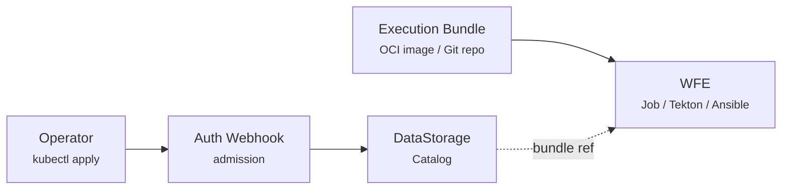

# Remediation Workflows

Kubernaut remediates issues by running **workflows** -- containerized actions that fix known problems. Workflows are registered as `RemediationWorkflow` CRDs, synced to a searchable catalog by the Auth Webhook, and matched to incidents by the LLM based on labels, infrastructure context, and remediation history.

This page covers everything you need to author, build, register, and manage workflows.

## Registration Model

Workflows are registered by applying a `RemediationWorkflow` CRD. The Auth Webhook intercepts the admission request, registers the workflow in the DataStorage catalog, captures the operator identity for audit attribution, and computes a content hash for deduplication.



| Component | Contents | Purpose |
|---|---|---|
| **RemediationWorkflow CRD** | Workflow schema (version, description, labels, parameters, execution config) | Registered in DataStorage catalog for discovery and LLM selection |
| **Execution bundle** | The container or playbook that runs the remediation | Referenced in the CRD; pulled by WFE at execution time |

The CRD approach replaces the previous OCI schema image model. Workflow schemas are now native Kubernetes resources, enabling `kubectl` management, GitOps workflows, and admission webhook integration for audit attribution.

## Create Your First Workflow

This tutorial walks through creating a workflow that restarts a deployment.

### Step 1: Write the Schema

Create `restart-deployment.yaml`:

```yaml
apiVersion: kubernaut.ai/v1alpha1
kind: RemediationWorkflow
metadata:
  name: restart-deployment-v1
spec:
  version: "1.0.0"
  description:
    what: "Performs a rolling restart of a deployment to clear corrupted runtime state"
    whenToUse: "When pods are in a degraded state but the deployment spec is correct"
    whenNotToUse: "When the issue is caused by a bad image or config change"
    preconditions: "The deployment exists and has at least one ready replica"
  maintainers:
    - name: "Platform Team"
      email: "platform@example.com"

  actionType: RestartDeployment

  labels:
    severity: [critical, high, medium]
    environment: [production, staging, development, "*"]
    component: deployment
    priority: "*"

  detectedLabels:
    helmManaged: "true"

  execution:
    engine: job
    bundle: registry.example.com/workflows/restart-deployment@sha256:abc123...

  parameters:
    - name: TARGET_NAMESPACE
      type: string
      required: true
      description: "Namespace of the deployment to restart"
    - name: TARGET_DEPLOYMENT
      type: string
      required: true
      description: "Name of the deployment to restart"

  dependencies:
    secrets: []
    configMaps: []
```

### Step 2: Write the Remediation Script

Create `remediate.sh`:

```bash
#!/bin/bash
set -euo pipefail

echo "Validating deployment exists..."
kubectl get deployment "$TARGET_DEPLOYMENT" -n "$TARGET_NAMESPACE" || {
  echo "ERROR: Deployment not found"
  exit 1
}

echo "Performing rolling restart..."
kubectl rollout restart deployment/"$TARGET_DEPLOYMENT" -n "$TARGET_NAMESPACE"

echo "Waiting for rollout to complete..."
kubectl rollout status deployment/"$TARGET_DEPLOYMENT" -n "$TARGET_NAMESPACE" --timeout=120s

echo "Verifying deployment health..."
READY=$(kubectl get deployment "$TARGET_DEPLOYMENT" -n "$TARGET_NAMESPACE" -o jsonpath='{.status.readyReplicas}')
DESIRED=$(kubectl get deployment "$TARGET_DEPLOYMENT" -n "$TARGET_NAMESPACE" -o jsonpath='{.spec.replicas}')

if [ "$READY" = "$DESIRED" ]; then
  echo "SUCCESS: All $READY/$DESIRED replicas ready"
else
  echo "WARNING: Only $READY/$DESIRED replicas ready"
  exit 1
fi
```

This follows the **Validate-Action-Verify** pattern:

1. **Validate** -- Confirm the deployment exists
2. **Action** -- Perform the rolling restart
3. **Verify** -- Check that all replicas are ready

### Step 3: Build the Execution Bundle

Create `Dockerfile.exec`:

```dockerfile
FROM registry.access.redhat.com/ubi9/ubi-minimal:latest
RUN microdnf install -y tar gzip && microdnf clean all
COPY --from=bitnami/kubectl:latest /opt/bitnami/kubectl/bin/kubectl /usr/local/bin/kubectl
COPY remediate.sh /scripts/remediate.sh
RUN chmod +x /scripts/remediate.sh
USER 1001
ENTRYPOINT ["/scripts/remediate.sh"]
```

Build and push:

```bash
docker build -f Dockerfile.exec -t registry.example.com/workflows/restart-deployment:v1.0.0 .
docker push registry.example.com/workflows/restart-deployment:v1.0.0
```

Note the image digest from the push output -- update the `execution.bundle` field in the CRD with the digest-pinned reference.

### Step 4: Register the Workflow

```bash
kubectl apply -f restart-deployment.yaml
```

The Auth Webhook intercepts the CREATE request, registers the workflow in the DataStorage catalog, captures the operator identity for audit attribution, and updates the CRD status with the assigned `workflowId` and `catalogStatus`.

Verify registration:

```bash
kubectl get remediationworkflow restart-deployment-v1 -o wide
```

## Schema Reference

For the complete field specification, see [RemediationWorkflow](../api-reference/crds.md#remediationworkflow) and [ActionType](../api-reference/crds.md#actiontype) in the CRD Reference.

### Labels

Mandatory labels control when a workflow is eligible during discovery:

| Label | Type | Required | Description |
|---|---|---|---|
| `severity` | string[] | Yes | Severity levels: `critical`, `high`, `medium`, `low` |
| `environment` | string[] | Yes | Environments: `production`, `staging`, `development`, `test`, or `"*"` |
| `component` | string | Yes | Resource kind: `pod`, `deployment`, `node`, or `"*"` |
| `priority` | string | Yes | Priority: `P0`, `P1`, `P2`, `P3`, or `"*"` |
| `signalName` | string | No | Optional metadata for workflow authors. Not used for matching -- the LLM selects by `actionType` |

Labels support:

- **Exact match** -- `component: deployment`
- **Wildcard** -- `component: "*"` (matches any value)
- **Multi-value** -- `severity: [critical, high]` (matches either)

!!! warning "Labels determine discoverability"
    Workflows that don't match the mandatory label filters are excluded entirely -- they never reach the LLM. A misconfigured severity or environment can silently hide a workflow from the candidate set. See [Workflow Search and Scoring](#workflow-search-and-scoring) for details.

### Detected Labels

Optional infrastructure-awareness labels that influence scoring and help the LLM select the right workflow for the target environment:

```yaml
detectedLabels:
  gitOpsManaged: "true"
  gitOpsTool: "argocd"      # argocd | flux | "*"
  helmManaged: "true"
  pdbProtected: "true"
  hpaEnabled: "true"
  stateful: "true"
  networkIsolated: "true"
  serviceMesh: "istio"       # istio | linkerd | "*"
```

| Label | Type | Valid Values |
|---|---|---|
| `gitOpsManaged` | boolean | `"true"` only |
| `gitOpsTool` | string | `argocd`, `flux`, `"*"` |
| `pdbProtected` | boolean | `"true"` only |
| `hpaEnabled` | boolean | `"true"` only |
| `stateful` | boolean | `"true"` only |
| `helmManaged` | boolean | `"true"` only |
| `networkIsolated` | boolean | `"true"` only |
| `serviceMesh` | string | `istio`, `linkerd`, `"*"` |

Workflows that declare detected labels earn scoring boosts when the target resource matches -- see [Workflow Search and Scoring](#workflow-search-and-scoring).

### Bundle Digest Format

For `job` and `tekton` engines, the `execution.bundle` field must use a **digest-pinned** OCI reference:

```
registry.example.com/repo/image@sha256:<64 hex characters>
```

- Must contain `@` (tag-only references are rejected)
- Must use `sha256:` algorithm
- Digest must be exactly 64 hex characters
- An optional tag before `@` is allowed: `image:v1.0.0@sha256:abc123...`

For the `ansible` engine, the `execution.bundle` field is a Git repository URL, and `execution.bundleDigest` is the Git commit SHA.

### Dependencies

Workflows can declare Secrets and ConfigMaps that must exist in the execution namespace:

```yaml
dependencies:
  secrets:
    - name: registry-credentials
  configMaps:
    - name: app-config
```

The Workflow Execution controller validates that these resources exist before creating the execution resource. How they are delivered to the workflow depends on the engine:

**Kubernetes Jobs:**

- Secrets mounted at `/run/kubernaut/secrets/<name>` (read-only)
- ConfigMaps mounted at `/run/kubernaut/configmaps/<name>` (read-only)

**Tekton Pipelines:**

- Secrets bound as `secret-<name>` workspaces
- ConfigMaps bound as `configmap-<name>` workspaces

**Ansible (AWX/AAP):**

- For each Secret in `dependencies.secrets`, the executor reads the Kubernetes Secret, dynamically creates an AWX credential type with an `env` injector, creates an ephemeral AWX credential, and attaches it to the job launch. AWX injects the values as environment variables into the Execution Environment:

    ```
    KUBERNAUT_SECRET_{SECRET_NAME}_{KEY}
    ```

    For example, a Secret named `gitea-repo-creds` with keys `username` and `password` becomes:

    - `KUBERNAUT_SECRET_GITEA_REPO_CREDS_USERNAME`
    - `KUBERNAUT_SECRET_GITEA_REPO_CREDS_PASSWORD`

    Ephemeral credentials are automatically deleted after the AWX job completes or is cleaned up. The Kubernetes Secret remains the single source of truth -- if it changes, the next execution picks up the new values.

- For each ConfigMap in `dependencies.configMaps`, the executor reads the Kubernetes ConfigMap and merges its data into AWX `extra_vars` with a standardized prefix:

    ```
    KUBERNAUT_CONFIGMAP_{CONFIGMAP_NAME}_{KEY}
    ```

    For example, a ConfigMap named `app-settings` with keys `timeout` and `log-level` becomes extra_vars:

    - `KUBERNAUT_CONFIGMAP_APP_SETTINGS_TIMEOUT`
    - `KUBERNAUT_CONFIGMAP_APP_SETTINGS_LOG_LEVEL`

    ConfigMap data is non-sensitive, so it uses AWX extra_vars (not credentials). The playbook accesses these as standard Ansible variables.

!!! warning "Security: Use `no_log: true` for sensitive Ansible tasks"
    When writing Ansible playbooks that handle secrets (credentials, tokens, passwords), always set `no_log: true` on tasks that read or use sensitive values. This prevents AWX from recording secret data in job output logs:

    
    ```yaml
    - name: Read Git credentials from AWX credential env vars
      ansible.builtin.set_fact:
        git_username: "{{ lookup('env', 'KUBERNAUT_SECRET_GITEA_REPO_CREDS_USERNAME') }}"
        git_password: "{{ lookup('env', 'KUBERNAUT_SECRET_GITEA_REPO_CREDS_PASSWORD') }}"
      no_log: true
    ```
    

    Tasks to protect include: reading credentials from environment variables, building authenticated URLs, cloning repositories with embedded credentials, and any task that passes secrets as arguments.

### Parameters

Parameters use `UPPER_SNAKE_CASE` names and are injected as environment variables. For the complete parameter schema, see [RemediationWorkflow](../api-reference/crds.md#remediationworkflow) in the CRD Reference.

The `description` field is shown to the LLM during `get_workflow`, so it should be clear enough for the LLM to populate the parameter from its investigation findings.

`TARGET_RESOURCE` is always injected automatically from the `RemediationRequest` target.

For `ansible` executions, the executor also auto-injects remediation context variables into AWX `extra_vars` (BR-WE-015 TR-6):

| Variable | Source | Purpose |
|----------|--------|---------|
| `WFE_NAME` | WorkflowExecution CRD name | Query WFE status, parameters, or execution metadata via the Kubernetes API |
| `WFE_NAMESPACE` | WorkflowExecution CRD namespace | Namespace of the WFE |
| `RR_NAME` | `wfe.Spec.RemediationRequestRef.Name` | Reference the parent RemediationRequest in commit messages, logs, and audit annotations -- no Kubernetes API lookup needed |
| `RR_NAMESPACE` | `wfe.Spec.RemediationRequestRef.Namespace` | Namespace of the parent RR |

These variables are injected by the executor and must not be declared as parameters in the workflow schema. `RR_NAME` is the most commonly used -- for example, the GitOps memory limits playbook includes the RR name in its Git commit message to link the code change back to the remediation event.

## Execution Engines

### Kubernetes Jobs

Single-step remediations run as Kubernetes Jobs in the `kubernaut-workflows` namespace:

```yaml
execution:
  engine: job
  bundle: registry.example.com/workflows/restart-deployment@sha256:abc123...
```

The Workflow Execution controller creates a Job with:

- **Environment variables** -- All parameters injected as env vars, plus `TARGET_RESOURCE`
- **Dependency mounts** -- Secrets at `/run/kubernaut/secrets/<name>`, ConfigMaps at `/run/kubernaut/configmaps/<name>`
- **ServiceAccount** -- `kubernaut-workflow-runner` (pre-configured RBAC)

### Tekton Pipelines

Multi-step remediations use Tekton Pipelines:

```yaml
execution:
  engine: tekton
  bundle: registry.example.com/tekton-bundles/oom-recovery:v1.0.0@sha256:abc123...
```

The bundle must contain a Tekton Pipeline named `workflow`. The controller creates a PipelineRun with:

- **Tekton bundle resolver** -- The bundle is referenced via `resolver: bundles` with the digest-pinned image
- **Parameters** -- All parameters injected as Tekton params, plus `TARGET_RESOURCE`
- **Dependency workspaces** -- Secrets as `secret-<name>` workspace bindings, ConfigMaps as `configmap-<name>` workspace bindings

Tekton provides step ordering, retries, and artifact passing between steps.

### Ansible (AWX/AAP)

Workflows that run Ansible playbooks via AWX or Ansible Automation Platform (AAP) use the `ansible` engine:

```yaml
apiVersion: kubernaut.ai/v1alpha1
kind: RemediationWorkflow
metadata:
  name: ansible-fix-config
spec:
  version: "1.0.0"
  description:
    what: "Fixes application configuration drift using Ansible"
    whenToUse: "When config drift is detected and the correct state is in a Git repository"
  actionType: FixConfiguration
  labels:
    severity: [high, medium]
    environment: [production, staging]
    component: deployment
    priority: "*"
  execution:
    engine: ansible
    bundle: https://github.com/org/remediation-playbooks.git
    bundleDigest: b7e6a135be2019f995cb4875dbc0116dfda39d21
    engineConfig:
      playbookPath: "playbooks/fix-config.yml"
      jobTemplateName: "kubernaut-fix-config"
  parameters:
    - name: target_kind
      type: string
      required: true
      description: "Kind of the target resource"
```

The `engineConfig` fields for Ansible:

| Field | Required | Description |
|---|---|---|
| `playbookPath` | Yes | Path to the playbook within the Git repository |
| `jobTemplateName` | Yes | AWX/AAP Job Template name to launch |
| `inventoryName` | No | AWX/AAP inventory to use |

The Workflow Execution controller launches the AWX job template, passes parameters as extra variables, and monitors the job status until completion.

**Dependencies in Ansible workflows:**

- **Secrets** (`dependencies.secrets`): Injected as environment variables via ephemeral AWX credentials (`KUBERNAUT_SECRET_{NAME}_{KEY}`). Use `lookup('env', ...)` in your playbook.
- **ConfigMaps** (`dependencies.configMaps`): Merged into AWX extra_vars (`KUBERNAUT_CONFIGMAP_{NAME}_{KEY}`). Access as standard Ansible variables.

## The Validate-Action-Verify Pattern

Workflows should follow the **Validate-Action-Verify** (VAV) pattern:

1. **Validate** -- Confirm the issue exists and the fix is applicable (e.g., check the deployment exists, verify the resource is in the expected state)
2. **Action** -- Apply the remediation (patch deployment, scale resources, restart pods)
3. **Verify** -- Check that the fix was applied correctly (e.g., rollout status, health check)

This ensures workflows are **idempotent** and **safe to retry**. If the validate step fails, the workflow exits early without making changes. If the verify step fails, the Effectiveness Monitor will detect the failure.

## Action Type Taxonomy

Action types form the vocabulary the LLM uses to reason about remediation. Each action type has a structured description (`what`, `whenToUse`, `whenNotToUse`, `preconditions`) that the LLM reads during the `list_available_actions` step.

### Demo Action Types

When `demoContent.enabled: true` (the default), the chart seeds the following action types:

| Action Type | What It Does |
|---|---|
| `ScaleReplicas` | Horizontally scale a workload by adjusting the replica count |
| `RestartPod` | Kill and recreate one or more pods |
| `IncreaseCPULimits` | Increase CPU resource limits on containers |
| `IncreaseMemoryLimits` | Increase memory resource limits on containers |
| `RollbackDeployment` | Revert a deployment to its previous stable revision |
| `DrainNode` | Drain and cordon a Kubernetes node, evicting all pods |
| `CordonNode` | Cordon a node to prevent new pod scheduling |
| `RestartDeployment` | Perform a rolling restart of all pods in a workload |
| `CleanupNode` | Reclaim disk space on a node by purging temporary files |
| `DeletePod` | Delete specific pods without waiting for graceful termination |
| `GitRevertCommit` | Revert a bad commit in a Git repository managed by GitOps |
| `ProvisionNode` | Request provisioning of a new Kubernetes node |
| `GracefulRestart` | Perform a graceful rolling restart to reset runtime state |
| `CleanupPVC` | Remove old or unnecessary files from a PVC |
| `RemoveTaint` | Remove a taint from a Kubernetes node |
| `PatchHPA` | Patch an HPA to increase maxReplicas or adjust thresholds |
| `RelaxPDB` | Temporarily relax a PDB to unblock a pending node drain |
| `ProactiveRollback` | Proactively roll back based on predictive SLO burn rate analysis |
| `CordonDrainNode` | Cordon a node, then drain existing pods to other nodes |
| `FixCertificate` | Recreate a missing or corrupted CA Secret for cert-manager |
| `HelmRollback` | Roll back a Helm release to its previous healthy revision |
| `FixAuthorizationPolicy` | Remove or fix a Linkerd AuthorizationPolicy blocking traffic |
| `FixStatefulSetPVC` | Recreate a missing PVC for a StatefulSet and restart the stuck pod |
| `FixNetworkPolicy` | Remove a deny-all NetworkPolicy blocking legitimate ingress |
| `MigrateEmptyDirToPVC` | Migrate a stateful workload from ephemeral emptyDir storage to a persistent volume claim |

### Registering Custom Action Types

The taxonomy is **user-extensible**. Operators register custom action types by applying an `ActionType` CRD:

```yaml
apiVersion: kubernaut.ai/v1alpha1
kind: ActionType
metadata:
  name: restart-sidecar
spec:
  name: RestartSidecar
  description:
    what: "Restart only the sidecar container without affecting the main application"
    whenToUse: "When a service mesh sidecar is in a degraded state but the main container is healthy"
    whenNotToUse: "When the main application container is also failing"
    preconditions: "The pod has a sidecar container identified by the service mesh annotation"
```

```bash
kubectl apply -f restart-sidecar-actiontype.yaml
```

The Auth Webhook intercepts the CREATE, registers the action type in the DataStorage taxonomy, and captures the operator identity for audit attribution. Deleting the CRD disables the action type (soft delete). Re-applying a previously deleted CRD re-enables the existing entry.

!!! warning "Action type descriptions directly affect LLM behavior"
    The LLM reads `what`, `whenToUse`, `whenNotToUse`, and `preconditions` verbatim during workflow discovery. Poorly written or overlapping descriptions degrade workflow selection quality:

    - **Write clear, unambiguous descriptions** so the LLM can distinguish between action types
    - **Avoid semantic collisions** -- action types that overlap in meaning (e.g., `RestartPod` vs `RecyclePod`) will confuse the LLM
    - **Use PascalCase naming** consistent with existing demo types
    - Action types are intentionally **stable** -- they should not change frequently during a deployment's lifecycle

## Workflow Lifecycle

Workflows have five lifecycle states:

| State | Description | Discoverable |
|---|---|---|
| `active` | Available for selection | Yes (if `is_latest_version`) |
| `disabled` | Temporarily unavailable (CRD deleted, or manually disabled) | No |
| `superseded` | Replaced by a new registration with different content for the same `metadata.name` + `version` | No |
| `deprecated` | Marked for removal, still usable | No |
| `archived` | Permanently removed from catalog | No |

State transitions via `kubectl`:

```bash
# Register (active)
kubectl apply -f my-workflow.yaml

# Disable (deleting the CRD disables the catalog entry)
kubectl delete remediationworkflow my-workflow

# Re-enable (re-applying a previously deleted CRD re-enables it)
kubectl apply -f my-workflow.yaml
```

State transitions via the DataStorage API (for advanced lifecycle management):

```bash
curl -X PATCH http://data-storage:8080/api/v1/workflows/{workflow_id}/disable
curl -X PATCH http://data-storage:8080/api/v1/workflows/{workflow_id}/enable
curl -X PATCH http://data-storage:8080/api/v1/workflows/{workflow_id}/deprecate
```

### Content Integrity and Supersede

When a `RemediationWorkflow` CRD is applied with the same `metadata.name` + `version` as an existing active workflow, the Auth Webhook computes a content hash of the incoming schema and compares it to the existing entry:

| Existing State | Content Hash | Result |
|---|---|---|
| `active` | Same | Idempotent return (no DB writes) |
| `active` | Different | Old workflow marked `superseded`, new one created as `active` |
| `disabled` | Same | Re-enabled |
| `disabled` | Different | New workflow created as `active` |

### Version Management

When a new version of a workflow is registered (same `metadata.name`, different `version`), the previous version's `is_latest_version` flag is set to `false`. Only workflows with `status = 'active'` AND `is_latest_version = true` are discoverable.

This means you can register a new version and the old one is automatically excluded from discovery without needing to disable it.

## Workflow Search and Scoring

Understanding how DataStorage filters and scores workflows is critical for authoring effective schemas. Your label and detected label choices directly affect whether the LLM ever sees your workflow.

### Layer 1: Mandatory Label Filtering (WHERE clause)

Before scoring, DataStorage filters candidates using the mandatory labels from the schema. Workflows that fail any filter are **excluded entirely** -- they never reach the LLM.

| Filter | Matching Rule |
|---|---|
| **Severity** | JSONB array `?` operator: workflow's `severity` array must contain the query value, or contain `"*"` |
| **Component** | Case-insensitive comparison: Kubernetes Kind is PascalCase (e.g., `Deployment`), workflow labels store lowercase (e.g., `deployment`) |
| **Environment** | JSONB array `?` operator with `"*"` wildcard fallback |
| **Priority** | Handles both scalar (`"P1"`) and array (`["P0","P1"]`) values with `"*"` wildcard |

Additionally, only `active` + `is_latest_version = true` workflows pass.

### Layer 2: Semantic Scoring (ORDER BY)

Surviving candidates are scored by infrastructure label overlap. The formula:

```
final_score = LEAST((5.0 + detected_boost + custom_boost - penalty) / 10.0, 1.0)
```

The base score is 0.5 (5.0/10.0). Boosts increase it, penalties decrease it. The `LEAST` clamp ensures the score never exceeds 1.0 when many labels match.

**Detected label boost weights:**

| Label | Exact Match | Workflow Wildcard (`"*"`) | Query Wildcard |
|---|---|---|---|
| `gitOpsManaged` | +0.10 | -- | -- |
| `gitOpsTool` | +0.10 | +0.05 | +0.05 |
| `pdbProtected` | +0.05 | -- | -- |
| `serviceMesh` | +0.05 | +0.025 | +0.025 |
| `networkIsolated` | +0.03 | -- | -- |
| `helmManaged` | +0.02 | -- | -- |
| `stateful` | +0.02 | -- | -- |
| `hpaEnabled` | +0.02 | -- | -- |

Maximum possible boost: **0.39** (all labels match exactly).

**Penalty rules** (high-impact only):

| Condition | Penalty |
|---|---|
| Target IS GitOps-managed but workflow doesn't declare `gitOpsManaged` | -0.10 |
| Target uses a specific GitOps tool but workflow declares a different one | -0.10 |

Maximum possible penalty: **0.20**.

**Custom labels:** +0.15 per exact match, +0.075 per wildcard match.

### What This Means for Workflow Authors

- **Detected labels have the highest impact on ranking.** A GitOps-aware workflow (`gitOpsManaged: "true"`, `gitOpsTool: "argocd"`) will consistently outrank a generic one when the target is ArgoCD-managed.
- **Setting `"*"` wildcards earns half credit.** Useful for broadly applicable workflows that work with any GitOps tool or service mesh.
- **Not declaring a detected label means "no requirement"** -- no boost, no penalty (except for GitOps, which applies a penalty when the target IS GitOps-managed).
- **Custom labels provide fine-grained differentiation** for organization-specific matching (e.g., `team: payments`).

### Connection to Signal Processing Rego Policies

The SP Rego policies determine the values that feed into discovery:

All classification rules live in a single `policy.rego` file under `package signalprocessing`:

- The `severity` and `priority` rules produce values for **Layer 1 filtering** -- a misconfigured rule can silently exclude correct workflows
- The `environment` rules produce the environment value for **Layer 1 filtering**
- The `labels` rules (`kubernaut.ai/label-*`) produce values for **Layer 2 scoring** at +0.15 per match

!!! note "Why business classification is not used for discovery"
    Workflows are reusable across organizational boundaries -- a `RollbackDeployment` works for any team, business unit, or SLA tier. Mandatory labels describe the **technical remediation context** (severity, resource type, environment). Business classification describes **who owns the resource**, which is orthogonal to what fix is needed. Operators who want organizational matching can use custom labels (e.g., `kubernaut.ai/label-team=payments` on the namespace + `customLabels: {team: ["payments"]}` in the schema).

### Scoring Is Internal Ordering, Not Selection

The `final_score` determines the order in which workflows are presented to the LLM, but the **LLM makes the final selection** based on descriptions, remediation history, and context. A workflow ranked #2 by score can still be selected if its description better matches the root cause.

## Demo Workflows

When `demoContent.enabled: true` (the default), the chart seeds the following demo workflows:

| Workflow | Action Type |
|---|---|
| `crashloop-rollback-v1` | RollbackDeployment |
| `crashloop-rollback-risk-v1` | RollbackDeployment |
| `restart-pods-v1` | RollbackDeployment |
| `rollback-deployment-v1` | RollbackDeployment |
| `increase-memory-limits-v1` | IncreaseMemoryLimits |
| `increase-memory-limits-gitops-v1` | IncreaseMemoryLimits |
| `graceful-restart-v1` | GracefulRestart |
| `git-revert-v2` | GitRevertCommit |
| `provision-node-v1` | ProvisionNode |
| `proactive-rollback-v1` | ProactiveRollback |
| `patch-hpa-v1` | PatchHPA |
| `relax-pdb-v1` | RelaxPDB |
| `remove-taint-v1` | RemoveTaint |
| `cleanup-pvc-v1` | CleanupPVC |
| `cordon-drain-v1` | CordonDrainNode |
| `fix-certificate-v1` | FixCertificate |
| `fix-certificate-gitops-v1` | GitRevertCommit |
| `helm-rollback-v1` | HelmRollback |
| `fix-authz-policy-v1` | FixAuthorizationPolicy |
| `fix-statefulset-pvc-v1` | FixStatefulSetPVC |
| `fix-network-policy-v1` | FixNetworkPolicy |
| `migrate-emptydir-to-pvc-gitops-v1` | MigrateEmptyDirToPVC |

These are starting points. Operators supplement them with custom workflows using custom or existing action types.

## CRUD Operations

### RemediationWorkflow

**Create:**

```bash
kubectl apply -f my-workflow.yaml
```

**Read:**

```bash
kubectl get remediationworkflows
kubectl get remediationworkflow my-workflow -o yaml
```

**Update** (spec fields are immutable after creation; apply a new version instead):

Re-apply the CRD with the same `metadata.name` + `version` but different content. The old workflow is marked `superseded` and a new one is created.

**Delete** (disables in catalog):

```bash
kubectl delete remediationworkflow my-workflow
```

### ActionType

**Create:**

```bash
kubectl apply -f my-actiontype.yaml
```

**Read:**

```bash
kubectl get actiontypes
kubectl get actiontype my-actiontype -o yaml
```

**Update** (description field is mutable):

Edit the CRD and re-apply:

```bash
kubectl apply -f my-actiontype.yaml
```

**Delete** (disables in taxonomy):

```bash
kubectl delete actiontype my-actiontype
```

Re-applying a previously deleted `ActionType` CRD re-enables it with the previous workflow associations intact.

## Next Steps

- [Investigation Pipeline](../architecture/hapi-investigation.md) -- How the LLM discovers and selects workflows
- [Human Approval](approval.md) -- When workflows require approval before execution
- [Effectiveness Monitoring](effectiveness.md) -- How outcomes are evaluated
- [Architecture: Workflow Execution](../architecture/workflow-execution.md) -- Deep-dive into the execution engine
