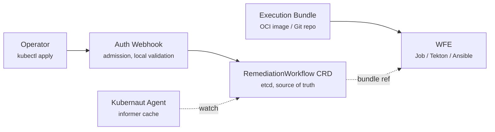

# Remediation Workflows

Kubernaut remediates issues by running **workflows** -- containerized actions that fix known problems. Workflows are registered as `RemediationWorkflow` CRDs, admitted directly by the Auth Webhook, and matched to incidents by the LLM based on labels, infrastructure context, and remediation history.

This page covers everything you need to author, build, register, and manage workflows.

## Registration Model

Workflows are registered by applying a `RemediationWorkflow` CRD. As of v1.6 (DD-WORKFLOW-018), the Auth Webhook owns the entire CRD lifecycle **locally** -- it intercepts the admission request, validates the schema, captures the operator identity for audit attribution, and computes a content hash for deduplication, all without a DataStorage round-trip. The CRD itself (persisted in etcd) is the sole source of truth; there is no separate DataStorage-side catalog table anymore.


```mermaid
flowchart LR
    Op["Operator<br/><small>kubectl apply</small>"] --> AW["Auth Webhook<br/><small>admission, local validation</small>"]
    AW --> ETCD["RemediationWorkflow CRD<br/><small>etcd, source of truth</small>"]
    KA["Kubernaut Agent<br/><small>informer cache</small>"] -.->|"watch"| ETCD
    Bundle["Execution Bundle<br/><small>OCI image / Git repo</small>"] --> WFE["WFE<br/><small>Job / Tekton / Ansible</small>"]
    ETCD -.->|"bundle ref"| WFE
```

| Component | Contents | Purpose |
|---|---|---|
| **RemediationWorkflow CRD** | Workflow schema (version, description, labels, parameters, execution config) | Source of truth for discovery and LLM selection, watched by Kubernaut Agent's in-memory catalog (v1.6, DD-WORKFLOW-019) |
| **Execution bundle** | The container or playbook that runs the remediation | Referenced in the CRD; pulled by WFE at execution time |

The CRD approach replaces the previous OCI schema image model. Workflow schemas are native Kubernetes resources, enabling `kubectl` management, GitOps workflows, and admission webhook integration for audit attribution -- with no external database dependency for registration or discovery.

!!! important "Namespace placement"
    - **`RemediationWorkflow`** and **`ActionType`** CRDs must be applied in `kubernaut-system` (or your configured platform namespace).
    - **`ServiceAccount`**, **`ClusterRole`**, and **`ClusterRoleBinding`** for per-workflow RBAC go in `kubernaut-workflows` (the execution namespace).

    All production workflows in the [kubernaut-demo-scenarios](https://github.com/jordigilh/kubernaut-demo-scenarios/tree/main/deploy) repository follow this convention.

## Create Your First Workflow

This tutorial walks through creating a workflow that restarts a deployment.

### Step 1: Write the Schema

Create `restart-deployment.yaml`. Production workflows ship as multi-document YAML: a per-workflow `ServiceAccount` with scoped RBAC, followed by the `RemediationWorkflow` CRD.

```yaml
# --- Per-workflow ServiceAccount and RBAC (in the execution namespace) ---
apiVersion: v1
kind: ServiceAccount
metadata:
  name: restart-deployment-v1-runner
  namespace: kubernaut-workflows
---
apiVersion: rbac.authorization.k8s.io/v1
kind: ClusterRole
metadata:
  name: kubernaut:workflow:restart-deployment-v1
rules:
  - apiGroups: ["apps"]
    resources: ["deployments"]
    verbs: ["get", "patch"]
  - apiGroups: ["apps"]
    resources: ["deployments/status", "replicasets"]
    verbs: ["get", "list"]
  - apiGroups: [""]
    resources: ["pods"]
    verbs: ["get", "list"]
---
apiVersion: rbac.authorization.k8s.io/v1
kind: ClusterRoleBinding
metadata:
  name: kubernaut:workflow:restart-deployment-v1
subjects:
  - kind: ServiceAccount
    name: restart-deployment-v1-runner
    namespace: kubernaut-workflows
roleRef:
  kind: ClusterRole
  name: kubernaut:workflow:restart-deployment-v1
  apiGroup: rbac.authorization.k8s.io
---
# --- RemediationWorkflow CRD (in the platform namespace) ---
apiVersion: kubernaut.ai/v1alpha1
kind: RemediationWorkflow
metadata:
  name: restart-deployment-v1
  namespace: kubernaut-system
spec:
  version: "1.0.0"
  description:
    what: "Performs a rolling restart of a deployment to clear corrupted runtime state"
    whenToUse: "When pods are in a degraded state but the deployment spec is correct"
    whenNotToUse: "When the issue is caused by a bad image or config change"
    preconditions: "The deployment exists and has at least one ready replica"
  maintainers:
    - name: "Platform Team"
      email: "platform@example.com"

  actionType: RestartDeployment

  labels:
    severity: [critical, high, warning]
    environment: [production, staging, development, "*"]
    component: [deployment]
    priority: "*"

  detectedLabels:
    helmManaged: "true"

  execution:
    engine: job
    bundle: registry.example.com/workflows/restart-deployment@sha256:abc123...
    serviceAccountName: restart-deployment-v1-runner

  parameters:
    - name: TARGET_RESOURCE_NAME
      type: string
      required: true
      description: "Name of the root managing resource (KA-injected)"
    - name: TARGET_RESOURCE_KIND
      type: string
      required: true
      description: "Kind of the root managing resource (KA-injected)"
    - name: TARGET_RESOURCE_NAMESPACE
      type: string
      required: false
      description: "Namespace of the root managing resource (KA-injected; empty for cluster-scoped)"
    - name: TARGET_RESOURCE_API_VERSION
      type: string
      required: false
      description: "API version of the root managing resource (KA-injected)"
    - name: TARGET_DEPLOYMENT
      type: string
      required: true
      description: "Name of the deployment to restart"

  dependencies:
    secrets: []
    configMaps: []
```

!!! tip "Per-workflow ServiceAccounts"
    Each workflow should declare its own ServiceAccount with least-privilege RBAC scoped to the resources it needs. The SA and its ClusterRole/ClusterRoleBinding go in the execution namespace (`kubernaut-workflows`), while the `RemediationWorkflow` CRD itself goes in the platform namespace (`kubernaut-system`). See the [kubernaut-demo-scenarios](https://github.com/jordigilh/kubernaut-demo-scenarios/tree/main/deploy/remediation-workflows) repository for complete examples.

### Step 2: Write the Remediation Script

Create `remediate.sh`:

```bash
#!/bin/bash
set -euo pipefail

echo "Validating deployment exists..."
kubectl get deployment "$TARGET_DEPLOYMENT" -n "$TARGET_RESOURCE_NAMESPACE" || {
  echo "ERROR: Deployment not found"
  exit 1
}

echo "Performing rolling restart..."
kubectl rollout restart deployment/"$TARGET_DEPLOYMENT" -n "$TARGET_RESOURCE_NAMESPACE"

echo "Waiting for rollout to complete..."
kubectl rollout status deployment/"$TARGET_DEPLOYMENT" -n "$TARGET_RESOURCE_NAMESPACE" --timeout=120s

echo "Verifying deployment health..."
READY=$(kubectl get deployment "$TARGET_DEPLOYMENT" -n "$TARGET_RESOURCE_NAMESPACE" -o jsonpath='{.status.readyReplicas}')
DESIRED=$(kubectl get deployment "$TARGET_DEPLOYMENT" -n "$TARGET_RESOURCE_NAMESPACE" -o jsonpath='{.spec.replicas}')

if [ "$READY" = "$DESIRED" ]; then
  echo "SUCCESS: All $READY/$DESIRED replicas ready"
else
  echo "WARNING: Only $READY/$DESIRED replicas ready"
  exit 1
fi
```

### Step 3: Build the Execution Bundle

Create `Containerfile.exec`:

```dockerfile
FROM registry.access.redhat.com/ubi9/ubi-minimal:latest
RUN microdnf install -y tar gzip && microdnf clean all
COPY --from=bitnami/kubectl:latest /opt/bitnami/kubectl/bin/kubectl /usr/local/bin/kubectl
COPY remediate.sh /scripts/remediate.sh
RUN chmod +x /scripts/remediate.sh
USER 1001
ENTRYPOINT ["/scripts/remediate.sh"]
```

Build and push:

```bash
podman build -f Containerfile.exec -t registry.example.com/workflows/restart-deployment:v1.0.0 .
podman push registry.example.com/workflows/restart-deployment:v1.0.0
```

Note the image digest from the push output -- update the `execution.bundle` field in the CRD with the digest-pinned reference.

### Step 4: Register the Workflow

```bash
kubectl apply -f restart-deployment.yaml
```

The Auth Webhook intercepts the CREATE request, validates and admits the workflow locally, captures the operator identity for audit attribution, and updates the CRD status with the assigned `workflowId` and `catalogStatus`.

Verify registration:

```bash
kubectl get remediationworkflow restart-deployment-v1 -o wide
```

## Create Your First Ansible Workflow

This tutorial walks through creating an Ansible-based workflow that fixes application configuration drift via a GitOps commit. It mirrors the Job tutorial above but uses AWX/AAP as the execution engine.

### Step 1: Set Up the AWX Job Template

Create a Job Template in your AWX/AAP instance:

- **Name**: `kubernaut-fix-config-drift` (this becomes `engineConfig.jobTemplateName`)
- **Project**: Point to a Git repository containing your playbooks (AWX syncs the repo via its SCM credential)
- **Playbook**: Select the playbook path (e.g., `playbooks/fix-config-drift.yml`)
- **Execution Environment**: Use an EE that includes the `kubernetes.core` and `community.general` collections

### Step 2: Write the Playbook

Create `playbooks/fix-config-drift.yml` in your playbook repository:


```yaml
---
- name: Fix configuration drift via GitOps commit
  hosts: localhost
  connection: local
  gather_facts: false

  tasks:
    - name: Read Git credentials from AWX credential env vars
      ansible.builtin.set_fact:
        git_username: "{{ lookup('env', 'KUBERNAUT_SECRET_GIT_REPO_CREDS_USERNAME') }}"
        git_password: "{{ lookup('env', 'KUBERNAUT_SECRET_GIT_REPO_CREDS_PASSWORD') }}"
      no_log: true

    - name: Clone application config repository
      ansible.builtin.git:
        repo: "https://{{ git_username }}:{{ git_password }}@github.com/org/app-config.git"
        dest: /tmp/app-config
        version: main
      no_log: true

    - name: Apply corrected configuration
      ansible.builtin.template:
        src: templates/deployment-config.yml.j2
        dest: "/tmp/app-config/{{ TARGET_RESOURCE_NAMESPACE }}/{{ TARGET_RESOURCE_NAME }}/config.yml"

    - name: Commit and push fix
      ansible.builtin.shell: |
        cd /tmp/app-config
        git add -A
        git commit -m "fix({{ TARGET_RESOURCE_NAMESPACE }}): correct config drift for {{ TARGET_RESOURCE_NAME }} [RR: {{ RR_NAME }}]"
        git push origin main
      no_log: true
```


Key points:

- Secrets are accessed via `lookup('env', 'KUBERNAUT_SECRET_...')` — always use `no_log: true` on tasks that handle credentials
- `RR_NAME` is auto-injected by the executor and used here to link the Git commit back to the remediation event
- `kubernetes.core` modules authenticate automatically via the injected `K8S_AUTH_*` credentials

### Step 3: Write the Schema

Create `fix-config-drift.yaml` with the SA + RBAC + CRD multi-doc pattern:

```yaml
apiVersion: v1
kind: ServiceAccount
metadata:
  name: fix-config-drift-v1-runner
  namespace: kubernaut-workflows
---
apiVersion: rbac.authorization.k8s.io/v1
kind: ClusterRole
metadata:
  name: kubernaut:workflow:fix-config-drift-v1
rules:
  - apiGroups: ["apps"]
    resources: ["deployments"]
    verbs: ["get", "list"]
  - apiGroups: [""]
    resources: ["configmaps"]
    verbs: ["get", "list"]
---
apiVersion: rbac.authorization.k8s.io/v1
kind: ClusterRoleBinding
metadata:
  name: kubernaut:workflow:fix-config-drift-v1
subjects:
  - kind: ServiceAccount
    name: fix-config-drift-v1-runner
    namespace: kubernaut-workflows
roleRef:
  kind: ClusterRole
  name: kubernaut:workflow:fix-config-drift-v1
  apiGroup: rbac.authorization.k8s.io
---
apiVersion: kubernaut.ai/v1alpha1
kind: RemediationWorkflow
metadata:
  name: fix-config-drift-v1
  namespace: kubernaut-system
spec:
  version: "1.0.0"
  description:
    what: "Fixes application configuration drift by committing the correct state to the source Git repository"
    whenToUse: "When config drift is detected and the correct state is defined in a GitOps-managed repository"
    whenNotToUse: "When the drift is intentional or the application is not GitOps-managed"
    preconditions: "The deployment exists, the config repository is accessible, and Git credentials are available"
  maintainers:
    - name: "Platform Team"
      email: "platform@example.com"

  actionType: FixConfiguration

  labels:
    severity: [high, warning]
    environment: [production, staging]
    component: [deployment]
    priority: "*"

  detectedLabels:
    gitOpsManaged: "true"

  execution:
    engine: ansible
    bundle: https://github.com/org/remediation-playbooks.git
    bundleDigest: b7e6a135be2019f995cb4875dbc0116dfda39d21
    serviceAccountName: fix-config-drift-v1-runner
    engineConfig:
      playbookPath: "playbooks/fix-config-drift.yml"
      jobTemplateName: "kubernaut-fix-config-drift"

  parameters:
    - name: TARGET_RESOURCE_NAME
      type: string
      required: true
      description: "Name of the root managing resource (KA-injected)"
    - name: TARGET_RESOURCE_KIND
      type: string
      required: true
      description: "Kind of the root managing resource (KA-injected)"
    - name: TARGET_RESOURCE_NAMESPACE
      type: string
      required: false
      description: "Namespace of the root managing resource (KA-injected; empty for cluster-scoped)"
    - name: TARGET_RESOURCE_API_VERSION
      type: string
      required: false
      description: "API version of the root managing resource (KA-injected)"

  dependencies:
    secrets:
      - name: git-repo-creds
    configMaps: []
```

!!! note "`bundleDigest` is the Git commit SHA"
    Unlike Job/Tekton workflows where the bundle is an OCI image digest, Ansible workflows use the Git commit SHA to pin the exact playbook version. Update `bundleDigest` when you push new playbook changes to ensure Kubernaut runs the version you registered.

### Step 4: Create the Secret

The workflow declares `git-repo-creds` as a dependency. Create it in the execution namespace:

```bash
kubectl create secret generic git-repo-creds \
  -n kubernaut-workflows \
  --from-literal=username=kubernaut-bot \
  --from-literal=password=ghp_xxxxxxxxxxxx
```

The executor reads this Secret, creates an ephemeral AWX credential, and injects the values as `KUBERNAUT_SECRET_GIT_REPO_CREDS_USERNAME` and `KUBERNAUT_SECRET_GIT_REPO_CREDS_PASSWORD` environment variables into the Execution Environment. The ephemeral credential is deleted after the AWX job completes.

### Step 5: Register the Workflow

```bash
kubectl apply -f fix-config-drift.yaml
```

Verify registration:

```bash
kubectl get remediationworkflow fix-config-drift-v1 -n kubernaut-system -o wide
```

The `CATALOGSTATUS` column should show `Active` once the Auth Webhook completes registration. If it shows `Pending`, the webhook is still processing. If it shows `Invalid`, check the workflow spec for errors (e.g., unreachable bundle URL).

## Schema Reference

For the complete field specification, see [RemediationWorkflow](../api-reference/crds.md#remediationworkflow) and [ActionType](../api-reference/crds.md#actiontype) in the CRD Reference.

### Labels

Mandatory labels control when a workflow is eligible during discovery:

| Label | Type | Required | Description |
|---|---|---|---|
| `severity` | string[] | Yes | Severity levels: `critical`, `high`, `warning`, `info` (array, `minItems: 1`) |
| `environment` | string[] | Yes | Environments: `production`, `staging`, `development`, `test`, or `"*"` (array, `minItems: 1`) |
| `component` | string[] | Yes | Resource kind(s): `pod`, `deployment`, `node`, or `"*"` (array, `minItems: 1`) |
| `priority` | string | Yes | Priority: `P0`, `P1`, `P2`, `P3`, or `"*"` (single value) |
| `cluster` | string[] | No (v1.6, Fleet only) | Cluster classification(s) this workflow applies to (e.g., `production`, `staging-eu`), or `"*"`. See [Fleet: Cluster Label](#fleet-cluster-label-v16) below. |

Labels support:

- **Exact match** -- `component: [deployment]`
- **Wildcard** -- `component: ["*"]` (matches any value)
- **Multi-value** -- `severity: [critical, high]` (matches either)

!!! warning "Labels determine discoverability"
    Workflows that don't match the mandatory label filters are excluded entirely -- they never reach the LLM. A misconfigured severity or environment can silently hide a workflow from the candidate set. See [Workflow Search and Scoring](#workflow-search-and-scoring) for details.

#### Fleet: Cluster Label (v1.6)

`cluster` (BR-FLEET-003, Issue #1511) restricts a workflow to signals originating from specific clusters, based on the cluster's business classification (e.g., `production`, `staging-eu`) rather than its cluster name. It behaves differently depending on whether Fleet is enabled:

- **Non-fleet deployments** (no cluster classification is ever produced) -- this dimension is **never evaluated**, regardless of whether a workflow declares `cluster`. Existing workflows with no `cluster` field are completely unaffected by upgrading to v1.6.
- **Fleet-enabled deployments** -- once Signal Processing resolves a concrete cluster classification for the incoming signal, matching works exactly like `component`/`environment`: case-insensitive exact match, or `"*"` to match any cluster.

!!! warning "Omitting `cluster` excludes the workflow once Fleet is enabled"
    In a fleet-enabled deployment, a workflow with **no `cluster` entries is excluded** the moment a signal carries a concrete cluster classification -- this is an active exclusion, not a pass-through default. If you enable Fleet on a cluster fleet with pre-existing workflows that never declared `cluster`, those workflows will stop being discoverable for any classified cluster unless you add `cluster: ["*"]` (match any cluster) or an explicit list of classifications. See [Troubleshooting: A workflow doesn't appear for a specific cluster](workflow-authoring.md#a-workflow-doesnt-appear-for-a-specific-cluster-fleet) for diagnosis steps.

### Workflow display name

`FormatWorkflowDisplay(actionType, workflowName)` returns `ActionType:WorkflowName` for user-visible strings. It is a pure string formatter -- no DataStorage lookup, no failure mode. The Remediation Orchestrator calls it once, at workflow-selection time (never LLM-suppliable), and persists the result as `workflowDisplayName` on the RemediationRequest; consumers such as Notification read this precomputed field directly rather than resolving it at display time. If `workflowName` is empty, it returns an empty string regardless of `actionType`; if only `actionType` is empty, it returns `workflowName` alone (no `:` prefix).

### Detected Labels

Optional infrastructure-awareness labels that influence scoring and help the LLM select the right workflow for the target environment:

```yaml
detectedLabels:
  gitOpsManaged: "true"
  gitOpsTool: "argocd"      # argocd | flux | "*"
  helmManaged: "true"
  pdbProtected: "true"
  hpaEnabled: "true"
  stateful: "true"
  networkIsolated: "true"
  serviceMesh: "istio"       # istio | linkerd | "*"
  resourceQuotaConstrained: "true"
  virtualMachine: "true"
  liveMigratable: "true"
  cdiManaged: "true"
  storageBackend: "odf-ceph" # odf-ceph | lvms | local | "*"
```

| Label | Type | Valid Values | Category |
|---|---|---|---|
| `gitOpsManaged` | boolean | `"true"` only | GitOps management |
| `gitOpsTool` | string | `argocd`, `flux`, `"*"` | GitOps management |
| `pdbProtected` | boolean | `"true"` only | Workload protection |
| `hpaEnabled` | boolean | `"true"` only | Workload protection |
| `stateful` | boolean | `"true"` only | Workload characteristics |
| `helmManaged` | boolean | `"true"` only | Workload characteristics |
| `networkIsolated` | boolean | `"true"` only | Security posture |
| `serviceMesh` | string | `istio`, `linkerd`, `"*"` | Security posture |
| `resourceQuotaConstrained` | boolean | `"true"` only | Resource constraints |
| `virtualMachine` | boolean | `"true"` only | Virtualization (CNV) |
| `liveMigratable` | boolean | `"true"` only | Virtualization (CNV) |
| `cdiManaged` | boolean | `"true"` only | Virtualization (CNV) |
| `storageBackend` | string | `odf-ceph`, `lvms`, `local`, `"*"` | Virtualization (CNV) |

Workflows that declare detected labels earn scoring boosts when the target resource matches -- see [Workflow Search and Scoring](#workflow-search-and-scoring).

### Bundle Digest Format

For `job` and `tekton` engines, the `execution.bundle` field must use a **digest-pinned** OCI reference:

```
registry.example.com/repo/image@sha256:<64 hex characters>
```

- Must contain `@` (tag-only references are rejected)
- Must use `sha256:` algorithm
- Digest must be exactly 64 hex characters
- An optional tag before `@` is allowed: `image:v1.0.0@sha256:abc123...`

For the `ansible` engine, the `execution.bundle` field is a Git repository URL, and `execution.bundleDigest` is the Git commit SHA.

!!! note "No registry pre-flight check (v1.5.3+)"
    DataStorage does **not** verify that `execution.bundle` resolves in the registry at registration time. Earlier versions ran an OCI existence check from the DataStorage pod's own network/credential context, but this could not validate self-signed or credential-required private registries reachable only by the actual workflow execution environment, so it was removed. An incorrect or unreachable image reference now registers successfully and only fails later, at Job/PipelineRun image-pull time (`ImagePullBackOff`/`ErrImagePull` — check via `kubectl describe pod` or `kubectl get job`).

### Dependencies

Workflows can declare Secrets and ConfigMaps that must exist in the execution namespace:

```yaml
dependencies:
  secrets:
    - name: registry-credentials
  configMaps:
    - name: app-config
```

The Workflow Execution controller validates that these resources exist before creating the execution resource. How they are delivered to the workflow depends on the engine:

**Kubernetes Jobs:**

- Secrets mounted at `/run/kubernaut/secrets/<name>` (read-only)
- ConfigMaps mounted at `/run/kubernaut/configmaps/<name>` (read-only)

**Tekton Pipelines:**

- Secrets bound as `secret-<name>` workspaces
- ConfigMaps bound as `configmap-<name>` workspaces

**Ansible (AWX/AAP):**

- For each Secret in `dependencies.secrets`, the executor reads the Kubernetes Secret, dynamically creates an AWX credential type with an `env` injector, creates an ephemeral AWX credential, and attaches it to the job launch. AWX injects the values as environment variables into the Execution Environment:

    ```
    KUBERNAUT_SECRET_{SECRET_NAME}_{KEY}
    ```

    For example, a Secret named `gitea-repo-creds` with keys `username` and `password` becomes:

    - `KUBERNAUT_SECRET_GITEA_REPO_CREDS_USERNAME`
    - `KUBERNAUT_SECRET_GITEA_REPO_CREDS_PASSWORD`

    Ephemeral credentials are automatically deleted after the AWX job completes or is cleaned up. The Kubernetes Secret remains the single source of truth -- if it changes, the next execution picks up the new values.

- For each ConfigMap in `dependencies.configMaps`, the executor reads the Kubernetes ConfigMap and merges its data into AWX `extra_vars` with a standardized prefix:

    ```
    KUBERNAUT_CONFIGMAP_{CONFIGMAP_NAME}_{KEY}
    ```

    For example, a ConfigMap named `app-settings` with keys `timeout` and `log-level` becomes extra_vars:

    - `KUBERNAUT_CONFIGMAP_APP_SETTINGS_TIMEOUT`
    - `KUBERNAUT_CONFIGMAP_APP_SETTINGS_LOG_LEVEL`

    ConfigMap data is non-sensitive, so it uses AWX extra_vars (not credentials). The playbook accesses these as standard Ansible variables.

!!! warning "Security: Use `no_log: true` for sensitive Ansible tasks"
    When writing Ansible playbooks that handle secrets (credentials, tokens, passwords), always set `no_log: true` on tasks that read or use sensitive values. This prevents AWX from recording secret data in job output logs:

    
    ```yaml
    - name: Read Git credentials from AWX credential env vars
      ansible.builtin.set_fact:
        git_username: "{{ lookup('env', 'KUBERNAUT_SECRET_GITEA_REPO_CREDS_USERNAME') }}"
        git_password: "{{ lookup('env', 'KUBERNAUT_SECRET_GITEA_REPO_CREDS_PASSWORD') }}"
      no_log: true
    ```
    

    Tasks to protect include: reading credentials from environment variables, building authenticated URLs, cloning repositories with embedded credentials, and any task that passes secrets as arguments.

### Parameters

Parameters use `UPPER_SNAKE_CASE` names and are injected as environment variables.

| Field | Type | Description |
|---|---|---|
| `name` | string | Parameter name in `UPPER_SNAKE_CASE` |
| `type` | string | One of: `string`, `integer`, `boolean`, `float`, `array` |
| `required` | boolean | Whether the parameter must be provided |
| `description` | string | Shown to the LLM during `get_workflow` — write it clearly enough for the LLM to populate the value from its investigation findings |
| `default` | JSON | Default value (type must match `type` field) |
| `enum` | string[] | Allowed values (validated at execution time) |
| `pattern` | string | Regex validation for `string` parameters |
| `minimum` | number | Minimum value for `integer`/`float` parameters |
| `maximum` | number | Maximum value for `integer`/`float` parameters |
| `dependsOn` | string[] | Names of other parameters this one depends on |

For the complete parameter schema, see [RemediationWorkflow](../api-reference/crds.md#remediationworkflow) in the CRD Reference.

#### Canonical target resource parameters

Every workflow schema **must** declare these three parameters as `required: true`:

| Parameter | Description |
|---|---|
| `TARGET_RESOURCE_NAME` | Name of the root managing resource |
| `TARGET_RESOURCE_KIND` | Kind of the root managing resource (e.g., `Deployment`) |
| `TARGET_RESOURCE_NAMESPACE` | Namespace of the root managing resource (empty for cluster-scoped) |
| `TARGET_RESOURCE_API_VERSION` | API version of the root managing resource (e.g., `apps/v1`) |

These are **KA-injected** -- Kubernaut Agent derives them from the K8s-verified `root_owner` (resolved via the Pod → ReplicaSet → Deployment owner chain) and injects them into `selected_workflow.parameters` before the AIAnalysis completes. The LLM never sees or populates these fields (they are stripped from the schema before the LLM receives it).

If Kubernaut Agent cannot determine the `root_owner` (e.g., the resource context tools were never called), the investigation is flagged `rca_incomplete` with `needs_human_review=true`.

Additionally, the WFE controller injects `TARGET_RESOURCE` (composite format `namespace/kind/name`) from `wfe.Spec.TargetResource` into every Job and Tekton PipelineRun as a system variable.

Workflows may also declare additional **operational parameters** (e.g., `TARGET_DEPLOYMENT`, `GRACE_PERIOD_SECONDS`) that the LLM populates from its investigation findings.

#### Ansible auto-injected variables

For `ansible` executions, the executor also auto-injects remediation context variables into AWX `extra_vars` (BR-WE-015 TR-6):

| Variable | Source | Purpose |
|----------|--------|---------|
| `WFE_NAME` | WorkflowExecution CRD name | Query WFE status, parameters, or execution metadata via the Kubernetes API |
| `WFE_NAMESPACE` | WorkflowExecution CRD namespace | Namespace of the WFE |
| `RR_NAME` | `wfe.Spec.RemediationRequestRef.Name` | Reference the parent RemediationRequest in commit messages, logs, and audit annotations -- no Kubernetes API lookup needed |
| `RR_NAMESPACE` | `wfe.Spec.RemediationRequestRef.Namespace` | Namespace of the parent RR |

These variables are injected by the executor and must not be declared as parameters in the workflow schema. `RR_NAME` is the most commonly used -- for example, the GitOps memory limits playbook includes the RR name in its Git commit message to link the code change back to the remediation event.

## Execution Engines

### Kubernetes Jobs

Single-step remediations run as Kubernetes Jobs in the `kubernaut-workflows` namespace:

```yaml
execution:
  engine: job
  bundle: registry.example.com/workflows/restart-deployment@sha256:abc123...
```

The Workflow Execution controller creates a Job with:

- **Environment variables** -- All parameters (including the four canonical `TARGET_RESOURCE_*` params) injected as env vars, plus the system-injected `TARGET_RESOURCE`
- **Dependency mounts** -- Secrets at `/run/kubernaut/secrets/<name>`, ConfigMaps at `/run/kubernaut/configmaps/<name>`
- **ServiceAccount** -- Per-workflow SA from `execution.serviceAccountName` (recommended). Falls back to the execution namespace default SA if omitted.

### Tekton Pipelines

Multi-step remediations use Tekton Pipelines:

```yaml
execution:
  engine: tekton
  bundle: registry.example.com/tekton-bundles/oom-recovery:v1.0.0@sha256:abc123...
```

The bundle must contain a Tekton Pipeline named `workflow`. The controller creates a PipelineRun with:

- **Tekton bundle resolver** -- The bundle is referenced via `resolver: bundles` with the digest-pinned image
- **Parameters** -- All parameters (including the four canonical `TARGET_RESOURCE_*` params) injected as Tekton params, plus the system-injected `TARGET_RESOURCE`
- **Dependency workspaces** -- Secrets as `secret-<name>` workspace bindings, ConfigMaps as `configmap-<name>` workspace bindings

Tekton provides step ordering, retries, and artifact passing between steps.

### Ansible (AWX/AAP)

Workflows that run Ansible playbooks via AWX or Ansible Automation Platform (AAP) use the `ansible` engine:

```yaml
apiVersion: kubernaut.ai/v1alpha1
kind: RemediationWorkflow
metadata:
  name: ansible-fix-config
  namespace: kubernaut-system
spec:
  version: "1.0.0"
  description:
    what: "Fixes application configuration drift using Ansible"
    whenToUse: "When config drift is detected and the correct state is in a Git repository"
  actionType: FixConfiguration
  labels:
    severity: [high, warning]
    environment: [production, staging]
    component: [deployment]
    priority: "*"
  execution:
    engine: ansible
    bundle: https://github.com/org/remediation-playbooks.git
    bundleDigest: b7e6a135be2019f995cb4875dbc0116dfda39d21
    serviceAccountName: ansible-fix-config-runner
    engineConfig:
      playbookPath: "playbooks/fix-config.yml"
      jobTemplateName: "kubernaut-fix-config"
  parameters:
    - name: TARGET_RESOURCE_NAME
      type: string
      required: true
      description: "Name of the root managing resource (KA-injected)"
    - name: TARGET_RESOURCE_KIND
      type: string
      required: true
      description: "Kind of the root managing resource (KA-injected)"
    - name: TARGET_RESOURCE_NAMESPACE
      type: string
      required: false
      description: "Namespace of the root managing resource (KA-injected; empty for cluster-scoped)"
    - name: TARGET_RESOURCE_API_VERSION
      type: string
      required: false
      description: "API version of the root managing resource (KA-injected)"
```

The `engineConfig` fields for Ansible:

| Field | Required | Description |
|---|---|---|
| `playbookPath` | Yes | Path to the playbook within the Git repository |
| `jobTemplateName` | Yes | AWX/AAP Job Template name to launch |
| `inventoryName` | No | AWX/AAP inventory to use |

The Workflow Execution controller launches the AWX job template, passes parameters as extra variables, and monitors the job status until completion.

**Dependencies in Ansible workflows:**

- **Secrets** (`dependencies.secrets`): Injected as environment variables via ephemeral AWX credentials (`KUBERNAUT_SECRET_{NAME}_{KEY}`). Use `lookup('env', ...)` in your playbook.
- **ConfigMaps** (`dependencies.configMaps`): Merged into AWX extra_vars (`KUBERNAUT_CONFIGMAP_{NAME}_{KEY}`). Access as standard Ansible variables.

**Automatic K8s API credentials:**

The executor automatically injects the WE controller's in-cluster ServiceAccount token as an ephemeral AWX credential on every job launch. Playbooks using `kubernetes.core` modules receive `K8S_AUTH_HOST`, `K8S_AUTH_API_KEY`, and `K8S_AUTH_SSL_CA_CERT` environment variables without manual credential configuration. The credential is ephemeral and deleted after the job completes. If the in-cluster environment is unavailable, the job proceeds without K8s credentials.

For a complete end-to-end walkthrough, see [Create Your First Ansible Workflow](#create-your-first-ansible-workflow).

## Action Type Taxonomy

Action types form the vocabulary the LLM uses to reason about remediation. Each action type has a structured description (`what`, `whenToUse`, `whenNotToUse`, `preconditions`) that the LLM reads during the `list_available_actions` step.

### Registering Action Types

The taxonomy is **user-extensible**. Operators register custom action types by applying an `ActionType` CRD:

```yaml
apiVersion: kubernaut.ai/v1alpha1
kind: ActionType
metadata:
  name: restart-sidecar
  namespace: kubernaut-system
spec:
  name: RestartSidecar
  description:
    what: "Restart only the sidecar container without affecting the main application"
    whenToUse: "When a service mesh sidecar is in a degraded state but the main container is healthy"
    whenNotToUse: "When the main application container is also failing"
    preconditions: "The pod has a sidecar container identified by the service mesh annotation"
```

```bash
kubectl apply -f restart-sidecar-actiontype.yaml
```

The Auth Webhook intercepts the CREATE, validates and admits the action type locally, and captures the operator identity for audit attribution. Deleting the CRD disables the action type; re-applying a previously deleted name re-creates it as a fresh entry (there is no distinct "re-enable" semantics as of v1.6 -- deletion and re-creation are plain CRD CREATE/DELETE admission events).

!!! note "`whenNotToUse` and `preconditions` are optional but strongly recommended"
    The `whenNotToUse` and `preconditions` fields are optional on both `ActionType` and `RemediationWorkflow` descriptions. However, providing them significantly improves LLM selection quality by giving the model explicit exclusion criteria and validation requirements.

!!! warning "Action type descriptions directly affect LLM behavior"
    The LLM reads `what`, `whenToUse`, `whenNotToUse`, and `preconditions` verbatim during workflow discovery. Poorly written or overlapping descriptions degrade workflow selection quality:

    - **Write clear, unambiguous descriptions** so the LLM can distinguish between action types
    - **Avoid semantic collisions** -- action types that overlap in meaning (e.g., `RestartPod` vs `RecyclePod`) will confuse the LLM
    - **Use PascalCase naming** consistent with existing demo types
    - Action types are intentionally **stable** -- they should not change frequently during a deployment's lifecycle

## Workflow Lifecycle

Workflows have seven lifecycle states:

| State | Description | Discoverable |
|---|---|---|
| `Pending` | Initial state before Auth Webhook registration completes | No |
| `Active` | Available for selection | Yes (if `is_latest_version`) |
| `Invalid` | Registration failed (e.g., action type not found in taxonomy, or a schema-declared dependency Secret/ConfigMap does not exist) | No |
| `Disabled` | Temporarily unavailable (CRD deleted, or manually disabled) | No |
| `Superseded` | Replaced by a new registration with different content for the same `metadata.name` + `version` | No |
| `Deprecated` | Marked for removal, still usable | No |
| `Archived` | Permanently removed from catalog | No |

State transitions via `kubectl`:

```bash
# Register (active)
kubectl apply -f my-workflow.yaml

# Disable (deleting the CRD disables the catalog entry)
kubectl delete remediationworkflow my-workflow

# Re-enable (re-applying a previously deleted CRD re-enables it)
kubectl apply -f my-workflow.yaml
```

!!! note "kubectl is the only lifecycle management path (v1.6)"
    Through v1.5, DataStorage also exposed a REST API (`PATCH /api/v1/workflows/{workflow_id}/disable|enable|deprecate`) for advanced lifecycle management. As of v1.6 (DD-WORKFLOW-018), this REST surface and its backing handlers were deleted outright -- the Auth Webhook owns the `RemediationWorkflow` CRD lifecycle entirely locally now. `kubectl apply`/`kubectl delete` (above) is the only supported way to transition workflow state.

### Content Integrity and Supersede

When a `RemediationWorkflow` CRD is applied with the same `metadata.name` + `version` as an existing active workflow, the Auth Webhook computes a content hash of the incoming schema and compares it to the existing entry:

| Existing State | Content Hash | Result |
|---|---|---|
| `active` | Same | Idempotent return (no DB writes) |
| `active` | Different | Old workflow marked `superseded`, new one created as `active` |
| `disabled` | Same | Re-enabled |
| `disabled` | Different | New workflow created as `active` |

### Version Management

When a new version of a workflow is registered (same `metadata.name`, different `version`), the previous version's `is_latest_version` flag is set to `false`. Only workflows with `status = 'active'` AND `is_latest_version = true` are discoverable.

This means you can register a new version and the old one is automatically excluded from discovery without needing to disable it.

## Workflow Search and Scoring

Understanding how workflows are filtered and scored is critical for authoring effective schemas. Your label and detected label choices directly affect whether the LLM ever sees your workflow.

!!! info "v1.6: discovery, filtering, and scoring moved in-process to Kubernaut Agent"
    Through v1.5, DataStorage's PostgreSQL/JSONB queries performed this filtering and scoring. **As of v1.6** (DD-WORKFLOW-018, DD-WORKFLOW-019), Kubernaut Agent performs the exact same filtering and scoring logic in-process, over its own informer-cache-backed watch of the `RemediationWorkflow`/`ActionType` CRDs -- there is no DataStorage round trip and no PostgreSQL query on the investigation path. The formula, boost weights, and matching semantics documented below are unchanged; only where they execute changed. See [Registration Model](#registration-model) for the underlying CRD-native architecture.

### Layer 1: Mandatory Label Filtering (hard filter)

Before scoring, Kubernaut Agent filters candidates using the mandatory labels from the schema. Workflows that fail any filter are **excluded entirely** -- they never reach the LLM.

| Filter | Matching Rule |
|---|---|
| **Severity** | Workflow's `severity` array must contain the query value, or contain `"*"` |
| **Component** | Case-insensitive comparison: Kubernetes Kind is PascalCase (e.g., `Deployment`), workflow labels store lowercase (e.g., `deployment`) |
| **Environment** | Workflow's `environment` array must contain the query value, or contain `"*"` |
| **Priority** | String match (single value) with `"*"` wildcard |
| **Cluster** (v1.6, Fleet only) | Workflow's `cluster` array must contain the query value (case-insensitive) or `"*"`; dimension is skipped entirely when no cluster classification is present (non-fleet). See [Fleet: Cluster Label](#fleet-cluster-label-v16). |

Additionally, only `Active` + latest-version workflows pass (see [Workflow Lifecycle](#workflow-lifecycle)).

### Layer 2: Semantic Scoring (ranking)

Surviving candidates are scored by infrastructure label overlap. The formula:

```
final_score = LEAST((5.0 + detected_boost + custom_boost - penalty) / 10.0, 1.0)
```

The base score is 0.5 (5.0/10.0). Boosts increase it, penalties decrease it. The `LEAST` clamp ensures the score never exceeds 1.0 when many labels match.

**Detected label boost weights:**

| Label | Exact Match | Workflow Wildcard (`"*"`) | Query Wildcard |
|---|---|---|---|
| `gitOpsManaged` | +0.10 | -- | -- |
| `gitOpsTool` | +0.10 | +0.05 | +0.05 |
| `virtualMachine` | +0.08 | -- | -- |
| `pdbProtected` | +0.05 | -- | -- |
| `serviceMesh` | +0.05 | +0.025 | +0.025 |
| `storageBackend` | +0.05 | +0.025 | +0.025 |
| `liveMigratable` | +0.04 | -- | -- |
| `networkIsolated` | +0.03 | -- | -- |
| `cdiManaged` | +0.03 | -- | -- |
| `helmManaged` | +0.02 | -- | -- |
| `stateful` | +0.02 | -- | -- |
| `hpaEnabled` | +0.02 | -- | -- |

Maximum possible boost: **0.59** (all labels match exactly).

!!! note "`resourceQuotaConstrained` is not scored"
    The `resourceQuotaConstrained` label is detected and stored but does not contribute to workflow scoring. It is available for Rego policy evaluation via `input.analysis.detectedLabels`.

**Penalty rules** (high-impact only):

| Condition | Penalty |
|---|---|
| Target IS GitOps-managed but workflow doesn't declare `gitOpsManaged` | -0.10 |
| Target uses a specific GitOps tool but workflow declares a different one | -0.10 |

Maximum possible penalty: **0.20**.

**Custom labels:** +0.15 per exact match, +0.075 per wildcard match.

### What This Means for Workflow Authors

- **Detected labels have the highest impact on ranking.** A GitOps-aware workflow (`gitOpsManaged: "true"`, `gitOpsTool: "argocd"`) will consistently outrank a generic one when the target is ArgoCD-managed.
- **Setting `"*"` wildcards earns half credit.** Useful for broadly applicable workflows that work with any GitOps tool or service mesh.
- **Not declaring a detected label means "no requirement"** -- no boost, no penalty (except for GitOps, which applies a penalty when the target IS GitOps-managed).
- **Custom labels provide fine-grained differentiation** for organization-specific matching (e.g., `team: payments`).

### Connection to Signal Processing Rego Policies

The SP Rego policies determine the values that feed into discovery:

All classification rules live in a single `policy.rego` file under `package signalprocessing`:

- The `severity` and `priority` rules produce values for **Layer 1 filtering** -- a misconfigured rule can silently exclude correct workflows
- The `environment` rules produce the environment value for **Layer 1 filtering**
- The `labels` rules (`kubernaut.ai/label-*`) produce values for **Layer 2 scoring** at +0.15 per match
- (Fleet only, v1.6) A separate `cluster` classification rule produces the value for the **Layer 1 `cluster` filter** -- see [Fleet: Cluster Label](#fleet-cluster-label-v16)

!!! note "Why business classification is generally not used for discovery"
    Workflows are reusable across organizational boundaries -- a `RollbackDeployment` works for any team, business unit, or SLA tier. Mandatory labels describe the **technical remediation context** (severity, resource type, environment). Business classification generally describes **who owns the resource**, which is orthogonal to what fix is needed. Operators who want organizational matching can use custom labels (e.g., `kubernaut.ai/label-team=payments` on the namespace + `customLabels: {team: ["payments"]}` in the schema). The `cluster` classification (v1.6, Fleet-only) is a deliberate, narrow exception to this principle: it exists specifically to let a shared workflow catalog restrict certain workflows to certain clusters in a multi-cluster fleet, not to model organizational ownership.

### Scoring Is Internal Ordering, Not Selection

The `final_score` determines the order in which workflows are presented to the LLM, but the **LLM makes the final selection** based on descriptions, remediation history, and context. A workflow ranked #2 by score can still be selected if its description better matches the root cause.

## Example Workflows

The [kubernaut-demo-scenarios](https://github.com/jordigilh/kubernaut-demo-scenarios) repository contains a library of reference workflows covering common remediation patterns (CrashLoopBackOff rollback, OOM memory increase, GitOps revert, node drain, certificate repair, etc.). These are ready-to-use starting points that operators can adapt to their environment.

```
kubernaut-demo-scenarios/deploy/
├── action-types/          # One YAML per ActionType CRD
│   ├── crashloop-rollback.yaml
│   └── increase-memory-limits.yaml
└── remediation-workflows/
    └── <scenario>/        # Multi-doc YAML (SA + RBAC + CRD),
        ├── <scenario>.yaml    plus Dockerfile and remediate.sh
        ├── Containerfile.exec # for job-engine workflows
        └── remediate.sh
```

Operators register workflows by applying `RemediationWorkflow` CRDs — see [Authoring Workflows](workflow-authoring.md) for guidelines.

## CRUD Operations

### RemediationWorkflow

**Create:**

```bash
kubectl apply -f my-workflow.yaml
```

**Read:**

```bash
kubectl get remediationworkflows
kubectl get remediationworkflow my-workflow -o yaml
```

**Update** (spec fields are immutable after creation; apply a new version instead):

Re-apply the CRD with the same `metadata.name` + `version` but different content. The old workflow is marked `superseded` and a new one is created.

**Delete** (disables in catalog):

```bash
kubectl delete remediationworkflow my-workflow
```

### ActionType

**Create:**

```bash
kubectl apply -f my-actiontype.yaml
```

**Read:**

```bash
kubectl get actiontypes
kubectl get actiontype my-actiontype -o yaml
```

**Update** (description field is mutable):

Edit the CRD and re-apply:

```bash
kubectl apply -f my-actiontype.yaml
```

**Delete** (disables in taxonomy):

```bash
kubectl delete actiontype my-actiontype
```

Re-applying a previously deleted `ActionType` CRD re-enables it with the previous workflow associations intact.

## Next Steps

- [Investigation Pipeline](../architecture/kubernaut-agent-investigation.md) -- How the LLM discovers and selects workflows
- [Human Approval](approval.md) -- When workflows require approval before execution
- [Effectiveness Monitoring](effectiveness.md) -- How outcomes are evaluated
- [Architecture: Workflow Execution](../architecture/workflow-execution.md) -- Deep-dive into the execution engine
