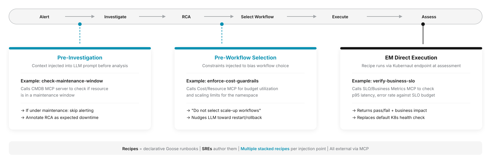

---
hide:
  - navigation
  - toc
---

# What's Next

The features below are planned for future Kubernaut releases. For features that shipped in v1.5, see [What's New: v1.5](../whats-new/index.md#v15). For features that shipped in v1.5.1 (Kubernaut Console, per-phase LLM routing, multi-provider JWT, severity triage LLM, SSE status endpoint), see [What's New: v1.5.1](../whats-new/index.md#v151). For Fleet Management, the `AgentSession` CRD, the v1alpha2 Operator CRD, and the LLM provider rewrite shipped in v1.6, see [What's New: v1.6](../whats-new/index.md#v16).

!!! info "Fleet's shipped design differs from the earlier ACM/OCM plan below"
    The Fleet Operations concept previously outlined here (hub-and-spoke via raw ACM/OCM, direct AWX playbook dispatch, per-hop Keycloak JWTs) was **superseded** by the [Fleet Management architecture](../architecture/fleet.md) that actually shipped in v1.6: a pluggable scope backend (FMC or ACM Search) plus an MCP Gateway (Kuadrant/Envoy AI Gateway) for cluster-transparent tool access, with OAuth2 client-credentials auth and no remote Ansible/AWX support. See [What's New: v1.6](../whats-new/index.md#v16) for what shipped.

## Next up

### ServiceNow Incident Triage

Consume ServiceNow incidents as signals through the API Frontend, enabling Kubernaut to investigate and remediate ITSM tickets alongside Kubernetes alerts ([#1338](https://github.com/jordigilh/kubernaut/issues/1338)). Design work is underway ([ADR-063](https://github.com/jordigilh/kubernaut/blob/main/docs/architecture/decisions/ADR-063-servicenow-signal-integration.md), [DD-INT-020](https://github.com/jordigilh/kubernaut/blob/main/docs/architecture/decisions/DD-INT-020-servicenow-signal-target-type.md)); no implementation has landed as of v1.6.

### Fleet backend expansion

Rancher and Clusterpedia as additional pluggable scope backends alongside the FMC and ACM Search backends that shipped in v1.6 — see [Fleet Management: Pluggable scope backend](../architecture/fleet.md).

---

## Future

### Custom Agent Injection

Pluggable investigation and remediation agents via the **AgenticWorkflow CRD**, enabling operators to inject domain-specific automation into the Kubernaut pipeline ([#1242](https://github.com/jordigilh/kubernaut/issues/1242), [#883](https://github.com/jordigilh/kubernaut/issues/883), [#711](https://github.com/jordigilh/kubernaut/issues/711)).

SREs define reusable agentic workflows as declarative [Goose recipes](https://block.github.io/goose/docs/guides/recipes/) — YAML-based configurations that package instructions, MCP extensions, and parameters into shareable, reproducible agent behaviors. Kubernaut injects them at three pipeline points via the Goose runtime, each calling external MCP tools. Each injection point accepts multiple stacked recipes.

#### Injection 1: Pre-Investigation (Kubernaut Agent)

Context injected into the LLM prompt before analysis begins.

**Example: `check-maintenance-window`** — Calls a CMDB MCP server to check if the resource is in a maintenance window or had recent deployments. The result is injected into the investigation context before the LLM starts. If under maintenance, alerting is skipped and the RCA is annotated as expected downtime.

#### Injection 2: Pre-Workflow Selection (Kubernaut Agent)

Constraints injected to bias workflow choice.

**Example: `enforce-cost-guardrails`** — Calls a Cost/Resource MCP for budget utilization and scaling limits for the namespace. Returns constraints such as "do not select scale-up workflows", nudging the LLM toward restart/rollback over resource-intensive remediations.

#### Injection 3: EM Direct Execution (via Goose)

Recipe runs via Kubernaut Agent endpoint at effectiveness assessment time.

**Example: `verify-business-slo`** — Calls an SLO/Business Metrics MCP to check p95 latency, error rate, and order throughput against SLO budget. Returns a structured pass/fail verdict with business impact data, replacing the default Kubernetes health check with SRE-defined assessment SOPs.

---

!!! success "Shipped in v1.6"
    **Fleet Management** — multi-cluster investigation and remediation via a pluggable scope backend (FMC/ACM Search) and MCP Gateway. See [What's New: v1.6](../whats-new/index.md#v16).

!!! success "Shipped in v1.5.1"
    **Kubernaut Console** — Web UI for interactive investigation and remediation. See [What's New: v1.5.1](../whats-new/index.md#v151).

!!! info "Subject to change"
    Features listed here are planned but may change. See the [Kubernaut milestones](https://github.com/jordigilh/kubernaut/milestones) for the latest status. For the full roadmap including Collective Intelligence and Operational Expansion (cost, security, non-K8s), see [ROADMAP.md](https://github.com/jordigilh/kubernaut/blob/main/docs/roadmap/ROADMAP.md).
