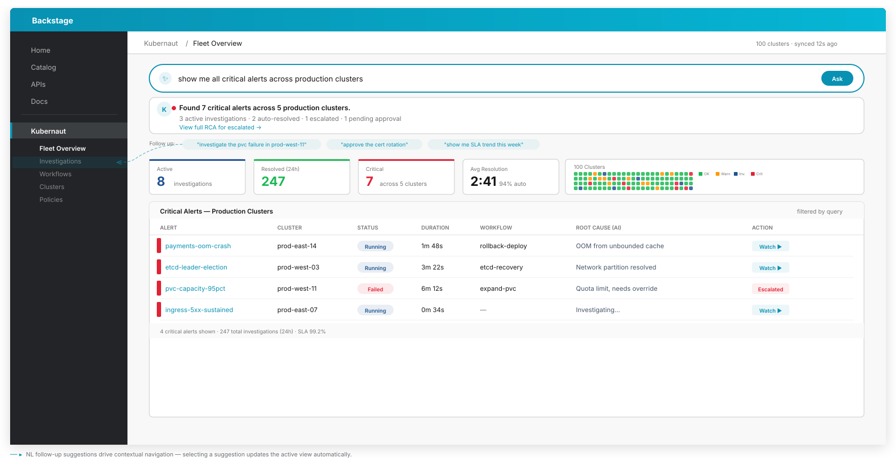
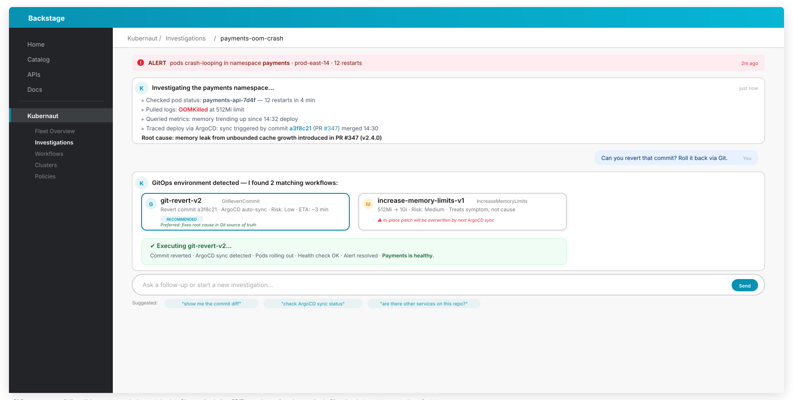
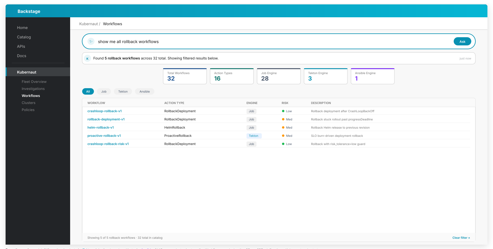
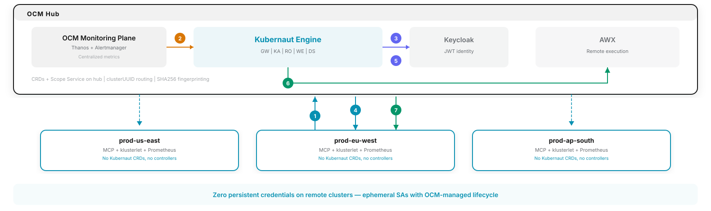

---
hide:
  - navigation
  - toc
---

---
hide:
  - navigation
---

# What's Next

Kubernaut v1.5 is the next major milestone, focused on agentic architecture and interactive sessions. The features below are in active development.

## Interactive Sessions

Streaming, conversational MCP interface enabling any consuming agent to interact with Kubernaut in real time:

- **Real-time streaming** — Investigation findings streamed token-by-token via SSE; consuming agents render them natively (chat bubbles, log panels, progress bars).
- **Choice presentation** — Workflow options returned as structured data (name, description, risk level, parameters) for agents to render in their preferred UX.
- **Conversational steering** — Multi-turn context maintained across follow-up questions during an investigation.
- **Join mid-flight** — Attach to an in-progress remediation that was already started autonomously (from an alert) and receive current state plus live updates without restarting the session.

??? example "Joining an in-flight investigation"

    

    

    

    Backstage &nbsp;&gt;&nbsp; Kubernaut &nbsp;&gt;&nbsp; inv-7f3a
    

    

    
<strong>Operator</strong> What's going on with <code>checkout-service</code> in <code>prod-us-east</code>? I see alerts firing.

    
<strong>Kubernaut</strong> live 
    There's already an investigation running on <code>checkout-service</code> — it started 2 minutes ago from a <code>PodCrashLoopBackOff</code> alert. Let me catch you up.  
    Checking events first… I see 14 OOMKilled events in the last 30 minutes, all on <code>checkout-service-7b4d9</code>. The memory limit is set to 512Mi.  
    Let me look at the metrics… There's a clear spike in <code>container_memory_working_set_bytes</code> — usage jumped to 623Mi right at 03:14 UTC. Something changed at that time.  
    Pulling the logs around 03:14… Found it: <em>"cache size exceeded soft limit, disabling eviction"</em>. A config reload at 03:14 introduced an unbounded in-memory cache — it's consuming all available memory and triggering the OOM kills.  
    So the root cause is the config change, not a traffic spike.
    

    
<strong>Operator</strong> Makes sense. What can we do about it?

    
<strong>Kubernaut</strong> 
    Searching workflow catalog… Found two workflows that match this scenario:
    

    

    <strong>restart-and-patch-memory</strong> 
    Confidence: 91% &middot; Risk: low 
    Bump memory limit to 768Mi + rolling restart
    

    

    <strong>rollback-config</strong> 
    Confidence: 85% &middot; Risk: low 
    Revert ConfigMap to pre-03:14 version
    

    

    

    
<strong>Operator</strong> Go with rollback-config — the cache change wasn't approved.

    
<strong>Kubernaut</strong> 
    Reverting ConfigMap… <code>checkout-config</code> rolled back to revision <code>v42</code> — that's the last known good version before the cache change.  
    Triggering rolling restart… Pods are cycling now. 1/3 ready… 2/3 ready… <strong>3/3 ready</strong>. All pods are back up with the old config.  
    Rollback complete. I'll keep watching for the next 5 minutes to make sure the OOM kills don't come back.
    

    
<strong>Kubernaut</strong> resolved All clear — no OOMKilled events in the last 5 minutes and memory is stable at 340Mi. Looks like the rollback did the trick. Closing this one out.

    

    

??? example "Starting from a natural language signal"

    

    

    

    Backstage &nbsp;&gt;&nbsp; Kubernaut &nbsp;&gt;&nbsp; inv-a29c
    

    

    
<strong>Operator</strong> The payment processing in <code>prod-eu-west</code> feels sluggish since this morning. Customers are complaining about timeouts at checkout.

    
<strong>Kubernaut</strong> investigating 
    Got it — sounds like a latency issue on <code>payment-gateway</code> in <code>prod-eu-west</code> starting this morning. Let me take a look.  
    Looking at the metrics… p99 latency jumped from 120ms to 2.4s right at 07:58 UTC. That's a 20x increase — definitely not gradual.  
    Checking pod health… All 5 replicas are running with no restarts, so it's not a crash loop. The issue is upstream.  
    Pulling logs… I see repeated <em>"connection pool exhausted, waiting for available connection"</em> — the app can't reach its database fast enough.  
    Checking the database endpoints… There it is — <code>payment-db</code> only has 1 of 3 endpoints ready. Two replicas went down at 07:55 UTC from a node drain. The remaining replica can't handle the full connection load, so the pool saturates and requests time out.
    

    
<strong>Operator</strong> That makes sense, the infra team had a maintenance window. What can we do to fix it?

    
<strong>Kubernaut</strong> 
    Searching workflow catalog… Two options based on the RCA:
    

    

    <strong>scale-statefulset</strong> 
    Confidence: 93% &middot; Risk: low 
    Restore <code>payment-db</code> to 3 replicas on available nodes
    

    

    <strong>rollback-node-drain</strong> 
    Confidence: 72% &middot; Risk: medium 
    Uncordon the drained node and reschedule pods
    

    

    

    
<strong>Operator</strong> Go with scale-statefulset.

    
<strong>Kubernaut</strong> 
    Scaling StatefulSet… <code>payment-db</code> target set to 3 replicas. Waiting for the new pods to join the cluster.  
    Watching rollout… 1/3 ready… 2/3 ready… <strong>3/3 ready</strong>. All database replicas are back.  
    Connection pool is recovering — active connections dropped from 500/500 to 180/500. Latency should normalize shortly. I'll keep monitoring p99 for the next 10 minutes to confirm.
    

    

    

## Backstage Console

A Backstage plugin providing an operator dashboard for investigation management, workflow oversight, and approve/reject/override controls through a web UI.

!!! example "Conceptual mockups"
    The following mockups show the planned Backstage console experience. Designs are subject to change.

### Fleet Overview

Natural language query bar for intent-driven navigation. KPI cards (active investigations, resolved, critical alerts, avg resolution time), cluster health grid, and a filtered alerts table — all driven by the operator's query.

### Investigation View

Chat-style investigation transcript showing the Kubernaut Agent's live reasoning, tool calls, and root cause analysis. Operators can follow the AI's investigation in real time and intervene when needed.

### Workflow Catalog

Searchable workflow catalog with natural language filtering, KPI metrics, and a table showing workflow status, action types, match count, and effectiveness scores.

## MCP & A2A Integration

The **API Frontend** service acts as the MCP/A2A gateway, exposing 20 MCP tools across four domains:

- **Remediation lifecycle** — `kubernaut_list_remediations`, `kubernaut_get_remediation`, `kubernaut_approve`, `kubernaut_cancel_remediation`, `kubernaut_watch`, `kubernaut_submit_signal`
- **Investigation** — `kubernaut_start_investigation`, `kubernaut_poll_investigation`, `kubernaut_select_workflow`, `kubernaut_present_decision`
- **Data & history** — `kubernaut_list_workflows`, `kubernaut_get_remediation_history`, `kubernaut_get_effectiveness`, `kubernaut_get_audit_trail`
- **Cluster context** — `af_list_events`, `af_get_pods`, `af_get_workloads`, `af_resolve_owner`, `af_check_existing_rr`, `af_create_rr`

A2A (Agent-to-Agent) protocol support is implemented at the library level with agent card discovery at `/.well-known/agent-card.json`, ADK executor integration, and `InvestigationSession` CRDs linking A2A task IDs to remediation context.

## Declarative Recipes

SREs define reusable agentic workflows as declarative [Goose recipes](https://block.github.io/goose/docs/guides/recipes/) — YAML-based configurations that package instructions, MCP extensions, and parameters into shareable, reproducible agent behaviors. Kubernaut injects them at three pipeline points via the Goose runtime, each calling external MCP tools. Each injection point accepts multiple stacked recipes.

### Injection 1: Pre-Investigation (Kubernaut Agent)

Context injected into the LLM prompt before analysis begins.

**Example: `check-maintenance-window`** — Calls a CMDB MCP server to check if the resource is in a maintenance window or had recent deployments. The result is injected into the investigation context before the LLM starts. If under maintenance, alerting is skipped and the RCA is annotated as expected downtime.

### Injection 2: Pre-Workflow Selection (Kubernaut Agent)

Constraints injected to bias workflow choice.

**Example: `enforce-cost-guardrails`** — Calls a Cost/Resource MCP for budget utilization and scaling limits for the namespace. Returns constraints such as "do not select scale-up workflows", nudging the LLM toward restart/rollback over resource-intensive remediations.

### Injection 3: EM Direct Execution (via Goose)

Recipe runs via Kubernaut Agent endpoint at effectiveness assessment time.

**Example: `verify-business-slo`** — Calls an SLO/Business Metrics MCP to check p95 latency, error rate, and order throughput against SLO budget. Returns a structured pass/fail verdict with business impact data, replacing the default Kubernetes health check with SRE-defined assessment SOPs.

## Fleet Operations

Hub-and-spoke deployment using [OCM](https://open-cluster-management.io/) (Open Cluster Management) — 7 steps from alert to remediation, zero remote footprint.

### Remediation flow

1. Remote Prometheus forwards metrics to Thanos on hub
2. Alertmanager fires alert → Kubernaut Engine triggers pipeline
3. KE obtains JWT from Keycloak for MCP investigation
4. KE calls MCP on target remote cluster for RCA investigation
5. KE obtains JWT from Keycloak for remediation execution
6. KE dispatches remediation playbook to AWX
7. AWX executes fix on target remote cluster via ephemeral SA

!!! tip "Zero persistent credentials"
    Remediation uses ephemeral ServiceAccounts with OCM-managed lifecycle — no long-lived secrets stored on remote clusters.

## Natural Language Signal Intake

Accept signals described in plain language — not just structured Prometheus alerts or Kubernetes events. Operators, chat bots, and external agents can trigger investigations by describing symptoms conversationally. Kubernaut resolves the intent (cluster, service, symptom) and opens an investigation automatically. See the "Starting from a natural language signal" example under [Interactive Sessions](#interactive-sessions).

## Selective Trust — Trust Ladder Level 2

v1.4 shipped **global dry-run** (Level 1 — Observe), where the entire pipeline runs through AI analysis but stops before execution. Level 2 builds on this by introducing **per-workflow dry-run overrides**: trusted workflows that have been validated in observe mode graduate to real execution, while new or untested workflows remain in dry-run. Combined with the Backstage console, operators get dashboard visibility and a guided onboarding path for new clusters.

---

!!! info "Subject to change"
    Features listed here are planned but may change. See the [Kubernaut milestones](https://github.com/jordigilh/kubernaut/milestones) for the latest status.
